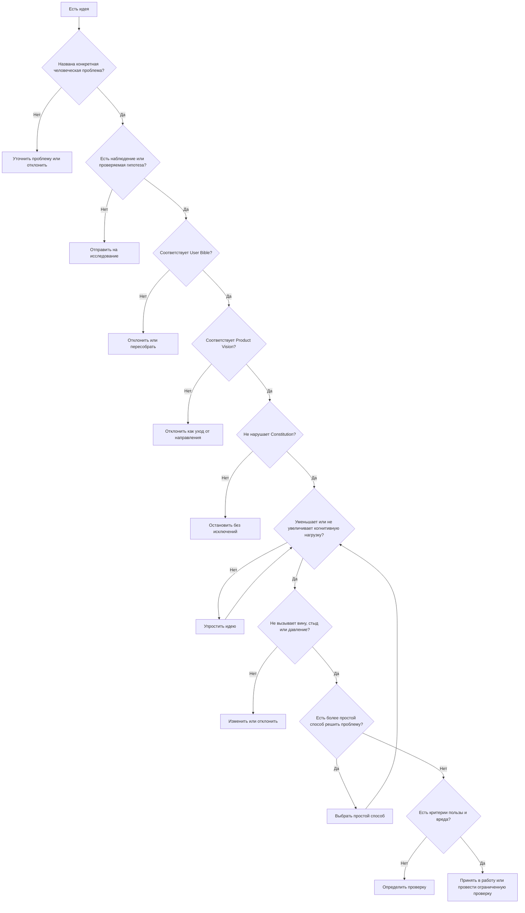
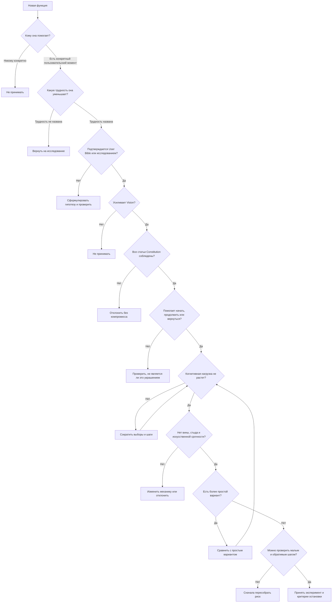
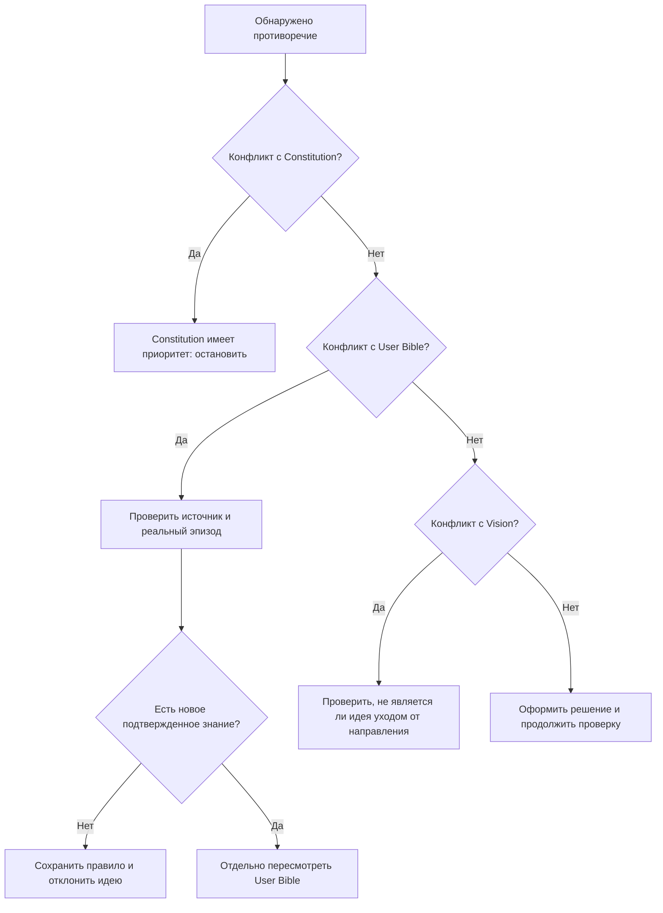
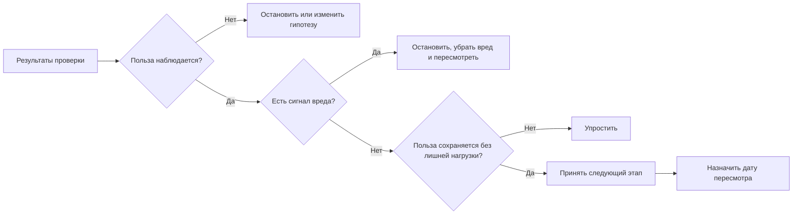

# Product Decision Framework

## 1. Назначение

Этот документ задает обязательный порядок принятия продуктовых решений: новых функций, изменений UX, правил AI, монетизации, тем, roadmap и отказа от существующих решений.

Он отвечает на вопрос: **имеет ли идея право стать продуктовым решением**.

Это не технический процесс реализации. После принятия решения инженерные границы и способы изменения системы сверяются с [Engineering Handbook v5](../docs/Engineering-Handbook-v5.md).

## 2. Непереговорные основания

Каждое решение проверяется в таком порядке:

1. Конкретная человеческая проблема.
2. User Bible и наблюдаемое поведение.
3. Product Vision.
4. Constitution.
5. ADHD principles и когнитивная нагрузка.
6. Риск вины, стыда, давления и потери агентности.
7. Более простой способ получить тот же результат.
8. Проверяемая гипотеза и критерий остановки.

Решение не может перескочить обязательный пункт только потому, что идея кажется красивой, срочной, прибыльной или популярной.

## 3. Универсальный процесс продуктового решения

### 3.1 Шаг 1. Зафиксировать идею

Идея записывается одной фразой. На этом этапе нельзя называть ее принятой функцией.

Обязательные поля:

- источник идеи;
- пользовательский эпизод;
- предполагаемая проблема;
- что уже известно;
- что пока является гипотезой;
- кто отвечает за дальнейшую проверку.

### 3.2 Шаг 2. Назвать проблему, а не решение

Нужно ответить:

- что происходит с человеком до появления идеи;
- что он пытается сделать;
- где возникает разрыв между намерением и действием;
- какой результат был бы полезен человеку;
- почему существующего опыта недостаточно.

Если проблема описана только словами «пользователи хотят функцию», идея возвращается на уточнение.

### 3.3 Шаг 3. Проверить User Bible

Проверяется не сходство идеи с красивым портретом, а соответствие конкретным состояниям и сценариям из [User-Bible.md](User-Bible.md).

Нужно отличить:

- подтвержденное наблюдение;
- рабочую гипотезу;
- предположение команды;
- неизвестное, которое сначала нужно исследовать.

### 3.4 Шаг 4. Проверить Vision

Идея должна усиливать долгосрочное направление Focus, а не вести его в сторону универсального списка, системы контроля, медицинского обещания или бесконечной настройки.

### 3.5 Шаг 5. Проверить Constitution

Проверяется каждая применимая статья [00-Constitution.md](00-Constitution.md). Нарушение неизменяемого правила останавливает идею независимо от потенциальной выгоды.

### 3.6 Шаг 6. Проверить когнитивную нагрузку

Нужно определить:

- сколько новых решений появляется у пользователя;
- сколько контекста нужно удерживать;
- может ли человек начать без полного понимания системы;
- что происходит в состоянии перегрузки;
- можно ли убрать шаг, поле, выбор или уведомление.

### 3.7 Шаг 7. Проверить эмоциональный вред

Идея отклоняется или меняется, если она усиливает вину, стыд, страх пропуска, чувство наблюдения или обязанность быть продуктивным.

### 3.8 Шаг 8. Найти более простой способ

До принятия функции команда обязана сформулировать как минимум один вариант с меньшим объемом правил и взаимодействий.

Если простой вариант решает ту же человеческую проблему, выбирается он.

### 3.9 Шаг 9. Определить проверку

До принятия должны быть определены:

- ожидаемое изменение человеческого поведения или опыта;
- положительный сигнал;
- сигнал вреда;
- минимальный способ проверить гипотезу;
- условие остановки;
- дата пересмотра.

### 3.10 Шаг 10. Принять, изменить, проверить или отклонить

Возможны только четыре исхода:

- `Принять` — основания достаточны, границы соблюдены, проверка определена.
- `Изменить` — проблема важна, но текущая формулировка нарушает принцип или перегружает опыт.
- `Проверить` — есть правдоподобная гипотеза, но недостаточно свидетельств.
- `Отклонить` — идея не соответствует основаниям или не имеет достаточно важной проблемы.

## 4. Общее дерево решения

## 5. Дерево решения для новой функции

Новая функция проходит полный путь, даже если она кажется маленькой. Размер изменения не освобождает от проверки человеческого смысла.

## 6. Дерево решения при противоречии

## 7. Дерево решения после проверки

## 8. Чек-лист поступления идеи

- [ ] Идея записана одной фразой.
- [ ] Указан источник идеи.
- [ ] Описан конкретный пользовательский эпизод.
- [ ] Отделены факты от гипотез.
- [ ] Назван предполагаемый результат для человека.
- [ ] Указано, почему текущего опыта недостаточно.
- [ ] Назначен ответственный за проверку.
- [ ] Идея не названа принятой функцией заранее.

## 9. Чек-лист User Bible

- [ ] Проверены соответствующие состояния из User Bible.
- [ ] Учитывается взрослость и агентность пользователя.
- [ ] Идея не сводит человека к диагнозу.
- [ ] Рассмотрены ясный день, потеря контекста, перегрузка и возвращение.
- [ ] Учтен разрыв между намерением и действием.
- [ ] Проверено влияние на чувство контроля.
- [ ] Проверено влияние после пропуска.
- [ ] Не сделан вывод о всей аудитории по одному эпизоду.

## 10. Чек-лист Vision

- [ ] Идея усиливает выбранное направление Focus.
- [ ] Идея не превращает продукт в универсальную систему управления всем.
- [ ] Идея не требует идеального пользователя.
- [ ] Идея не подменяет жизнь постоянной настройкой.
- [ ] Идея имеет понятную связь с полезным человеческим результатом.
- [ ] Идея не обещает невозможного.

## 11. Чек-лист Constitution

- [ ] Человек важнее системы.
- [ ] Пользователь остается взрослым и самостоятельным.
- [ ] Сохраняется агентность.
- [ ] Достоинство не обменивается на эффективность.
- [ ] Не используются стыд, вина и наказание.
- [ ] Пропуск не ухудшает право на помощь.
- [ ] Возвращение остается возможным.
- [ ] Хороший день не определяется идеальным выполнением.
- [ ] Нет скрытых изменений.
- [ ] Нет медицинских обещаний.
- [ ] Бесплатная ценность не уничтожается монетизацией.
- [ ] У пользователя остается возможность уйти.

## 12. Чек-лист когнитивной нагрузки

- [ ] Понятен следующий шаг.
- [ ] Количество новых выборов минимально.
- [ ] Не требуется удерживать лишний контекст.
- [ ] Можно начать до полного заполнения деталей.
- [ ] Настройка не блокирует действие.
- [ ] Сценарий перегрузки не сложнее обычного сценария.
- [ ] Есть возможность уменьшить обязательство.
- [ ] Есть возможность перенести или отменить.
- [ ] Ошибка не заставляет начинать весь путь заново.
- [ ] Продукт не требует длительного пребывания внутри.

## 13. Чек-лист эмоциональной безопасности

- [ ] Тексты не описывают характер пользователя.
- [ ] Пропуск не представлен как моральный провал.
- [ ] Нет публичного сравнения или рейтинга личности.
- [ ] Нет угрозы потери достоинства.
- [ ] Нет искусственной срочности.
- [ ] Напоминание поддерживает, а не преследует.
- [ ] Пользователь может отказаться без наказания.
- [ ] Сложный день рассматривается как нормальный сценарий.

## 14. Чек-лист простоты

- [ ] Сформулирован самый простой вариант.
- [ ] Удалены шаги, не влияющие на человеческий результат.
- [ ] Удалены настройки, которые можно отложить.
- [ ] Удалены дублирующие сигналы.
- [ ] Простой вариант сравнен с более сложным по ожидаемой пользе.
- [ ] Сложность оправдана конкретной проблемой, а не желанием добавить возможность.

## 15. Чек-лист проверки гипотезы

- [ ] Записана проверяемая гипотеза.
- [ ] Определен наблюдаемый человеческий результат.
- [ ] Определен сигнал вреда.
- [ ] Выбран минимальный и обратимый способ проверки.
- [ ] Определено, что будет считаться отсутствием пользы.
- [ ] Определена дата пересмотра.
- [ ] Определен ответственный за решение после проверки.

## 16. Чек-лист решения о принятии

- [ ] Проблема важнее самой идеи.
- [ ] User Bible проверен.
- [ ] Vision проверен.
- [ ] Constitution проверен.
- [ ] Когнитивная нагрузка не увеличивается без необходимости.
- [ ] Нет вины, стыда, наказания и скрытого давления.
- [ ] Простой вариант рассмотрен.
- [ ] Пользовательский результат измерим наблюдением.
- [ ] Сигналы вреда и stop conditions записаны.
- [ ] Решение имеет статус: `Принять`, `Изменить`, `Проверить` или `Отклонить`.

## 17. Чек-лист пересмотра после проверки

- [ ] Проверен реальный пользовательский эпизод, а не только мнение команды.
- [ ] Польза отделена от активности внутри продукта.
- [ ] Проверено возвращение после ошибки или пропуска.
- [ ] Проверена нагрузка в состоянии перегрузки.
- [ ] Проверены стыд, вина и ощущение давления.
- [ ] Зафиксированы неожиданные последствия.
- [ ] Решено: продолжить, изменить, остановить или удалить.
- [ ] Обновлены связанные продуктовые документы.

## 18. Формат записи принятого решения

Каждое принятое решение должно содержать:

1. Название решения.
2. Пользовательскую проблему.
3. Источник и качество доказательств.
4. Проверку User Bible.
5. Проверку Vision.
6. Проверку Constitution.
7. Упрощенный вариант.
8. Ожидаемый человеческий результат.
9. Риски и сигналы вреда.
10. Статус и дату пересмотра.
11. Ссылки на затронутые продуктовые документы.

## 19. Финальное правило

Идея принимается только после прохождения всех обязательных проверок. Если она не проходит проверку User Bible, Vision, Constitution, когнитивной нагрузки или эмоциональной безопасности, ее нельзя принять в прежнем виде. Сначала она должна быть изменена, проверена заново или отклонена.

