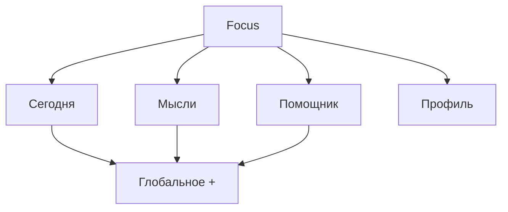
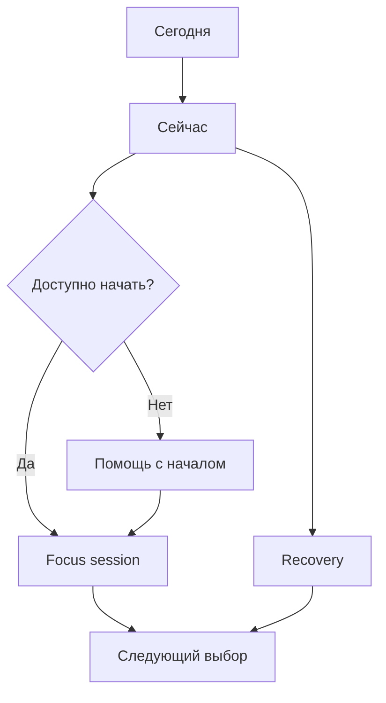
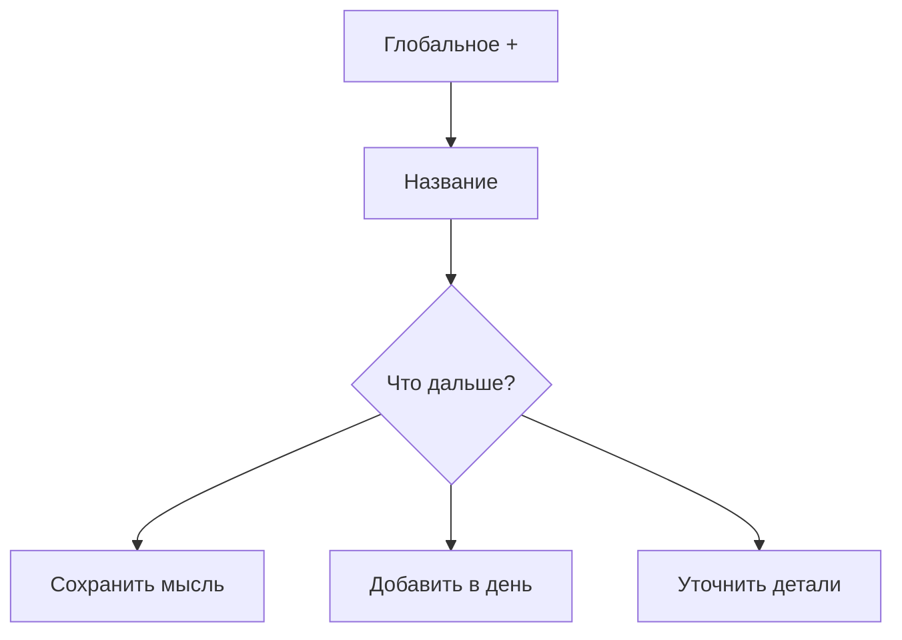

# Focus Future Screen Map

> **Статус:** целевая продуктовая карта, не описание текущей реализации
>
> **Версия:** 1.0
>
> **Дата:** 2026-08-12
>
> **Основание:** [PDR-001](../12-Decisions/PDR-001-Timeline-Centered-Day-Experience.md) и [PDR-002](../12-Decisions/PDR-002-User-Controlled-Time-Format.md)

## 1. Назначение карты

Эта карта определяет будущие пользовательские поверхности Focus и отношения
между ними. Она фиксирует **что должен позволять продукт**, но не задает роуты,
компоненты, состояние, API или порядок инженерной реализации.

Главный принцип карты:

> Пользователь должен из любого ключевого состояния быстро попасть к одному
> доступному действию, зафиксировать мысль или спокойно пересобрать план.

## 2. Навигационная модель

У Focus четыре постоянные зоны и одно глобальное действие.

| Зона | Главный вопрос | Роль |
|---|---|---|
| **Сегодня** | Что происходит сейчас и что можно сделать дальше? | основной таймлайн и точка действия |
| **Мысли** | Что мне нужно вынести из головы? | фиксация без обязательного планирования |
| **Помощник** | Какая поддержка нужна в этой ситуации? | запуск, упрощение, recovery, энергия и присутствие |
| **Профиль** | Как Focus должен работать для меня? | рутины, уведомления, внешний вид, интеграции и аккаунт |
| **`+` Добавить** | Что я хочу быстро зафиксировать? | глобальный вход в задачу, мысль, отдых или событие |

AI не ограничивается вкладкой «Помощник»: контекстные входы доступны из
«Сейчас», задачи, recovery и вечернего завершения.

## 3. Уровень 0: вход и первый полезный момент

### 0.1 Welcome

**Цель:** объяснить обещание Focus без длинной презентации.

Пользователь должен понять:

- Focus помогает увидеть ближайший шаг;
- план можно менять без чувства вины;
- продукт не требует идеальной системы.

### 0.2 Вход и регистрация

**Цель:** безопасно войти или продолжить без лишних решений.

### 0.3 Минимальный onboarding

Обязательный минимум:

- часовой пояс;
- разрешение на уведомления в момент, когда понятна их польза;
- первое намерение или выбор «Пока пропустить».

Темы, рутины, AI-настройки и подробные предпочтения не блокируют первый старт.

### 0.4 Первый полезный старт

Пользователь создает одно намерение, видит его в «Сейчас» и получает очевидный
вход `Начать` либо `Мне трудно начать`.

## 4. Зона «Сегодня»

### 1.1 Сегодня — таймлайн дня

Это домашний экран Focus.

Обязательные элементы:

- компактная календарная лента;
- текущий момент;
- карточка «Сейчас»;
- вертикальный таймлайн;
- задачи с видимой приблизительной длительностью;
- отдых, переходы и буферы;
- свободные окна без требования заполнить их;
- одна плавающая кнопка `+`;
- спокойный вход в recovery при расхождении плана с реальностью.

Прошлое остается доступным, но не должно визуально доминировать над возможностью
продолжить.

### 1.2 Карточка «Сейчас»

Главная поверхность действия.

Показывает:

- название текущего или ближайшего действия;
- доступную точку входа;
- приблизительную длительность;
- один основной CTA.

Действия:

- `Начать`;
- `Мне трудно начать`;
- `Завершить`;
- `Пауза`;
- `Изменить план`.

На одном состоянии не должно одновременно отображаться пять равнозначных CTA.
Вторичные действия раскрываются по запросу.

### 1.3 Другой день

Пользователь может просматривать и редактировать прошлые и будущие дни.
Просмотр другого дня не имитирует «Сейчас» и всегда предлагает короткий путь
вернуться к сегодняшнему дню.

### 1.4 Быстрое добавление

Первый экран требует только название.

Следующим шагом пользователь может:

- сохранить как мысль;
- поставить на сегодня;
- выбрать другое время;
- выбрать приблизительную длительность;
- открыть дополнительные параметры.

Вариант длительности `Не знаю` является полноценным ответом.

### 1.5 Полная форма задачи

Доступна по желанию и содержит:

- название;
- дату и приблизительное время;
- длительность или `Не знаю`;
- первый шаг;
- повторение;
- напоминание;
- заметку;
- энергоемкость как необязательный сигнал.

### 1.6 Детали задачи

Показывают контекст, историю текущего намерения и понятные действия:

- начать;
- уменьшить;
- разбить;
- перенести;
- отменить;
- удалить;
- вернуть последнее изменение.

### 1.7 Recovery: план сдвинулся

Открывается, когда пользователь сам просит помощи или Focus видит явное
расхождение, но никогда не меняет план без согласия.

Первый экран показывает:

- нейтральное описание факта;
- один рекомендуемый вариант;
- не более двух альтернатив;
- предварительный просмотр результата.

Варианты:

- `Продолжить с текущего момента`;
- `Оставить только главное`;
- `Сдвинуть оставшееся`;
- `Уменьшить эту задачу`;
- `Перенести на потом`.

После применения всегда доступна отмена.

### 1.8 Режим перегрузки

Минимальная версия Today:

- текущее время;
- одно выбранное действие;
- `Начать на 2 минуты`;
- `Выбрать легче`;
- `Мне нужен отдых`.

Полный таймлайн временно сворачивается, но данные и авторство пользователя не
исчезают.

### 1.9 Мягкое завершение дня

Показывает:

- что было сделано и к чему удалось вернуться;
- что больше не актуально;
- что пользователь хочет оставить на завтра;
- возможность завершить день без обязательного разбора всего списка.

Нет процента «идеальности дня», оценки характера или наказания за незавершенное.

## 5. Зона «Мысли»

### 2.1 Быстрая выгрузка

Один текстовый вход с обещанием: «Запиши, чтобы не держать в голове».

Сохранение не требует даты, категории, времени, приоритета или длительности.

### 2.2 Список мыслей

Показывает еще не разобранные записи спокойным потоком. Количество не
используется как красная задолженность.

### 2.3 Детали мысли

Действия:

- превратить в задачу;
- добавить в день;
- уточнить первый шаг;
- оставить мыслью;
- архивировать;
- удалить.

### 2.4 Мягкий разбор мыслей

Focus предлагает разбирать по одной записи. Массовый обязательный «inbox zero»
не является целью продукта.

## 6. Зона «Помощник»

### 3.1 Контекстный центр помощи

Не начинается с пустого чата. Показывает несколько понятных входов:

- `Мне трудно начать`;
- `План развалился`;
- `Слишком много дел`;
- `Помоги уменьшить задачу`;
- `Хочу сфокусироваться рядом с кем-то`.

### 3.2 Помощь с началом

Предлагает один из доступных входов:

- сформулировать первый физически наблюдаемый шаг;
- начать на две минуты;
- убрать подготовительный барьер;
- выбрать более легкое действие;
- открыть focus/body-doubling session.

### 3.3 Разбиение задачи

AI предлагает черновик шагов. Пользователь редактирует, принимает отдельные
шаги или отказывается от предложения. Исходная задача не меняется молча.

### 3.4 Recovery и пересборка дня

Использует тот же сценарий preview → accept/edit → undo, что и Today. Отдельный
чат не создает вторую несовместимую логику планирования.

### 3.5 Состояние и энергия

Короткий необязательный check-in помогает выбрать тип поддержки:

- мало сил;
- обычно;
- много энергии;
- перегрузка;
- нужен отдых.

Это не оценка личности и не медицинский вывод.

### 3.6 Focus session

Вход из «Сейчас», задачи или Помощника.

Варианты:

- приватный таймер;
- мягкий двухминутный старт;
- body doubling без обязательной камеры;
- публичная или приватная комната на более позднем этапе.

### 3.7 Активная focus session

Показывает минимум:

- текущее действие;
- время;
- паузу;
- завершение;
- выход без наказания.

### 3.8 Завершение session

Пользователь выбирает:

- закончил;
- сделал часть;
- хочу продолжить позже;
- задача изменилась;
- сейчас не получилось.

Каждый исход возвращает к следующему доступному выбору без моральной оценки.

## 7. Зона «Профиль»

### 4.1 Профиль и предпочтения

- имя;
- язык;
- часовой пояс;
- формат времени: `Как в системе` / `Use system setting` (по умолчанию),
  `24-часовой` / `24-hour` или `12-часовой` / `12-hour`;
- предпочтения поддержки;
- доступность и reduced motion.

Язык, часовой пояс и формат времени являются независимыми предпочтениями:
изменение одного из них не должно молча перезаписывать другое. Формат времени
применяется ко всем пользовательским поверхностям Focus согласно
[PDR-002](../12-Decisions/PDR-002-User-Controlled-Time-Format.md).

### 4.2 Рутины

- список рутин;
- создание и редактирование;
- мягкая пауза;
- применение к дню без скрытого заполнения расписания.

### 4.3 Уведомления

- разрешения;
- каналы;
- тихие часы;
- частота;
- приватность текста;
- локальные и удаленные напоминания.

### 4.4 Внешний вид

- Theme Worlds;
- размер текста;
- контраст;
- анимация;
- звук.

Внешний вид не должен скрывать текущий момент и состояния задач.

### 4.5 Интеграции

- календари;
- импорт и экспорт;
- подключенные сервисы;
- ясные границы доступа.

### 4.6 План и подписка

Показывает Free/Pro без ухудшения базового пути «увидеть → начать → вернуться».

### 4.7 Приватность, данные и аккаунт

- управление данными;
- экспорт;
- удаление;
- выход;
- понятное объяснение AI и персонализации.

## 8. Системные поверхности

Эти состояния не являются отдельными зонами навигации, но должны быть
спроектированы как полноценный опыт:

- запрос разрешения на уведомления;
- открытие из уведомления;
- offline;
- загрузка;
- пустое состояние;
- частичная ошибка;
- полная ошибка;
- повтор действия;
- undo;
- конфликт изменений;
- paywall;
- privacy consent;
- обновление продукта.

Каждое состояние отвечает на вопрос: **«Что я могу сделать сейчас?»**

## 9. Карта ключевых переходов

## 10. Приоритеты поставки

| Горизонт | Поверхности |
|---|---|
| **Now** | Today timeline, карточка «Сейчас», быстрый ввод, задача, базовый recovery, мысли, профиль/уведомления |
| **Next** | режим перегрузки, мягкий разбор мыслей, focus session, рутины, contextual helper, вечернее завершение |
| **Later** | AI-декомпозиция, energy-aware suggestions, explainable rescheduling, body-doubling rooms, интеграции, Theme Worlds |
| **Parked** | социальные рейтинги, streak-наказания, автоматический автопилот, обязательная камера, медицинские выводы |

## 11. Правила для всех экранов

Каждый экран обязан:

1. отвечать на один главный пользовательский вопрос;
2. иметь один визуально очевидный следующий шаг;
3. допускать выход без потери достоинства;
4. не использовать красный цвет как моральную оценку;
5. не требовать полной настройки до действия;
6. объяснять значимые изменения до применения;
7. сохранять undo для обратимых изменений;
8. выдерживать идеальный день, перегрузку, пропуск и возвращение;
9. не копировать узнаваемые визуальные решения Structured;
10. помогать человеку вернуться в жизнь, а не удерживать его внутри Focus.
