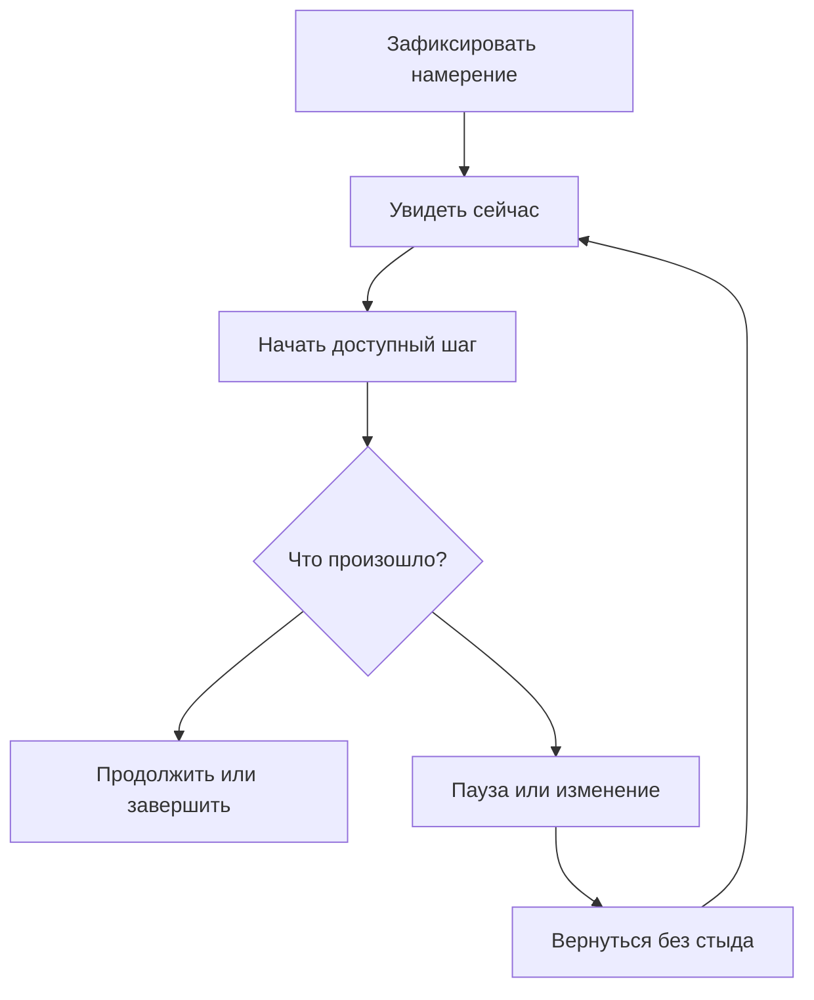

# Product Experience Model

> **Статус:** Active
>
> Это концептуальная модель опыта. Доменные сущности, lifecycle и архитектурные
> инварианты описаны в [System Bible](../../docs/System-Bible.md).

## 1. Core product loop

Основной цикл Focus:

Цикл не требует завершить все запланированное. Полезными исходами являются
начало, продолжение, честное уменьшение, перенос, отмена и возвращение.

## 2. First useful moment

Первый полезный момент наступает не после полного onboarding, а когда человек:

1. фиксирует одно намерение;
2. видит его как ближайший доступный шаг;
3. может начать или попросить помощь с началом.

Регистрация, разрешения, персонализация и объяснение функций не должны отдалять
этот момент без необходимости.

## 3. Day experience

### 3.1 Утро

Focus предлагает начать не с построения идеального расписания, а с выбора одного
главного намерения и реалистичной сборки дня с запасом.

### 3.2 Текущий момент

Today открывается на «Сейчас». Таймлайн дает контекст, но карточка текущего или
ближайшего действия дает точку входа.

### 3.3 Перегрузка

Focus уменьшает количество одновременно видимых решений. Пользователь может
выбрать один шаг, более легкое действие или отдых.

### 3.4 Потеря контекста

Продукт помогает восстановить только необходимое: что происходило, что еще
важно и какой выбор доступен сейчас. Он не требует сначала исправить весь план.

### 3.5 Расхождение плана с реальностью

Focus предлагает recovery с preview и undo. Прошлое описывается нейтрально, а
оставшийся день может быть уменьшен или пересобран.

### 3.6 Вечер

Завершение дня сохраняет память о сделанном и возвращениях, помогает отпустить
неактуальное и не превращает завтра в склад сегодняшнего долга.

## 4. Product surfaces

### 4.1 Сегодня

Таймлайн дня, «Сейчас», быстрое добавление, задача, recovery, overload mode и
мягкое завершение дня.

### 4.2 Мысли

Мгновенная фиксация без обязательного планирования и мягкий разбор по одной
записи.

### 4.3 Помощник

Контекстная поддержка запуска, уменьшения, разбиения, recovery, энергии и focus
session. AI не ограничивается отдельной вкладкой и не начинается только с
пустого чата.

### 4.4 Профиль

Рутины, уведомления, внешний вид, интеграции, подписка, доступность, приватность
и аккаунт.

### 4.5 Глобальное добавление

Единый вход для быстрой фиксации задачи, мысли, отдыха или события.

Полная карта поверхностей описана в
[Future Screen Map](Future-Screen-Map.md).

## 5. Role of support systems

| Система | Когда нужна | Чего не должна делать |
|---|---|---|
| Интерфейс | дать ориентацию и прямое действие | требовать постоянного обслуживания |
| Reminder | вернуть намерение в нужный момент | преследовать до выполнения |
| Smart Planner | предложить реалистичное изменение | молча переписывать план |
| AI | прояснить, уменьшить или предложить вход | диагностировать и присваивать авторство |
| Body doubling | дать присутствие во время старта | превращать работу в публичную оценку |

## 6. Healthy use

Здоровый цикл заканчивается возвращением к жизни пользователя. Focus не должен
удерживать человека после того, как следующий шаг стал понятен.

Сигналы здорового использования:

- быстрее найден доступный старт;
- стало легче вернуться после отвлечения;
- план изменяется без морального суда;
- свободное время не вызывает требования его заполнить;
- пользователь сохраняет авторство;
- приложение можно спокойно закрыть.

Сигналы вреда:

- бесконечное редактирование вместо действия;
- страх открыть Today после пропуска;
- зависимость от подтверждения системы;
- рост уведомлений для компенсации слабого опыта;
- ощущение, что таймлайн оценивает человека.

## 7. Cross-platform principles

На всех платформах сохраняются:

- модель «Сейчас → действие → продолжение или recovery»;
- нейтральный язык;
- видимость значимых изменений;
- право уменьшить, перенести, отменить и уйти;
- отсутствие скрытого автопилота.

Конкретная плотность и навигация могут учитывать устройство. Мобильный опыт
приоритетен для быстрого входа и текущего момента; большие экраны могут давать
больше контекста, но не больше обязательных решений.

## 8. Связанные документы

- [UX Principles](../03-UX/UX-Principles.md)
- [ADHD Principles](../04-ADHD/ADHD-Principles.md)
- [Smart Planner Philosophy](../06-Smart-Planner/Smart-Planner-Philosophy.md)
- [Future Screen Map](Future-Screen-Map.md)
- [PDR-001](../12-Decisions/PDR-001-Timeline-Centered-Day-Experience.md)
