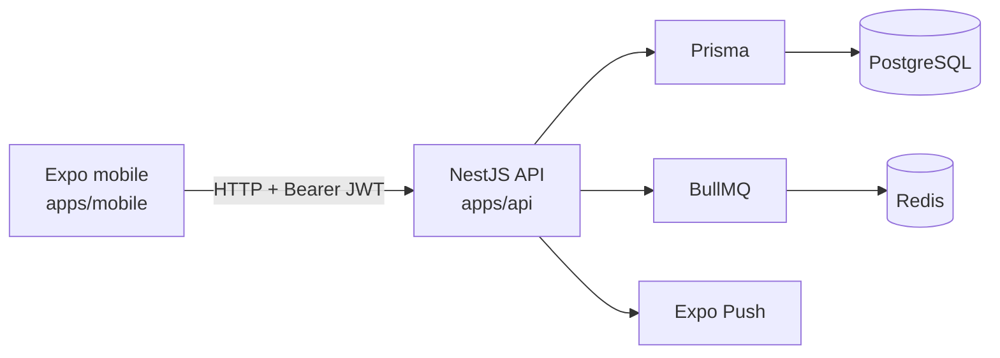

# Architecture

## Границы

- `apps/mobile/app/` — file-based routes и экраны.
- `apps/mobile/lib/` — API-клиент, feature API и timeline helpers.
- `apps/mobile/stores/` — auth state.
- `apps/api/src/*/*.controller.ts` — HTTP boundary.
- `apps/api/src/*/*.service.ts` — use cases и Prisma operations.
- `apps/api/src/*/*.module.ts` — Nest dependency graph.
- `apps/api/src/prisma/` — Prisma client lifecycle.

## Request lifecycle

`apps/api/src/main.ts` создаёт Nest application и глобальный строгий `ValidationPipe`. Защищённый controller route проходит `JwtAuthGuard`, после чего `CurrentUser` передаёт пользователя в service. Service выполняет ownership-aware Prisma query и возвращает результат или Nest exception.

## Модули API

`AppModule` собирает auth, users, tasks, routines, notifications, plan и Prisma modules. Notifications используют BullMQ/Redis; mobile регистрирует Expo push token через `PATCH /users/me` в `apps/mobile/app/_layout.tsx`.