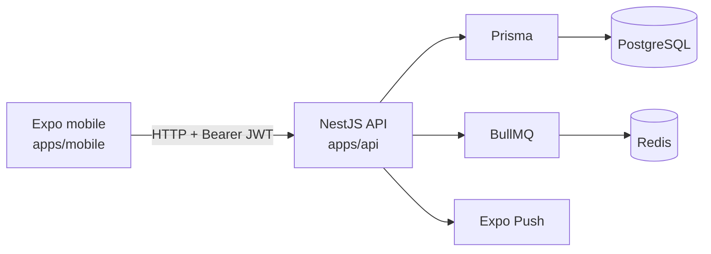
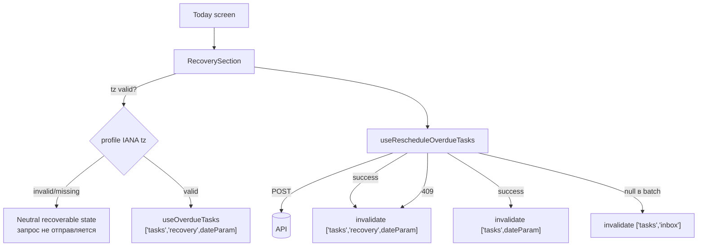

# Architecture



## Границы

- `apps/mobile/app/` — file-based routes и экраны.
- `apps/mobile/lib/` — API-клиент, feature API и timeline helpers.
- `apps/mobile/stores/` — auth state.
- `apps/api/src/*/*.controller.ts` — HTTP boundary.
- `apps/api/src/*/*.service.ts` — use cases и Prisma operations.
- `apps/api/src/*/*.module.ts` — Nest dependency graph.
- `apps/api/src/prisma/` — Prisma client lifecycle.

## Request lifecycle

`apps/api/src/main.ts` создаёт Nest application и глобальный строгий `ValidationPipe`. Защищённый controller route проходит `JwtAuthGuard`, после чего `CurrentUser` передаёт пользователя в service. Service выполняет ownership-aware Prisma query и возвращает результат или Nest exception.

## Модули API

`AppModule` собирает auth, users, tasks, routines, notifications, plan и Prisma modules.
Notifications используют BullMQ/Redis; mobile регистрирует Expo push token через
`POST /notifications/devices` (ADR-009).

## Notification channels (Package 0011 / ADR-006 / ADR-009)

```mermaid
flowchart TD
  T[Task create/update/delete] --> S[NotificationsService]
  S -->|scheduleTaskReminder| BQ[BullMQ job\ntask-reminder-{id}]
  BQ -->|delayed fan-out| W[NotificationsProcessor\nworker]
  W -->|DeviceToken.findMany| DB[(PostgreSQL)]
  W -->|generic payload| EX[Expo Push API]
  EX --> D1[Device A]
  EX --> D2[Device B]
  M[Mobile app] -->|expo-notifications| LS[Local scheduler\nlocal-notifications.ts]
  LS --> D1
```

**Local (mobile):** `lib/local-notifications.ts` schedules at most one `expo-notifications`
reminder per task using a deterministic identifier `task-reminder-${task.id}`. Content is
generic (no task title on locked screen). Bootstrap reconciliation re-syncs the bounded
future schedule (7-day horizon) on launch. Permission denial never blocks task CRUD.

**Remote (server):** BullMQ job fan-out to all active `DeviceToken` rows for the user.
Job payload: IDs only; push body: generic. DeviceNotRegistered revokes the specific token.

## Vertical slice: Guilt-Free Recovery

Пример полного слайса без кросс-доменного рефакторинга — вся логика добавлена внутрь `TasksModule`.

```text
backend   dto/reschedule-recovery.dto.ts   (explicit null, ArrayMaxSize, IsUUID)
          tasks.controller.ts              (routes перед /tasks/:id)
          task-recovery.service.ts         (day boundary, ownership, transaction)
shared    packages/shared-types/src/index.ts
            OverdueTasksResponse, RescheduleRecoveryRequest/Response, FREE_TIER_LIMITS
mobile    lib/timezone.ts                  (IANA/DST helpers, picker field extraction)
          lib/api/tasks.ts                 (useOverdueTasks, useRescheduleOverdueTasks,
                                            useInboxTasks, useToggleInboxTask)
          components/RecoverySection.tsx   (Today coordinator: tz guard → query → mutation)
          components/RecoveryBanner.tsx    (selection, two-phase picker, preview)
          components/PartialReminderNotice.tsx
          app/(tabs)/today.tsx, app/(tabs)/inbox.tsx
```

### Cache и data flow



Ключевые правила слайса: сервер владеет границей дня (клиентский `?date=` идёт только в cache key);
профильная timezone проверяется до любого вызова форматтера, и при её отсутствии recovery-запрос не
выполняется, а подстановка `UTC`/device tz запрещена; `['tasks','inbox']` инвалидируется только при
наличии destination `null`; частичный сбой напоминаний остаётся уведомлением уровня Today и
переживает unmount баннера.