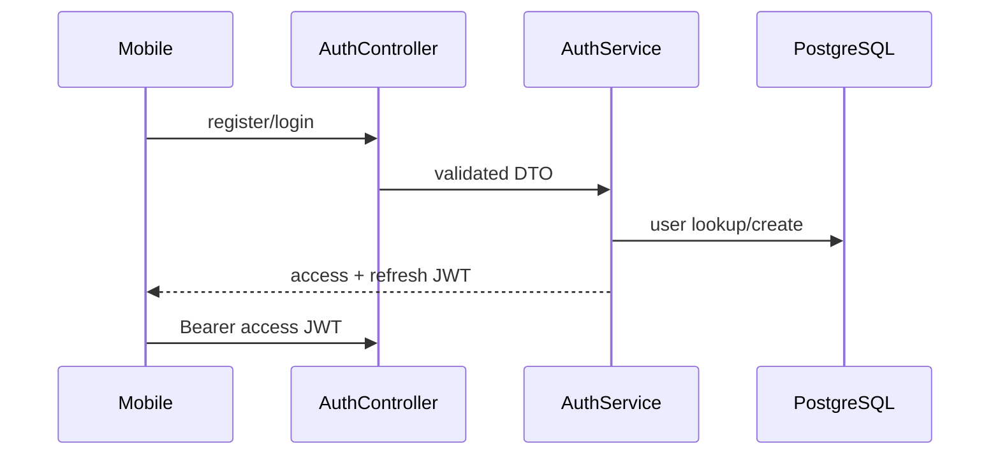

# Authentication

## Password flow

`POST /auth/register` и `POST /auth/login` принимают email или phone и пароль. `AuthService` хеширует пароль bcrypt и возвращает access/refresh JWT pair (`apps/api/src/auth/auth.service.ts`).

## JWT

Secrets берутся из `JWT_SECRET` и `JWT_REFRESH_SECRET` через `auth/jwt-secrets.ts`. Значения expirations по умолчанию — access `15m`, refresh `30d`, с настройкой через environment. `JwtStrategy` и `JwtAuthGuard` защищают routes; `GET /auth/me` исключает `passwordHash`.

Refresh endpoint: `POST /auth/refresh`. Logout/revocation endpoint и server-side refresh-token store в найденном коде отсутствуют; не следует описывать текущую реализацию как rotation/revocation.

## OAuth

Существуют `/auth/yandex`, `/auth/vk`, `/auth/mailru` с initiation и callback routes. Provider credentials, callback URLs и production behavior требуют deployment configuration и не должны выдумываться.