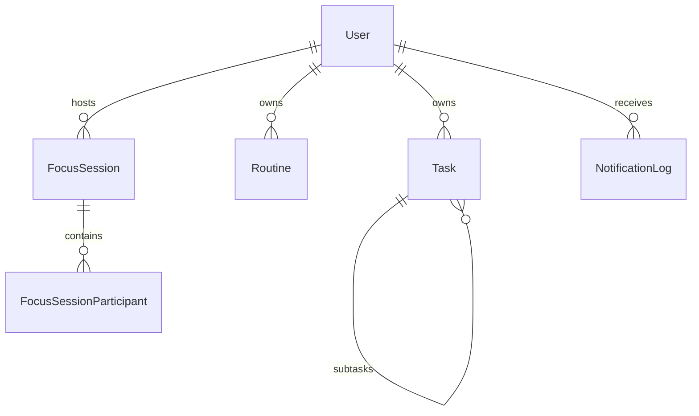

# Database

## ORM и миграции

Schema находится в `apps/api/prisma/schema.prisma`, provider — PostgreSQL. Начальная миграция: `apps/api/prisma/migrations/20260727060954_init/migration.sql`; lock-файл — `migration_lock.toml`.

## Сущности и связи

`User` хранит email/phone, password hash, timezone, onboarding, plan и OAuth ids. `Task` поддерживает расписание, длительность, RRULE, completion и self-relation подзадач. `Routine` хранит шаблон по дням недели. Focus-сессии и notification logs описаны в Prisma schema.

## Индексы и ownership

User-owned модели содержат `userId`. В schema объявлены индексы для `Task` по `userId` и `[userId, startTime]`, для `Routine` и уведомлений по `userId`. Services должны выполнять запросы в контексте текущего пользователя.

## Операции

Команды Prisma приведены в [Development](Development.md). `prisma migrate reset` разрушителен и не должен выполняться на shared/production database.