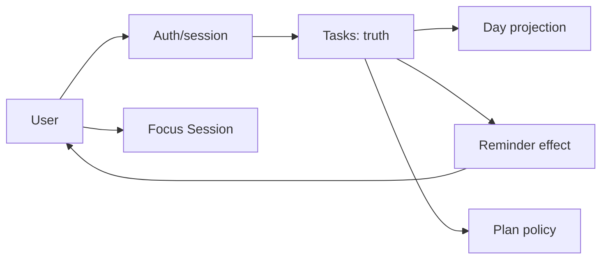
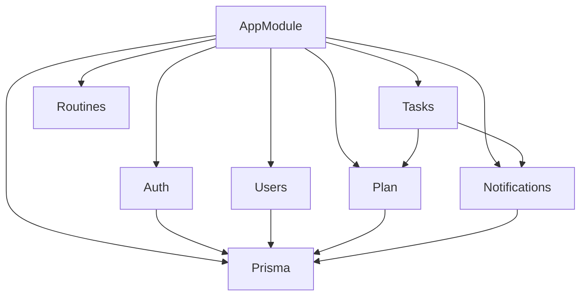
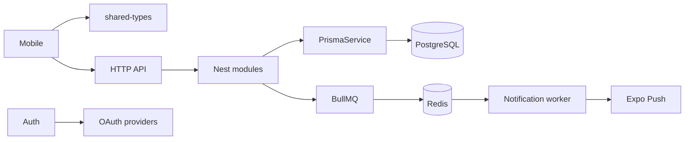
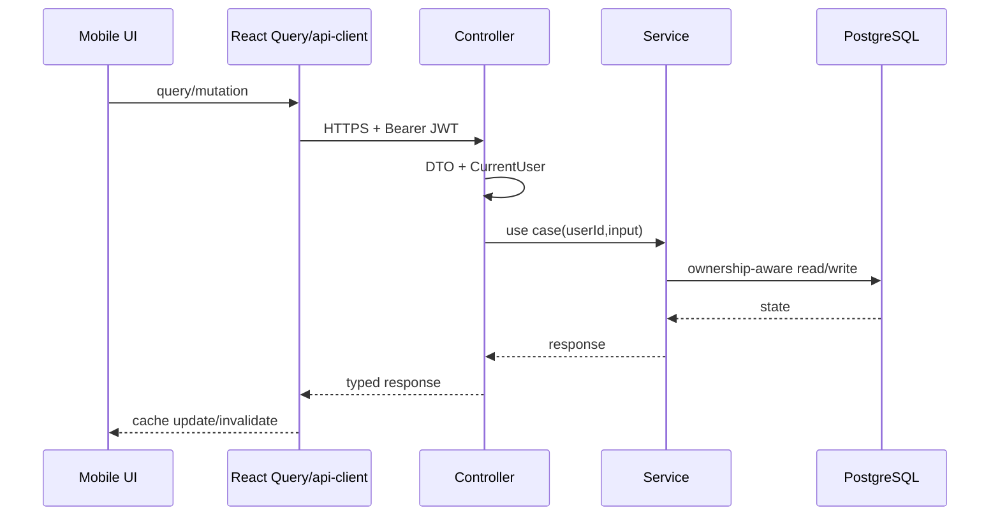
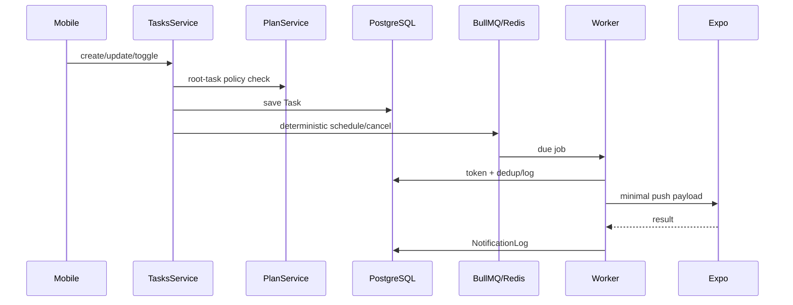
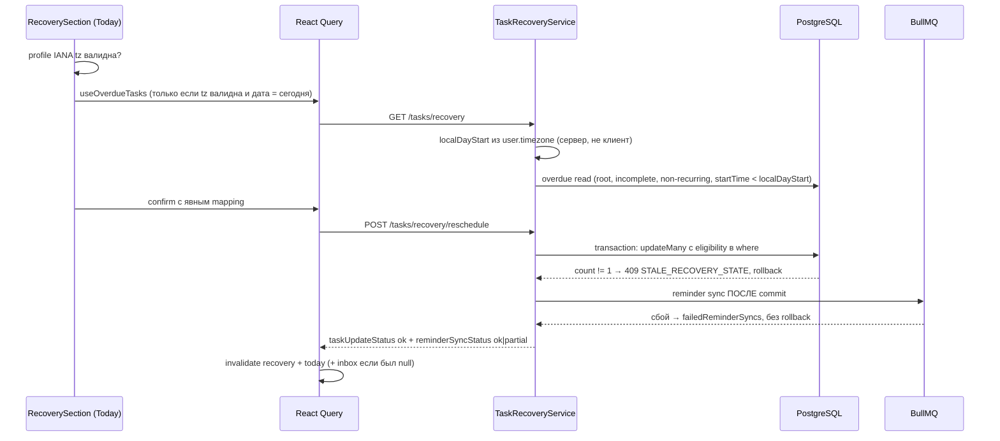

# Focus Engineering Handbook v5

> Единая книга проекта Focus ADHD planner. Это интегрированная карта знаний, а не копия исходных документов: подробности остаются в специализированных источниках, на которые здесь есть ссылки.

**Статус:** synthesis of current documentation.  
**Правило статуса:** `implemented` подтверждено текущими материалами; `planned` — roadmap; `incomplete` — модель или часть решения есть, но полный runtime-flow не завершён.

## Содержание

1. [Как читать](#1-как-читать)
2. [Продукт и системная модель](#2-продукт-и-системная-модель)
3. [Карта проекта](#3-карта-проекта)
4. [Карта модулей](#4-карта-модулей)
5. [Карта зависимостей](#5-карта-зависимостей)
6. [Карта потоков данных](#6-карта-потоков-данных)
7. [Архитектура и ADR](#7-архитектура-и-adr)
8. [Домены и lifecycle](#8-домены-и-lifecycle)
9. [API, backend и frontend](#9-api-backend-и-frontend)
10. [Authentication и безопасность](#10-authentication-и-безопасность)
11. [Database](#11-database)
12. [Deployment](#12-deployment)
13. [Проект за 30 минут](#13-проект-за-30-минут)
14. [Безопасное изменение архитектуры](#14-безопасное-изменение-архитектуры)
15. [Безопасное внедрение функций](#15-безопасное-внедрение-функций)
16. [Как AI сопровождает проект](#16-как-ai-сопровождает-проект)
17. [Риски и technical debt](#17-риски-и-technical-debt)
18. [FAQ](#18-faq)
19. [Словарь и глоссарий](#19-словарь-и-глоссарий)
20. [Индекс](#20-индекс)
21. [Карта источников](#21-карта-источников)
22. [Проверка Handbook глазами нового Senior Developer](#22-проверка-handbook-глазами-нового-senior-developer)

---

## 1. Как читать

v5 отвечает на вопрос **«как связаны части проекта и какое правило применять»**. Канонические детали находятся в [System Bible](System-Bible.md), [Developer Bible](Developer-Bible.md), [AI Bible](AI-Bible.md), [Architecture](Architecture.md), [API](API.md), [Backend](Backend.md), [Frontend](Frontend.md), [Authentication](Authentication.md), [Database](Database.md), [Deployment](Deployment.md), [ADR](ADR/README.md) и [research](research/19-architecture-risk-report.md).

Если сведения расходятся, проверить ADR, research и затем code/tests согласно [Developer Bible](Developer-Bible.md). Planned-возможность не выдавать за runtime.

Главная формула:

> **User identity → Task lifecycle → Day projection → reminder/policy effects.**

Задачи — operational truth; day view — projection; notifications — side effect; Premium — policy; Auth — identity/session continuity.

## 2. Продукт и системная модель

Focus — mobile planner для людей с ADHD/executive dysfunction. Цель — уменьшить friction между намерением и действием: помочь начать, удержать и завершить действие.

| Возможность | Архитектурная форма | Статус |
|---|---|---|
| Планирование дня | `Task` → day projection | implemented |
| Напоминания | BullMQ/Redis → worker → Expo Push | implemented; требует hardening |
| Focus Session | session/participant model + runtime | incomplete |
| Premium | `FREE/PRO` entitlement policy | policy implemented; billing не подтверждён |



Не считать текущими границами `apps/web`, production hosting, CI/CD, monitoring, backup automation, полноценный Focus runtime, Daily.co orchestration или payment provider без отдельного подтверждения. См. [System Bible](System-Bible.md#18-known-gaps) и [ADR-001](ADR/ADR-001-current-boundaries.md).

## 3. Карта проекта

```text
apps/api/              NestJS API, Prisma, BullMQ/worker
apps/mobile/           Expo, React Native, Expo Router
packages/shared-types/ общие TypeScript-контракты
docs/                  архитектура, ADR, research, runbooks
docker-compose*.yml    локальные PostgreSQL + Redis
package.json           npm workspaces и root scripts
```

| Boundary | Владелец | Ответственность |
|---|---|---|
| Mobile | `apps/mobile` | routes, UI, client state, API integration |
| API | `apps/api` | HTTP, validation, auth, use cases |
| Shared | `packages/shared-types` | общие типы, не backend internals |
| Persistence | Prisma/PostgreSQL | durable source of truth |
| Async | BullMQ/Redis | delayed/retryable coordination, не task truth |
| External | Expo Push, OAuth; Daily planned | provider integration behind policy |

## 4. Карта модулей



Backend flow: `HTTP → Controller → DTO/Validation → Service/use case → PrismaService → PostgreSQL → queue/worker/provider`.

Mobile flow: `Expo Router screen → lib/api + React Query → api-client`; Zustand хранит только session/UI/transient state; SecureStore — токены.

Границы: Auth — identity/session; Users — profile/device; Tasks — CRUD/ownership/date/completion/subtasks/recurrence/reminder sync; Routines — templates; Notifications — jobs/delivery/dedup/logs; Plan — limits/entitlement; Focus — sessions, пока incomplete.

Tasks потребляет Plan и Notifications. При росте side effects предпочтительны events/ports, чтобы не образовать обратные feature imports. Детали: [Module Analysis](research/16-module-analysis.md), [Class Analysis](research/17-class-analysis.md), [Component Analysis](research/18-component-analysis.md).

## 5. Карта зависимостей



Перед новым импортом проверить dependency direction, возможный цикл, утечку Prisma type в DTO, дублирование server state в Zustand, timeout/retry/idempotency внешнего вызова. См. [Dependency Graph](research/13-dependency-graph.md) и [Call Graph](research/14-call-graph.md).

## 6. Карта потоков данных

### Синхронный request



### Task → reminder



Trust rules: JWT supplies identity; `userId` from client is not trusted; PostgreSQL owns durable state; Redis only coordinates jobs; push payload is allowlisted; timeline/current-next is recomputable projection. Полная версия: [Data Flow](research/15-data-flow.md).

### Overdue recovery (реализовано, ADR-008)



Инварианты потока: границу дня определяет сервер, клиентский `?date=` идёт только в cache key;
невалидная или отсутствующая профильная timezone блокирует запрос, подстановка `UTC`/device tz
запрещена; условия eligibility живут в `where` самой записи, а не в предварительном чтении;
частичный сбой напоминаний — это 200, а не ошибка, и он не откатывает перенос задач.

Дополнительные инварианты (0007A/0007C):

- **Canonical date key.** `toCanonicalDateParam(date, profileTimezone)` — единственный
  хелпер для Today-запроса, dated-мутаций и Recovery-инвалидации. Разные хелперы для
  разных путей давали разные ключи вокруг полуночи при device tz ≠ profile tz.
- **Today-only guard.** `RecoverySection` проверяет `!isToday` ДО `!timezoneValid`.
  На исторических датах компонент возвращает `null` — без запроса и без timezone-state.
  На сегодня с невалидной/отсутствующей timezone — нейтральный actionable state.
- **Strict absolute timestamp.** Destination принимает только абсолютный ISO-8601 инстант
  (`...Z` или `...±HH:MM`). Date-only и offsetless → HTTP 400. Destination строго >
  `referenceInstant` сервиса (equal-to-now и earlier-today → HTTP 422).
- **Privacy-safe observability.** Recovery log-lines содержат outcome, count,
  `latencyMs`, reminderSyncStatus (где применимо) и failureClass (где применимо).
  Никаких userId, taskId, task title, timezone, localDayStart, destinations или payloads в новых строках.
- **Authenticated integration.** `tasks.controller.recovery.auth-integration.spec.ts` —
  реальный `JwtAuthGuard` + `JwtStrategy` + `TasksController` + `TaskRecoveryService` с двумя
  различными users. Доказывает: 401 без токена, 401 неверный secret, 401 неизвестный subject,
  два токена → два разных identity (observable по `userTimezone` в ответе и `userId` в
  `updateMany` where), ownership в обоих направлениях, mixed-batch атомарность, 200 при
  сбое очереди. PostgreSQL/Redis e2e и device smoke **NOT verified** в текущей среде
  (нет Docker/Redis/Postgres).
- **Mock isolation.** В тестах с `jest.resetAllMocks()` (не `clearAllMocks`) очереди
  `mockResolvedValueOnce` очищаются между тестами. Тесты, отклоняемые ValidationPipe, не
  должны ставить очереди для сервиса — иначе неиспользованные значения утекают.

## 7. Архитектура и ADR

| ADR | Решение | Следствие |
|---|---|---|
| [001](ADR/ADR-001-current-boundaries.md) | API/mobile/shared/persistence/async boundaries | web и неподтверждённые integrations — planned |
| [002](ADR/ADR-002-nestjs-modular-api.md) | Nest modules/controllers/services | feature строится vertical slice |
| [003](ADR/ADR-003-prisma-postgresql-persistence.md) | Prisma + PostgreSQL | user-owned models и ownership indexes |
| [004](ADR/ADR-004-jwt-bearer-authentication.md) | JWT Bearer | Guard + `@CurrentUser()` |
| [005](ADR/ADR-005-expo-router-mobile-state-and-data.md) | Expo Router/React Query/Zustand | route, server/client state разделены |
| [006](ADR/ADR-006-bullmq-redis-expo-push-notifications.md) | queue + push | scheduling отдельно от delivery |
| [007](ADR/ADR-007-npm-workspaces-monorepo.md) | npm workspaces | root/shared workspace boundary |

Инварианты: user-owned data; ownership до mutation; thin controllers; DTO не Prisma model; day projection не truth; timezone — correctness; async idempotent/observable; Premium не меняет identity; secrets не логируются; shared types не становятся свалкой.

## 8. Домены и lifecycle

### User/session

`Anonymous → Registered/Authenticated → ProfileReady → ActiveUsage → Free/Pro → Deleted`. Mobile bootstrap читает secure storage и подтверждает `/auth/me`. См. [Authentication](Authentication.md) и [System lifecycle](System-Bible.md#7-user-lifecycle).

### Task

`Draft → Scheduled/Active → Completed | Deleted`; edit может reopen. При изменении проверять date projection, timezone, recurrence, parent/child ownership, quota и reminder state. Root-task limit не применять к subtask без явного policy.

Отдельный подпереход — `Overdue → Rescheduled | Inbox` (ADR-008, реализовано). Задача считается
overdue только если она root (`parentTaskId IS NULL`), незавершённая, не recurring, имеет
`startTime` и `startTime < localDayStart` в IANA-timezone пользователя. Инварианты перехода:

- destination задаётся исключительно явно — **абсолютный ISO-8601 инстант** (`...Z` или
  `...±HH:MM`) либо `null` (Inbox); date-only и offsetless datetime → HTTP 400;
  отсутствующий ключ `targetStartTime` — ошибка, а не «по умолчанию в Inbox»;
- destination строго > `referenceInstant` сервиса; equal-to-now и earlier-today → HTTP 422;
- сервер никогда не вычисляет destination сам и не переносит задачи молча;
- переход меняет только `startTime`; title, duration, color, recurrence metadata, parent relation
  и completion state сохраняются;
- eligibility проверяется в `where` самой записи, поэтому параллельное завершение задачи
  приводит к 409, а не к перезаписи;
- повторная отправка того же подтверждённого перехода не даёт второй записи и второго напоминания.

### Notification (recovery-специфика)

Напоминание остаётся производным от Task и синхронизируется после commit. Для recovery это значит:
`startTime` в будущем → reminder планируется; `null` или completed → отменяется. Сбой очереди после
commit не откатывает перенос, а отражается в `reminderSyncStatus: "partial"`. Автоматической
дозаписи или повторной синхронизации при следующем подключении клиента **нет** — UI обязан
говорить об этом честно.

### Notification

`TokenRegistered → JobScheduled → Delivered/Cancelled → Logged`. Нужны стабильный `jobId`, retry/backoff, дедупликация и очистка `DeviceNotRegistered` token. Reminder derived from Task.

### Focus

Модель предусматривает host/participants/room/timer/public-private, но полноценный controller/service/client runtime не подтверждён: статус `incomplete`.

### Premium

`FREE → limit/paywall → PRO → downgrade/expiry`. Сейчас это entitlement policy. Billing должен быть отдельным модулем, с provider id, signature verification и idempotent webhook.

## 9. API, backend и frontend

Новая функция проходит vertical slice:

```text
endpoint → DTO → Controller → Service → Module
         → shared contract → mobile api/hook → screen
```

Каждый endpoint описывает method/status, auth, request/response, errors, ownership и cache key. Controller не содержит Prisma и orchestration; Service получает identity из JWT context; DTO валидирует внешний ввод; mobile не делает raw axios/fetch.

React Query — server state, cache/invalidation и optimistic rollback. Zustand — session/UI. Expo Router — filesystem routes; private route требует auth gating. Детали: [API](API.md), [Frontend](Frontend.md), [Backend](Backend.md), [Developer API workflow](Developer-Bible.md#6-как-добавить-api).

### Референсный слайс: Guilt-Free Recovery

Реализованный пример полного прохода без кросс-доменного рефакторинга (всё внутри `TasksModule`):

```text
dto → controller (routes перед /tasks/:id) → TaskRecoveryService → shared-types
    → lib/timezone.ts → lib/api/tasks.ts (hooks) → RecoverySection → RecoveryBanner → tests → docs
```

Что этот слайс фиксирует как норму для новых функций:

- **Порядок маршрутов.** Литеральный сегмент (`/tasks/recovery`) объявляется до параметрического
  (`/tasks/:id`), иначе `ParseUUIDPipe` перехватит запрос и вернёт 400.
- **Слои валидации не дублируют, а дополняют друг друга.** DTO отсекает форму данных на транспорте
  (400), сервис сохраняет собственные guard-проверки (403/409/422) для прямых вызовов. Из-за этого
  одно и то же условие может иметь разный статус на разных слоях — это нужно документировать, а не
  «выравнивать».
- **Строгие boolean в query.** Только `"true"`/`"false"`; `enableImplicitConversion` не включать —
  он превращает `"false"` в `true` до `@Transform`.
- **Никаких silent defaults в контракте.** Отсутствующее поле — ошибка; «переместить в Inbox»
  выражается явным `null`.
- **Cache-контракт описывается вместе с endpoint.** Ключи и правила инвалидации:
  `['tasks','recovery',dateParam]`, `['tasks',dateParam]`, `['tasks','inbox']` (последний — только
  когда в batch есть `null`). Ошибка 409 инвалидирует recovery-ключ; остальные ошибки оставляют
  экран восстановимым.
- **Клиент не занимается арифметикой дат.** Границы дня приходят с сервера; на клиенте все
  вычисления идут через `lib/timezone.ts` (`date-fns-tz`), а не через `toISOString().slice(0,10)`
  или прибавление 24 ч.
- **HTTP-boundary тесты обязательны.** Изолированной проверки DTO недостаточно: реальные статусы и
  работу production `ValidationPipe` доказывают supertest-специ (`*.http.spec.ts`).
- **Authenticated integration отдельно от HTTP-boundary.** `*.http.spec.ts` переопределяет guard и
  не доказывает identity-mapping. Отдельный `*.auth-integration.spec.ts` держит реальный
  `JwtAuthGuard` + `JwtStrategy` + `TaskRecoveryService`, использует два разных JWT-subject и
  проверяет observable identity boundary (`prisma.user.findUnique` lookup id + `userId` в
  `updateMany` where). Неизвестный subject → `null` из БД → 401 без дополнительного кода.
- **Strict destination timestamp.** Destination — обязательно абсолютный ISO-8601 инстант
  (`...Z` или `...±HH:MM`). Date-only и offsetless отклоняет `@Matches(ABSOLUTE_ISO_INSTANT)`
  на DTO-слое (HTTP 400). Сервис дополнительно проверяет `dest > referenceInstant`: equal-to-now
  и earlier-today → HTTP 422. Отдельные слои, разные статусы — намеренно.
- **Privacy-safe observability.** Log-строки Recovery содержат только outcome, count,
  `latencyMs`, reminderSyncStatus (где применимо) и failureClass (где применимо). userId,
  taskId, task title, timezone, localDayStart, destinations и payloads недопустимы в новых
  recovery log-строках. Тест должен шпионить на `logger` и assertить как наличие разрешённых
  полей, так и отсутствие запрещённых идентификаторов.
- **Mock isolation: resetAllMocks vs clearAllMocks.** `jest.clearAllMocks()` сбрасывает call
  history, но НЕ очередь `mockResolvedValueOnce`. Тесты, отклоняемые ValidationPipe до вызова
  сервиса, не должны выставлять `mockResolvedValueOnce` для сервиса — иначе неиспользованные
  значения утекают в следующий тест. Используй `jest.resetAllMocks()` в `beforeEach`,
  затем восстанавливай нужные implementations.
- **PostgreSQL/Redis e2e и device smoke — NOT verified** в средах без этих сервисов.
  Фиксируй как явно непроверенное, а не как пройденное.

## 10. Authentication и безопасность

Поток: `register/login/OAuth → access+refresh → secure storage → /auth/me → guarded API`. JWT идентифицирует, но Service всё равно проверяет ownership.

Правила:

- private routes используют `JwtAuthGuard`;
- user берётся через `@CurrentUser()`, не из body/`:userId`;
- UUID/query/body проходят pipes/DTO/ValidationPipe;
- secrets, tokens и env не логируются/коммитятся;
- OAuth использует secure randomness, timeout и redacted logs;
- billing webhook проверяет подпись и idempotency;
- push payload не содержит PII без allowlist.

Риск-приоритет: production dev-upgrade guard, OAuth random/provider strategy, общий HTTP timeout/redaction. Источник: [Architecture Risk Report](research/19-architecture-risk-report.md).

## 11. Database

`User` — центр; `Task`, `Routine`, `FocusSession`, participants и `NotificationLog` — user-owned модели. `userId` и индексы поддерживают фильтрацию. Backend ходит к Prisma только через `PrismaService`; PostgreSQL — source of truth.

Schema workflow: изменить `schema.prisma` → именованная `prisma migrate dev` → `prisma generate` → проверить SQL/build/tests → commit schema+migration. Production: `prisma migrate deploy`; не переписывать applied migration и не подменять историю `db push`. Destructive change: backup → additive migration → backfill → compatible switch → cleanup. Timezone и serialized ISO dates — часть correctness. См. [Database](Database.md) и [Developer migration](Developer-Bible.md#8-как-добавить-миграцию).

## 12. Deployment

Локальный baseline (Windows):

```bat
npm install
copy .env.example .env
docker compose up -d
cd apps\api
npx prisma migrate dev
npx prisma generate
cd ..\..
npm run dev:api
```

В другом терминале — `npm run dev:mobile`; физическому телефону нужен LAN API address. Проверки: `docker compose ps`, `npm run build:api`, `npm run test:api`. При stale Prisma Client сначала `npx prisma generate`; baseline failure отделить от feature diff, не маскировать `as any`.

Не подтверждены как production capability: hosting topology, CI/CD, monitoring, backups, rollback и DR. Для них нужен отдельный runbook/ADR. Root `dev:web` не использовать: `apps/web` отсутствует. См. [Development](Development.md) и [Deployment](Deployment.md).

## 13. Проект за 30 минут

**0–5:** прочитать [раздел 2](#2-продукт-и-системная-модель) и [System Bible](System-Bible.md).  
**5–10:** открыть `apps/api`, `apps/mobile`, `packages/shared-types`, `AppModule`, `schema.prisma`.  
**10–15:** проследить `screen → lib/api → Controller → DTO → Service → Prisma` по [data flow](#6-карта-потоков-данных).  
**15–20:** прочитать [Authentication](Authentication.md) и ADR-005; разделить JWT/Zustand и React Query.  
**20–25:** запустить локальный baseline по [разделу 12](#12-deployment).  
**25–30:** прочитать [Risk Report](research/19-architecture-risk-report.md) и roadmap; для своей задачи назвать boundary, truth, ownership, side effects, migration и tests.

Результат: вы знаете, кто может изменить запись, где её истина, какой эффект запускается и какой документ обновляется.

## 14. Безопасное изменение архитектуры

До изменения: описать current/target boundary; прочитать ADR и graphs; найти callers/tests; зафиксировать endpoint, DTO, query keys, DB columns, job payload; оценить security, ownership, timezone, retry и rollback.

Безопасная последовательность:

```text
characterization test → additive contract/schema → compatible implementation
→ migrate callers/data → observe/rollback → remove deprecated path
```

Не совмещать breaking API, naming refactor и destructive migration. Для schema: additive → backfill → switch → cleanup. Для side effects: сначала определить owner, event/port и idempotency. Gate: нет неописанного цикла, нет потери ownership, старый client имеет transition path, tests/build/docs обновлены.

## 15. Безопасное внедрение функций

Перед coding ответить: какую friction проблему решаем; какой boundary владеет; что truth; какой contract/status/errors; как проверяется ownership; влияет ли Plan; какие sync/async effects; что при provider/Redis failure; нужна ли migration/timezone/index; какие positive/negative/forbidden/retry tests.

Порядок: contract/schema → DTO → Service policy/ownership → Controller/module → worker/adapter → mobile API/hook → route/screen → tests → API/Architecture/ADR docs.

Definition of Done: auth и ownership; validation; migration/generate; React Query вместо server state в Zustand; deterministic job/retry/dedup/logging; tests success/error/foreign ownership; `npm run build:api`; `npm run test:api`; smoke auth → today → task → notification; docs в том же PR. Полные шаблоны: [Developer Bible](Developer-Bible.md#3-общий-workflow-изменения).

## 16. Как AI сопровождает проект

AI — traceable engineering partner, не генератор уверенных предположений.

**До предложения:** прочитать v5 и релевантный source doc; использовать существующий research вместо повторного code analysis; определить boundary/status/assumptions; проверить ADR/risk/debt.

**Во время:** минимальный diff; не смешивать baseline; не обходить security/validation; сохранять ownership, idempotency, timezone и state separation; обновлять docs/ADR.

**После:** self-review readability/modularity/testability/domain alignment; build/tests; проверить ссылки и implemented/planned/incomplete; явно назвать gaps и rollback.

Протокол: `Goal → boundary → evidence → plan → diff → verification → risks/rollback → docs`. Нормативные материалы: [AI Bible](AI-Bible.md), [AI Guide](AI-Guide.md), [AI decisions](ai/DECISIONS.md).

## 17. Риски и technical debt

| Приоритет | Риск | Направление |
|---|---|---|
| Critical | dev-upgrade может обойти entitlement | production guard + test |
| High | OAuth randomness/provider strategy | secure random, единый strategy, contract tests |
| High | внешний HTTP без timeout/redaction | общий client с timeout/retry |
| High | oversized `today`/`task-form` screens | декомпозиция |
| Medium | Tasks coupling с Plan/Notifications/recurrence | events/handlers/ports |
| Medium | direct Prisma everywhere | постепенно repository interfaces |
| Medium | `any` и date casts | API response types + mappers |
| Medium | PII в push payload | allowlist + snapshot tests |
| Low | cycles/dead artifacts/theme drift | dependency guard, hygiene, shared tokens |

Это синтез [Risk Report](research/19-architecture-risk-report.md) и [Technical Debt Roadmap](Technical-Debt-Roadmap.md), не новый аудит. Guardrails: madge/dependency-cruiser; ESLint security/theme rules; Jest/e2e entitlement/OAuth/push; typed date mapping; Redis-off smoke test.

## 18. FAQ

**Где source of truth?** PostgreSQL через services; для operational task state — `Task`.  
**Можно ли передать userId из mobile?** Нет, identity только JWT/`@CurrentUser()`.  
**Где tasks на mobile?** React Query; Zustand не дублирует server state.  
**Что при Redis outage?** Task CRUD может сохраниться; reminder — вторичный effect, ошибка должна быть наблюдаемой.  
**Есть ли web?** Нет подтверждённого `apps/web`; planned.  
**Есть ли billing?** Есть Free/Pro policy, provider/webhook не подтверждены.  
**Есть ли Focus Session?** Data model есть, runtime incomplete.  
**Как сделать breaking change?** Additive contract → migrate callers/data → deprecate → remove, с ADR.  
**Что при baseline build failure?** Зафиксировать baseline, `prisma generate`, отделить от feature; не отключать TypeScript.  
**Как обозначить неизвестное?** `planned`, `incomplete`, `не подтверждено`, а не уверенное «реализовано».

## 19. Словарь и глоссарий

| Термин | Значение |
|---|---|
| API boundary | NestJS HTTP-граница `apps/api` |
| Auth boundary | identity/session lifecycle, JWT, refresh, OAuth |
| client state | UI/session state, обычно Zustand |
| day projection | вычисляемое представление tasks для дня/timezone |
| DTO | validated external contract, не Prisma model |
| entitlement/Plan policy | право или ограничение `FREE/PRO` |
| Focus Session | structured room/session с participants; runtime incomplete |
| ownership | user читает/меняет только свои records |
| projection | derived representation из truth |
| reminder | task-derived prompt |
| server state | API data/cache, React Query |
| side effect | queue, push, log или external call после primary operation |
| source of truth | authoritative persisted state |
| task | unit of intention/execution; root/subtask, scheduled/recurring |
| vertical slice | endpoint → DTO → service → module → client → UI |
| worker | async job processor |
| idempotency | безопасный повтор без двойного результата |
| backfill | заполнение данных при migration |
| observability | logs/metrics/traces, позволяющие понять outcome |

Англо-русские пары: `ownership — владение`, `side effect — производный эффект`, `projection — проекция`, `policy — политика`, `source of truth — источник истины`, `guard — страж/защитный middleware`, `friction — трение между намерением и действием`.

## 20. Индекс

- **ADR:** [7](#7-архитектура-и-adr), [21](#21-карта-источников)
- **AI:** [16](#16-как-ai-сопровождает-проект)
- **API:** [9](#9-api-backend-и-frontend)
- **Authentication/JWT:** [10](#10-authentication-и-безопасность)
- **Backend/NestJS:** [4](#4-карта-модулей), [9](#9-api-backend-и-frontend)
- **BullMQ/Redis:** [5](#5-карта-зависимостей), [6](#6-карта-потоков-данных)
- **Database/Prisma:** [11](#11-database)
- **Deployment:** [12](#12-deployment)
- **Developer onboarding:** [13](#13-проект-за-30-минут)
- **Focus Session:** [2](#2-продукт-и-системная-модель), [8](#8-домены-и-lifecycle)
- **Frontend/Expo Router:** [9](#9-api-backend-и-frontend)
- **Ownership:** [7](#7-архитектура-и-adr), [10](#10-authentication-и-безопасность), [15](#15-безопасное-внедрение-функций)
- **Premium/Plan:** [2](#2-продукт-и-системная-модель), [8](#8-домены-и-lifecycle), [17](#17-риски-и-technical-debt)
- **Risk Report:** [17](#17-риски-и-technical-debt)
- **Task lifecycle:** [2](#2-продукт-и-системная-модель), [8](#8-домены-и-lifecycle)
- **Technical Debt Roadmap:** [17](#17-риски-и-technical-debt)
- **Timezone:** [6](#6-карта-потоков-данных), [11](#11-database)

## 21. Карта источников

Использованы все документы проекта как группы знаний:

- Основные книги: [Engineering Handbook](Engineering-Handbook.md), [System Bible](System-Bible.md), [Developer Bible](Developer-Bible.md), [AI Bible](AI-Bible.md), [AI Guide](AI-Guide.md).
- Технические области: [Architecture](Architecture.md), [Backend](Backend.md), [Frontend](Frontend.md), [API](API.md), [Authentication](Authentication.md), [Database](Database.md), [Deployment](Deployment.md), [Development](Development.md), [Git Workflow](Git-Workflow.md), [docs README](README.md).
- ADR: [ADR README](ADR/README.md), [ADR-001](ADR/ADR-001-current-boundaries.md), [ADR-002](ADR/ADR-002-nestjs-modular-api.md), [ADR-003](ADR/ADR-003-prisma-postgresql-persistence.md), [ADR-004](ADR/ADR-004-jwt-bearer-authentication.md), [ADR-005](ADR/ADR-005-expo-router-mobile-state-and-data.md), [ADR-006](ADR/ADR-006-bullmq-redis-expo-push-notifications.md), [ADR-007](ADR/ADR-007-npm-workspaces-monorepo.md).
- Research: [Dependency Graph](research/13-dependency-graph.md), [Call Graph](research/14-call-graph.md), [Data Flow](research/15-data-flow.md), [Module Analysis](research/16-module-analysis.md), [Class Analysis](research/17-class-analysis.md), [Component Analysis](research/18-component-analysis.md), [Architecture Risk Report](research/19-architecture-risk-report.md).
- AI/project state: [DECISIONS](ai/DECISIONS.md), [IMPLEMENTATION_STATE](ai/IMPLEMENTATION_STATE.md), [IMPLEMENTATION_STATE_v2](ai/IMPLEMENTATION_STATE_v2.md), [NEXT_STEPS](ai/NEXT_STEPS.md), [NEXT_STEPS_v2](ai/NEXT_STEPS_v2.md), [TESTING_DAY_NAVIGATION](ai/TESTING_DAY_NAVIGATION.md).
- Roadmap: [Technical Debt Roadmap](Technical-Debt-Roadmap.md).

Документы вне `docs/` являются operational context, но canonical architecture knowledge берётся из перечисленных источников и ADR.

## 22. Проверка Handbook глазами нового Senior Developer

Этот раздел — практическая проверка самой документации. Она выполнена **только по v5**, без обращения к исходному коду. Формулировка «достаточно» означает, что новый разработчик может безопасно начать действие, не угадывая критическое архитектурное правило. Формулировка «частично» означает, что направление понятно, но для выполнения нужен отдельный runbook или source document.

### 22.1 Как запустить проект

**Ответ по Handbook:** для локального baseline выполнить:

```bat
npm install
copy .env.example .env
docker compose up -d
cd apps\api
npx prisma migrate dev
npx prisma generate
cd ..\..
npm run dev:api
```

В отдельном терминале запустить `npm run dev:mobile`. Для физического устройства использовать LAN API address. После запуска проверить `docker compose ps`, `npm run build:api` и `npm run test:api`.

**Достаточно ли документации? Частично.** Команды и общий порядок есть, но запуск не полностью воспроизводим для нового человека.

**Конкретные пробелы:**

- нет списка обязательных инструментов и минимальных версий Node/npm/Docker/Expo;
- не указано, какие значения нужно заполнить в `.env`, какие из них обязательны только для API, OAuth, Redis, PostgreSQL или push;
- не указаны фактические порты, API base URL и способ выбрать LAN address;
- не описано, запускается ли notification worker отдельной командой или вместе с API;
- нет таблицы ожидаемых health/readiness признаков и типичных ошибок запуска;
- нет отдельного smoke-flow после старта: auth → `/auth/me` → task → day view.

**Предлагаемая структура дополнения:** `Prerequisites` → `Environment matrix` → `Services and ports` → `Startup commands` → `Health checks` → `Mobile device/network setup` → `Troubleshooting` → `Shutdown/reset`.

### 22.2 Как добавить новую функцию

**Ответ по Handbook:** идти vertical slice: `endpoint → DTO → Controller → Service → Module → shared contract → mobile api/hook → screen`. До coding определить boundary, source of truth, ownership, Plan policy, sync/async effects, failure behavior, migration/timezone/index и тесты. Затем пройти Definition of Done: validation, auth, ownership, migration/generate, React Query, deterministic jobs, tests, build, smoke и документация.

**Достаточно ли документации? Частично, ближе к достаточно для архитектурного дизайна.** Правильный порядок и инварианты понятны, но реализация новой функции потребует дополнительных конкретных соглашений.

**Конкретные пробелы:**

- нет шаблона feature brief с обязательными полями и примером заполнения;
- не указано, где размещать DTO, controller, service, module, mobile hook и тесты;
- не определены обязательные HTTP status codes, формат ошибок и правила именования endpoint/cache key;
- не описано, когда нужен ADR, а когда достаточно обновить API/Architecture/roadmap;
- нет explicit checklist для ownership-negative tests, retry/idempotency tests и rollback;
- не показан пример полного vertical slice для одной существующей capability.

**Предлагаемая структура дополнения:** `Feature brief template` → `Backend file placement` → `API contract template` → `Persistence/async decision` → `Mobile integration` → `Test matrix` → `Documentation and ADR decision` → `Definition of Done`.

### 22.3 Где находится логика авторизации

**Ответ по Handbook:** логика распределена по Auth boundary: `register/login/OAuth → access+refresh → secure storage → /auth/me → guarded API`. Private endpoints используют `JwtAuthGuard`, controller извлекает пользователя через `@CurrentUser()`, а service дополнительно проверяет ownership. Mobile хранит токены в SecureStore, session/UI — в Zustand.

**Достаточно ли документации? Частично.** Концептуальная ответственность ясна, но новый разработчик не сможет быстро найти конкретную реализацию и безопасно изменить auth flow без дополнительной карты.

**Конкретные пробелы:**

- нет таблицы `Auth responsibility → module/file/document owner`;
- не описаны точные access/refresh token TTL, rotation/revocation и поведение при expiry;
- не описаны register/login/OAuth error cases, linking existing users и provider-specific mapping;
- не указано, где находится route guard/bootstrap на mobile и как обрабатывается logout;
- не определено, какие endpoints public/private и как добавлять новый auth strategy;
- нет auth test matrix: unauthenticated, expired token, foreign ownership, OAuth failure и refresh race.

**Предлагаемая структура дополнения:** `Auth map` → `Token lifecycle` → `Public/private endpoint policy` → `Mobile bootstrap/logout` → `OAuth provider flow` → `Ownership enforcement` → `Security failure modes` → `Auth tests`.

### 22.4 Как проходит поток данных

**Ответ по Handbook:** mobile screen вызывает React Query/api-client, запрос идёт по HTTPS с Bearer JWT в controller, DTO и `CurrentUser` формируют доверенный input, service выполняет ownership-aware операцию через PrismaService/PostgreSQL, response возвращается в typed cache. Для reminder Task operation отдельно планирует deterministic BullMQ job, worker читает token/dedup state, вызывает Expo и пишет NotificationLog.

**Достаточно ли документации? Для архитектурной ориентации — да; для диагностики runtime — частично.** Синхронный и async flows показаны, но не хватает operational details.

**Конкретные пробелы:**

- нет одного concrete request/response/error примера от mobile до database и обратно;
- не описаны transaction boundaries и поведение при частичном сбое после записи Task;
- не указаны React Query key/invalidation/optimistic rollback conventions;
- не описаны queue retry/backoff limits, dead-letter/failure handling и recovery;
- не определены correlation/request/job IDs и минимальный набор observability fields;
- не описано, какие данные являются projection и как она пересчитывается при timezone/recurrence changes.

**Предлагаемая структура дополнения:** `Request contract example` → `Trust boundaries` → `Transaction boundary` → `Cache lifecycle` → `Async delivery/retry` → `Failure and recovery matrix` → `Observability` → `Projection rebuild rules`.

### 22.5 Как устроена база данных

**Ответ по Handbook:** PostgreSQL через Prisma — durable source of truth; `User` — центральная сущность, user-owned модели включают `Task`, `Routine`, `FocusSession`, participants и `NotificationLog`. Доступ идёт через `PrismaService`, ownership поддерживается `userId` и индексами. Изменения проходят через named migration, generate, build/tests; destructive changes — additive → backfill → switch → cleanup.

**Достаточно ли документации? Нет, только для понимания принципов.** Для изменения схемы или расследования связи данных нужна отдельная schema reference.

**Конкретные пробелы:**

- нет ER/data model diagram;
- нет таблицы моделей с ключевыми полями, nullable/required, enum и ownership rule;
- не перечислены relations, cascade/restrict behavior, unique constraints и индексы;
- не указано, где находится `schema.prisma`, migration directory и seed workflow;
- не описаны timezone storage convention, ISO serialization и recurrence representation достаточно конкретно;
- нет migration safety examples для rename, split, nullable-to-required и rollback/backup.

**Предлагаемая структура дополнения:** `Schema map` → `Model reference` → `Relations and constraints` → `Ownership/index matrix` → `Time/date rules` → `Migration workflow` → `Backup/rollback` → `Data integrity tests`.

### 22.6 Где искать риски

**Ответ по Handbook:** начать с [Architecture Risk Report](research/19-architecture-risk-report.md), затем сверить [Technical Debt Roadmap](Technical-Debt-Roadmap.md) и раздел [17](#17-риски-и-technical-debt). В текущем приоритете: entitlement guard, OAuth randomness/provider strategy, HTTP timeout/redaction, oversized mobile screens, coupling Tasks с Plan/Notifications, direct Prisma, weak typing/date casts, PII в push и dependency cycles.

**Достаточно ли документации? Частично.** Известные risk areas и направления исправления перечислены, но нет процесса работы с новым риском.

**Конкретные пробелы:**

- нет risk register с owner, likelihood, impact, status, due date и evidence;
- не определены severity criteria и правила эскалации Critical/High;
- нет связи risk → affected boundary → detection → mitigation → rollback;
- не описано, где фиксировать новый риск и кто утверждает закрытие;
- отсутствует release/security gate перед изменениями auth, schema, async и external providers;
- не разделены confirmed finding, hypothesis, accepted debt и resolved risk.

**Предлагаемая структура дополнения:** `Risk taxonomy` → `Risk register schema` → `Severity and escalation` → `Risk triage workflow` → `Release gates` → `Evidence/verification` → `Debt acceptance and closure`.

### 22.7 Итог проверки достаточности

| Вопрос | Достаточность v5 | Что можно сделать сейчас | Главный недостающий слой |
|---|---|---|---|
| Запуск | Частично | начать локальный baseline | reproducible environment/runbook |
| Новая функция | Частично | спроектировать vertical slice | concrete placement/contracts/tests |
| Авторизация | Частично | понять boundary и invariants | auth implementation map/token lifecycle |
| Поток данных | Частично | проследить основные sync/async paths | runtime failure/observability details |
| База данных | Недостаточно для schema work | понять persistence principles | schema/model reference |
| Риски | Частично | найти current risk priorities | triage/register/release gates |

Эти выводы не меняют существующие архитектурные утверждения и не заменяют source documents. Они фиксируют, какую практическую информацию должен добавить следующий documentation pass.

## Заключение

Focus следует понимать не как набор экранов, а как управляемый поток: identity создаёт доверенный контекст, tasks хранят operational truth, day projection делает состояние пригодным для действия, reminders добавляют prompt, а plan policy ограничивает доступ без изменения identity. Безопасное развитие проекта — это сохранение границ, трассируемые ADR/графы/тесты и честное разделение `implemented`, `planned` и `incomplete`.
