# System Bible

## 1. Purpose

Это не справочник по коду, а операционная карта системы.

Если в проект приходит новый Senior Developer, он должен понять:

- какую проблему решает продукт;
- какие сущности являются центральными;
- как пользователь проходит через систему от первого запуска до регулярного использования;
- как устроены задачи, уведомления, Focus Session и Premium;
- какие подсистемы синхронные, а какие асинхронные;
- где заканчивается ответственность каждого модуля;
- какие компоненты являются системно-критическими.

---

## 2. Business Domain

Система — это personal productivity platform для людей с ADHD / executive dysfunction, где главная ценность не в «списке дел», а в снижении friction между намерением и действием.

Продукт решает четыре доменные проблемы:

1. **Планирование дня** — пользователь видит задачи не как абстрактный backlog, а как временную структуру дня.
2. **Напоминания** — система подталкивает к старту задачи в нужный момент.
3. **Body doubling / Focus Session** — пользователь может работать в структурированном совместном фокус-пространстве.
4. **Premium gating** — продукт управляет ограничениями free tier и расширением возможностей через Pro.

Главная продуктовая идея:

> система должна помогать начать, удержать и завершить действие, а не просто хранить данные.

---

## 3. System Mental Model

Система строится вокруг одной базовой оси:

**User → Tasks → Day View → Reminder/Focus/Premium effects**

Это означает:

- всё начинается с авторизованного пользователя;
- задачи — основной рабочий объект;
- интерфейс дня — это производное представление задач;
- напоминания и лимиты — это не отдельные пользовательские сущности, а поведенческие надстройки над task lifecycle;
- Focus Session — отдельный domain stream, но он концептуально продолжает ту же идею: помочь начать и удержать фокус;
- Premium не является самоцелью; он меняет политику доступа к продукту.

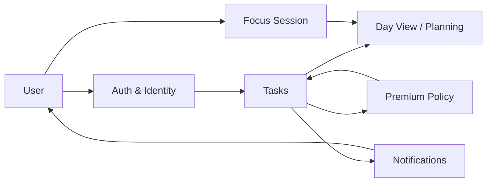

---

## 4. Core Domain Entities

### User

User — это центр системы. У него есть:

- identity: email / phone / OAuth identity;
- session state: JWT access + refresh;
- profile state: timezone, onboarding status, push token;
- plan state: Free / Pro;
- ownership boundary: все рабочие сущности принадлежат конкретному user.

### Task

Task — базовая единица намерения и исполнения.

Task может быть:

- scheduled или unscheduled;
- completed или active;
- root task или subtask;
- recurring или one-off.

### Routine

Routine — шаблон повторяющегося поведения, но не сама исполненная задача.

### NotificationLog

NotificationLog фиксирует факт попытки доставки и помогает дедуплицировать уведомления.

### FocusSession

FocusSession — структурированная сессия совместного фокуса, рассчитанная на host + participants + room.

### FocusSessionParticipant

Связующая сущность между session и user. Она хранит факт участия и временные границы входа/выхода.

### Plan

Plan — состояние коммерческой политики пользователя: Free или Pro.

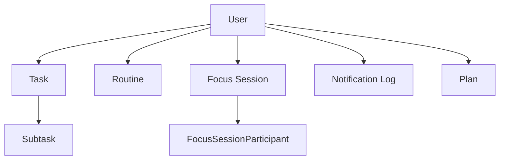

---

## 5. Central Components

Центральные компоненты системы:

1. **Mobile client** — инициирует все пользовательские действия.
2. **API boundary** — принимает запросы, валидирует и применяет security rules.
3. **Auth boundary** — отвечает за identity, session issuance и refresh.
4. **Task domain** — главный бизнес-модуль.
5. **Plan domain** — контролирует free/pro behavior.
6. **Notifications subsystem** — асинхронная доставка reminders.
7. **Persistence layer** — источник истины.
8. **External providers** — Expo Push API, OAuth providers, потенциально Daily.co.

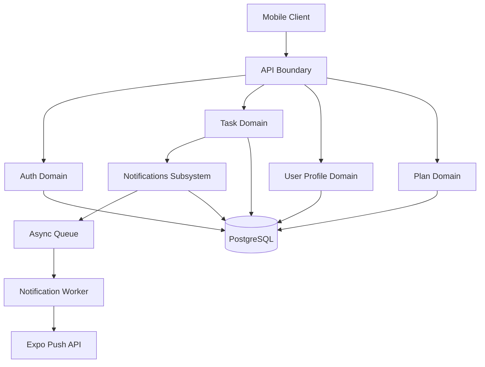

---

## 6. Responsibility Boundaries

### Auth boundary

Отвечает только за identity and session lifecycle:

- registration;
- login;
- refresh;
- current-user resolution;
- OAuth account linking;
- JWT validation.

Не отвечает за задачи, уведомления или подписки.

### User boundary

Отвечает за профиль и device registration:

- timezone;
- onboarding completion;
- expo push token;
- account deletion.

### Task boundary

Отвечает за task CRUD, ownership, date filtering, completion state, subtasks и reminder synchronization.

### Notifications boundary

Отвечает за job scheduling, delivery, deduplication, dead-token cleanup и notification logs.

### Plan boundary

Отвечает за policy enforcement:

- free tier limits;
- plan info;
- pro promotion / downgrade.

### Focus boundary

Фактически доменная модель уже существует, но runtime boundary ещё не полностью реализована. Это важно: модель есть, но жизненный цикл ещё не доведён до полноценного production flow.

---

## 7. User Lifecycle

Жизненный цикл пользователя состоит из следующих фаз:

1. **First contact** — пользователь открывает приложение.
2. **Authentication** — регистрация или логин.
3. **Bootstrap** — приложение поднимает сессию из secure storage.
4. **Profile enrichment** — timezone, onboarding flag, push token.
5. **Daily usage** — просмотр дня, создание задач, completion, reminders.
6. **Plan transition** — Free → Pro или Pro → Free.
7. **Account lifecycle end** — удаление аккаунта.

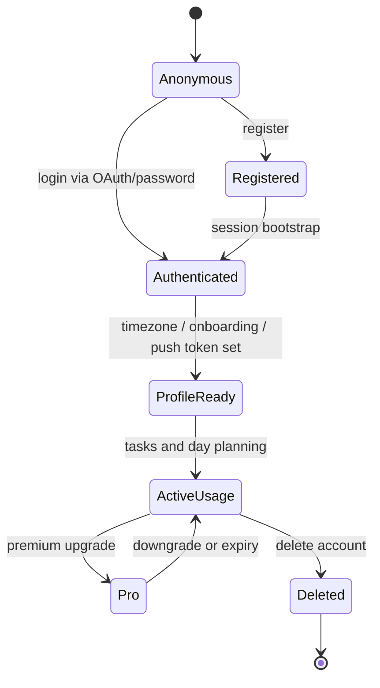

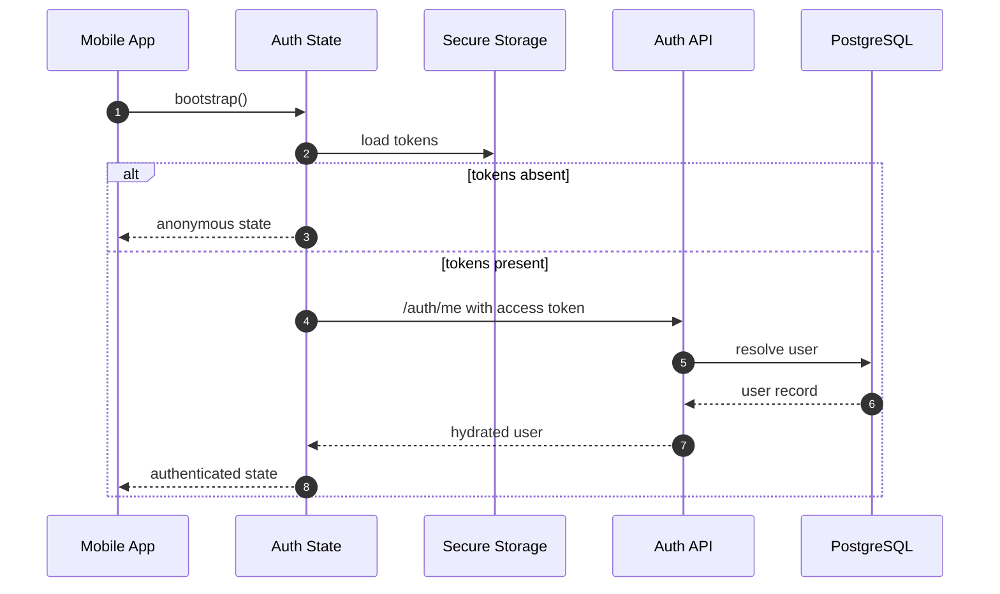

---

## 8. Task Lifecycle

Task lifecycle — самая важная бизнес-история системы.

### Фазы

1. **Creation**
   - пользователь создаёт задачу вручную или через quick add;
   - задача может быть root task или subtask.

2. **Classification**
   - scheduled / unscheduled;
   - recurring / one-off;
   - active / completed.

3. **Planned execution**
   - система показывает задачу в day view;
   - timezone влияет на выборку дня;
   - current/next task вычисляются на клиенте.

4. **Reminder synchronization**
   - если задача имеет время старта и не завершена, создаётся reminder job;
   - если задача завершена, reminder снимается.

5. **Progress transition**
   - toggle completion;
   - update title/time/duration/color/recurrence;
   - delete task.

6. **Deletion or archival by disappearance**
   - после удаления задача исчезает из day view;
   - reminder job также отменяется.

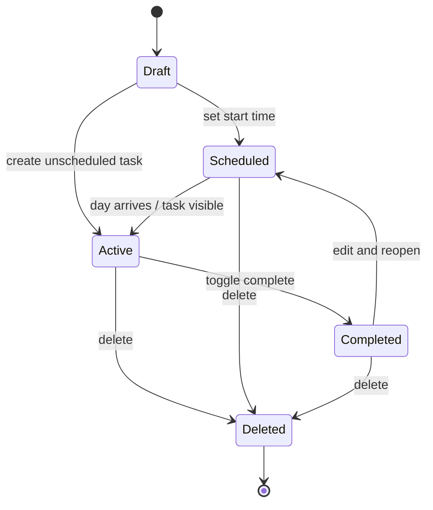

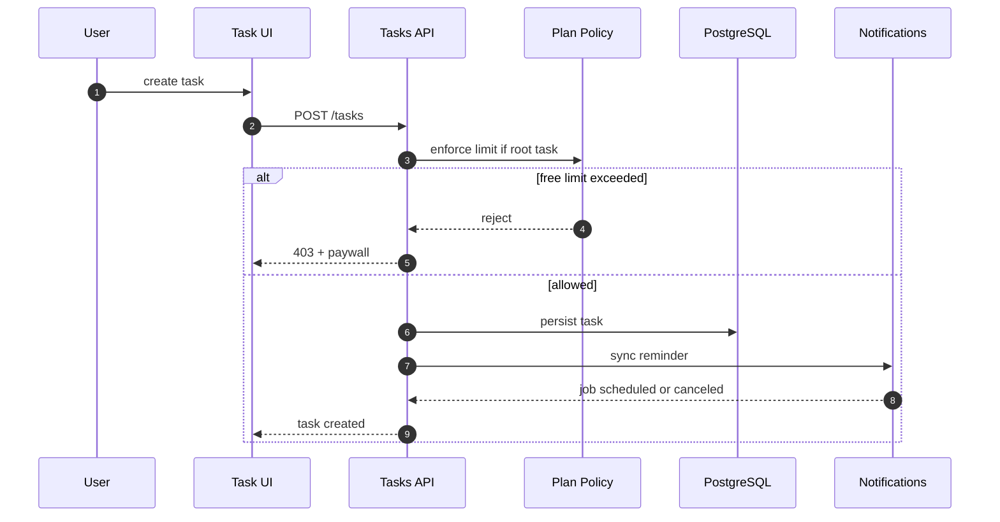

### Task invariants

- task belongs to exactly one user;
- subtask belongs to one parent task;
- reminder exists only when task is relevant and schedulable;
- free-tier limit is checked only for root tasks;
- ownership is validated before read/update/delete.

---

## 9. Notification Lifecycle

Notification lifecycle is asynchronous and reliability-oriented.

### Phases

1. **Device registration** — mobile app registers Expo push token after auth.
2. **Job scheduling** — task create/update/toggle creates or cancels reminder job.
3. **Delay waiting** — job sits in queue until scheduled execution time.
4. **Delivery attempt** — worker resolves token and sends push via Expo.
5. **Outcome recording** — delivery attempt is logged.
6. **Token healing** — invalid push token may be cleaned from user profile.
7. **Deduplication** — recent duplicate deliveries are suppressed.

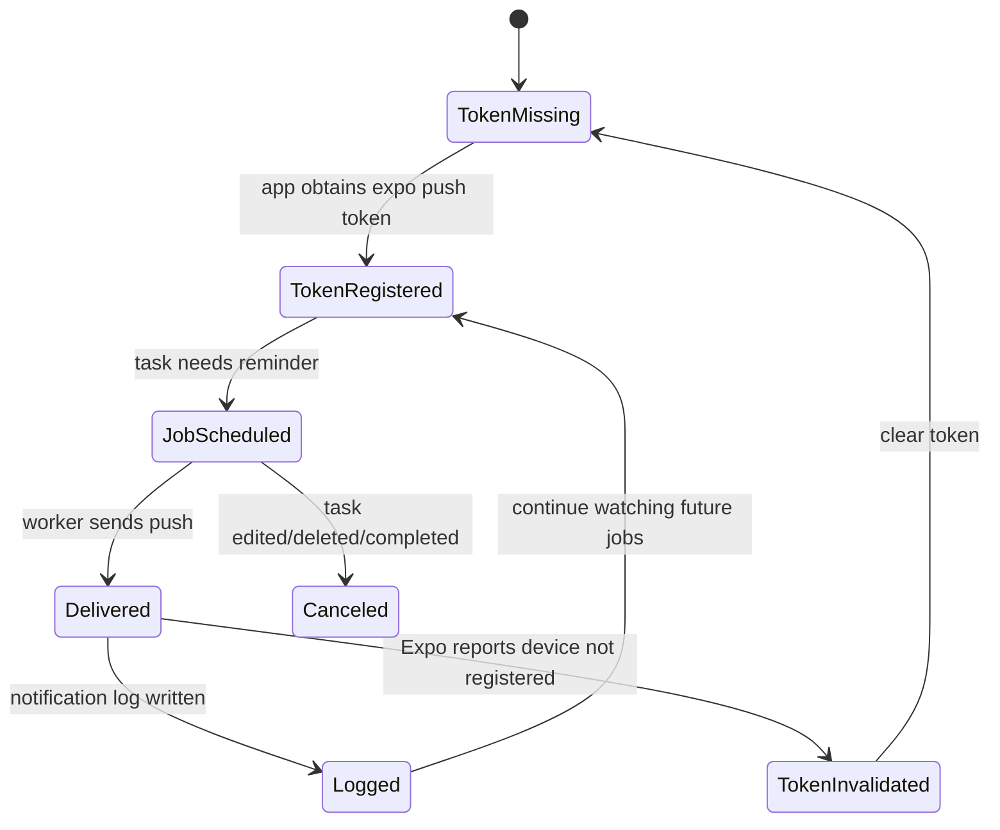

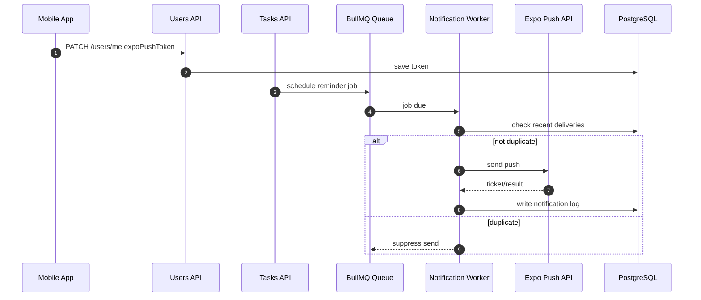

### Notification invariants

- reminders are derived from tasks, not independent user actions;
- worker must be idempotent under retries;
- delivery status is observable via notification log;
- token cleanup is part of delivery failure recovery.

---

## 10. Focus Session Lifecycle

Focus Session — domain, который уже заложен в данных, но runtime ещё не доведён до полноценной реализации.

### Intended model

- host creates a session;
- session may be public or private;
- users join as participants;
- session has room URL, timer and participant cap;
- session ends either explicitly or by time.

### Current reality

- доменные модели существуют;
- полноценный controller/service/client flow пока не найден;
- поэтому текущий runtime lifecycle считается **incomplete**.

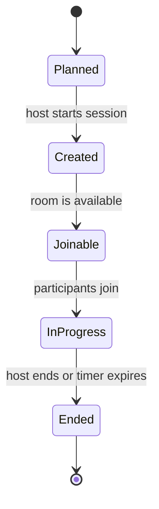

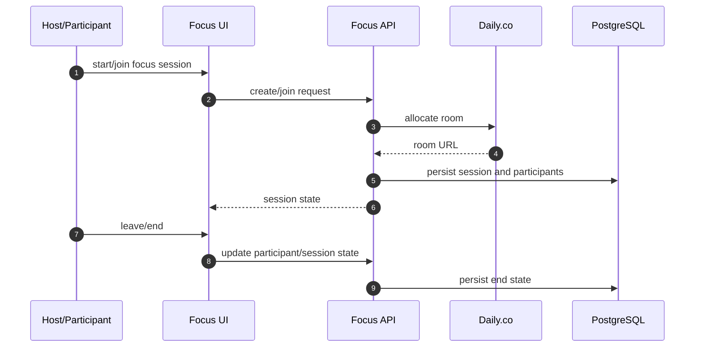

### Focus Session gap

Важно понимать различие между **data model** и **runtime capability**:

- data model уже фиксирует сущности и отношения;
- runtime behavior ещё требует полноценного orchestration layer;
- поэтому для Focus Session система находится между design and implementation.

---

## 11. Premium Lifecycle

Premium — это политика доступа, а не просто статус в UI.

### Phases

1. **Free** — базовый режим с ограничениями.
2. **Usage check** — при создании root task система проверяет лимит.
3. **Upgrade** — пользователь получает Pro и снимает лимит.
4. **Pro usage** — расширенная работа без free-tier block.
5. **Downgrade / expiry** — возврат в Free policy.

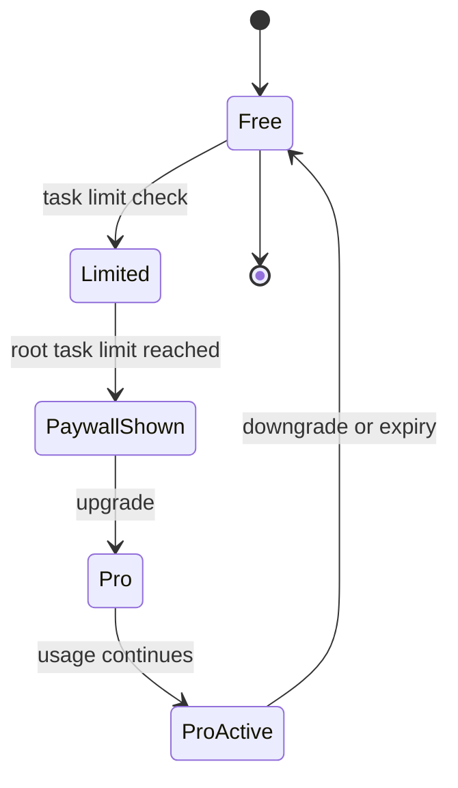

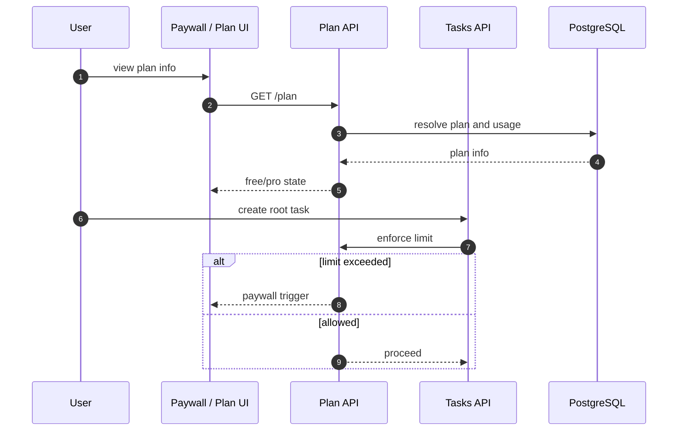

### Premium invariant

Premium changes policy, not identity.

- user remains the same;
- tasks remain owned by the same user;
- only business rules differ;
- plan transition must never corrupt task ownership or notification state.

---

## 12. How Subsystems Interact

### Synchronous interactions

- mobile client calls API endpoints;
- controllers validate request shape;
- services apply rules and read/write database;
- responses return immediately to UI.

### Asynchronous interactions

- reminder jobs are scheduled into queue;
- worker delivers push notifications later;
- notification logs preserve evidence of delivery;
- retries are handled without blocking task CRUD.

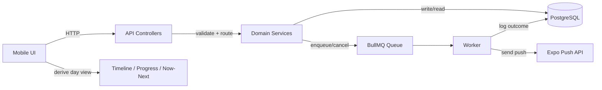

### Cross-domain coupling rules

1. **Tasks may depend on Plan**, because product policy affects task creation.
2. **Tasks may depend on Notifications**, because reminders are a derived side effect.
3. **Notifications must not own task truth** — they only consume task state.
4. **Users own the identity boundary** — every other domain references user through ownership.
5. **Focus should not leak into Tasks/Plan/Auth except through shared identity and policy rules.**

---

## 13. Architecture Diagram — Component View

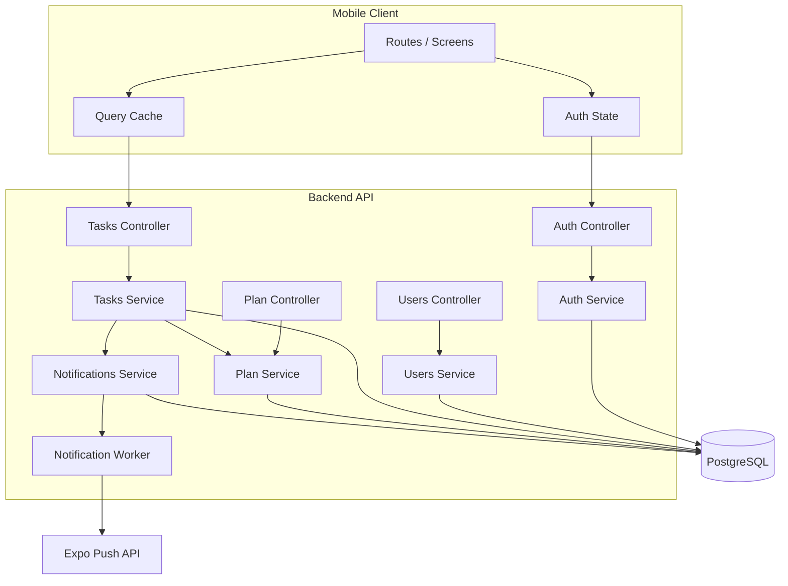

---

## 14. Architecture Diagram — Deployment View

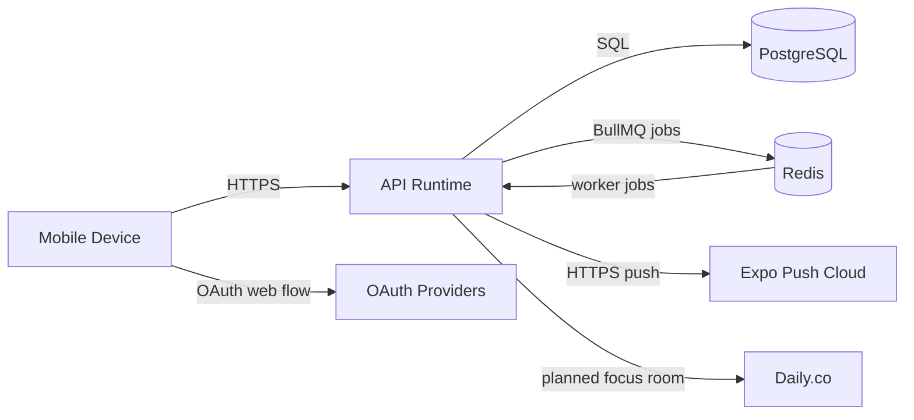

### Deployment interpretation

- mobile runs on device;
- API runs as backend runtime;
- PostgreSQL is the source of truth;
- Redis is the async coordination layer;
- Expo Push is the external delivery channel;
- OAuth providers are authentication partners;
- Daily.co is a planned collaboration provider for Focus Sessions.

---

## 15. Architectural Invariants

These rules define the system’s safe boundaries.

1. **All protected data is user-owned.**
2. **Controllers do not contain business orchestration beyond request translation.**
3. **Services own business rules and persistence orchestration.**
4. **Notifications are derived effects, not primary truth.**
5. **Premium policies must gate behavior, not identity.**
6. **Day view is a projection of tasks, not an independent source of truth.**
7. **Timezone is part of correctness, not cosmetic metadata.**
8. **Ownership checks are mandatory before mutation.**
9. **Focus runtime must not be confused with its schema presence.**

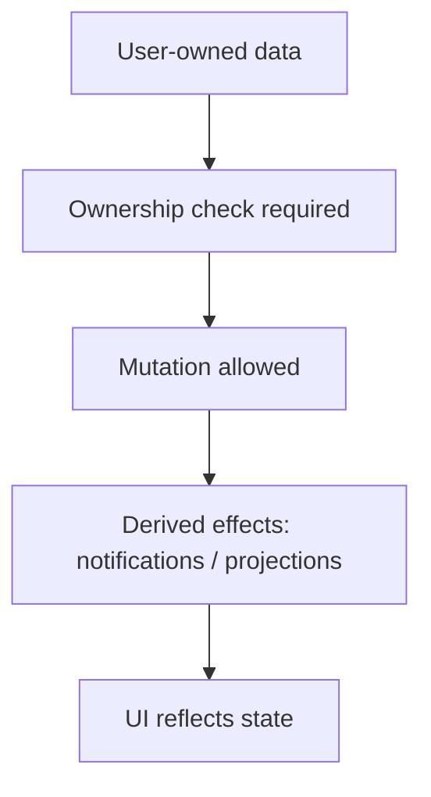

---

## 16. What Is Truly Central

Если упростить систему до ядра, центральны следующие элементы:

1. **User identity** — без неё система не существует.
2. **Task lifecycle** — главный рабочий процесс.
3. **Day projection** — UI-форма, через которую пользователь воспринимает задачу.
4. **Reminder engine** — превращает задачу в своевременный prompt.
5. **Plan policy** — определяет доступные границы поведения.
6. **Auth/session layer** — удерживает непрерывность пользовательского опыта.

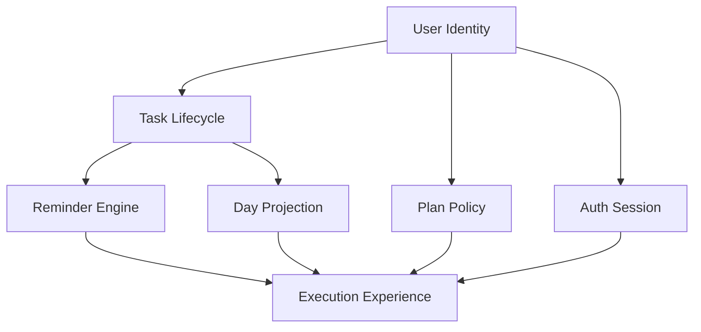

---

## 17. Senior Developer Onboarding Notes

Если ты новый Senior Developer в проекте, запомни следующее:

- сначала думай в терминах **domain flow**, а не экранов;
- почти любая крупная функция сводится к **user-owned state + side effects**;
- не ломай ownership and policy checks;
- если меняешь task state, подумай о reminder state;
- если меняешь plan state, подумай о free-tier gating;
- если добавляешь асинхронный эффект, убедись, что он идемпотентен;
- если работаешь с Focus Session, разделяй data model и runtime orchestration;
- timezone must be treated as part of business correctness.

---

## 18. Known Gaps

### Focus Session runtime

Схема данных есть, но полноценный runtime lifecycle ещё не завершён.

### Real billing provider

Premium сейчас ведёт себя как product flag and policy layer, а не как полноценная платёжная система.

### Recurring reminder materialization

Повторяющиеся задачи требуют отдельной стратегии materialization/reminder generation.

### Deeper domain separation

Система уже имеет ясные границы, но в будущем может потребовать более строгого разделения orchestration vs domain policy.

---

## 19. Final Summary

Система — это productivity engine для ADHD-friendly planning.

Её реальное ядро:

- пользователь проходит через auth/session layer;
- создаёт и управляет задачами;
- видит day projection как рабочую сцену;
- получает reminders как asynchronous push effect;
- может переходить между Free и Pro;
- в перспективе использует Focus Session для совместного фокуса.

Если помнить только одно правило, то вот оно:

> **Tasks are the source of operational truth; everything else is either identity, policy, projection or side effect.**
