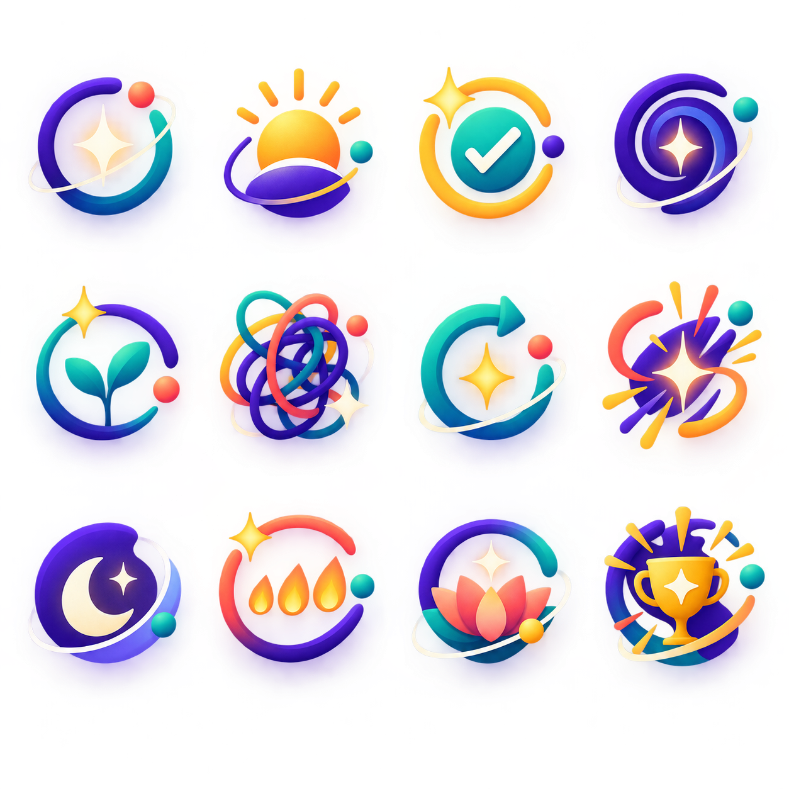
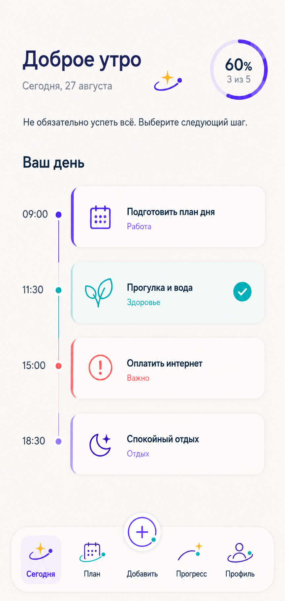

# Orbits visual references

Эта папка содержит четыре AI-generated design reference images, созданные в
рамках согласованного процесса product design Focus 2026-08-26/27. Они
архивируют направление **Orbits** и служат входными данными для Phase A
visual specification; это не production assets, не готовые SVG и не runtime
evidence.

## Индекс и provenance

| Файл | Размер | Bytes | SHA-256 | Статус | Разрешённое назначение |
| --- | ---: | ---: | --- | --- | --- |
| `orbits-concept-board-01.png` | 1254 x 1254 | 1,704,585 | `5CC737D2266BF79625229E3DA47B73C10D7D7C21653E84BC0EACFFA6C0D002F7` | Concept reference — approved as visual-language inspiration, not production assets | Исследование glossy/orbital language, цвета, состояний и настроения; не источник отдельных иконок, размеров или sprite-фрагментов |
| `orbits-navigation-approved-direction-01.png` | 1914 x 822 | 877,515 | `70BB38C4BA488885882A54CD066AB7D535816B1EED275B313E55A31ABB634E1E` | Superseded navigation iteration — retained for design history | История решения и сравнение; не использовать как approved navigation implementation |
| `orbits-navigation-approved-direction-02.png` | 1909 x 824 | 929,168 | `73EF79F0D0A78A823FB01C1A83E91884E71964C7E38B64F5A6C07EDE4527F1CB` | Approved navigation direction | Направление нижней навигации: видимые слова, поднятая центральная Add, компактное active Today и спокойная иерархия |
| `today/today-orbits-approved-direction-01.png` | 864 x 1821 | 1,021,775 | `96B99B12A5261546FBA22520BF320854D0B909268BA17768B2F4E856B08E45AA` | Approved Today visual direction | Reference composition для Today: тёплый фон, greeting/date, progress ring, timeline cards, completed state и нижняя навигация |

Общий объём файлов — 4,702,043 bytes; все файлы меньше лимита 3 MiB на один
reference. PNG проверены локально после копирования; содержимое и байты не
редактировались.

## Визуальный просмотр

## Границы использования

- Approval относится к product direction и композиции, а не к pixel-perfect
  implementation. `orbits-navigation-approved-direction-02.png` и
  `today/today-orbits-approved-direction-01.png` — approved references;
  первая navigation-картинка остаётся superseded history.
- Не копировать растровые фрагменты в application assets, не вытаскивать из
  concept board финальные иконки и не считать PNG заменой SVG/icon system.
- Production SVG/vector assets, shared tokens, React Native components,
  contrast/runtime checks и physical-device evidence требуют отдельного
  Phase B approval/evidence gate.
- Provider marks и прочие third-party brand assets не утверждены этой папкой и
  не имеют здесь license/provider approval.
- Эти изображения не содержат approved OAuth provider marks; provider identity,
  licensing и brand rules проверяются отдельно.
- Reference изображения не должны подменять задачу, данные, recovery,
  accessibility или базовые действия Focus.

Полная implementation-neutral спецификация находится в
[`docs/design/orbits-visual-spec.md`](../../orbits-visual-spec.md).
