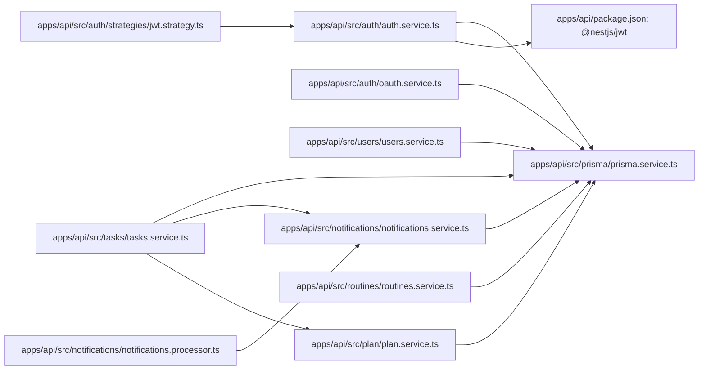
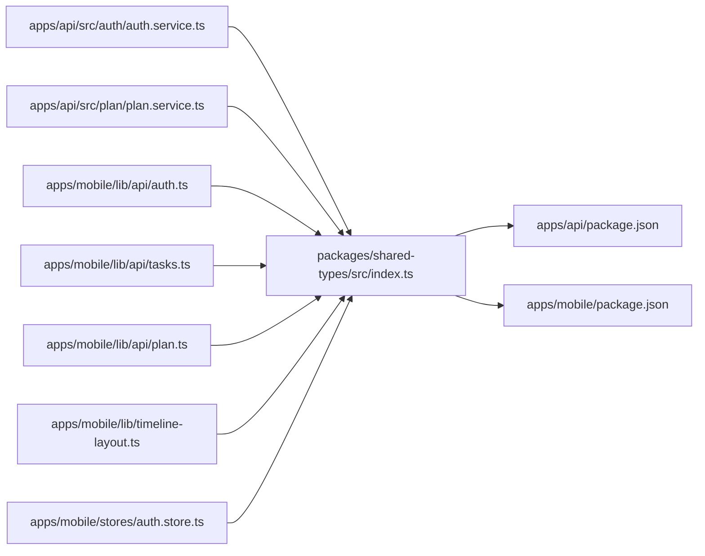

# Dependency Graph Research

## Область и метод

Анализ выполнен по исходникам `apps/api/src`, `apps/api/prisma`, `apps/mobile` и `packages/shared-types/src`, а также по `package.json` этих пакетов. Связь считается подтверждённой только если она выражена импортом, NestJS metadata (`imports/providers/controllers/exports`), вызовом hook/API-функции или импортом shared package. Внешние npm-пакеты не разворачиваются в графы файлов. В репозитории нет отдельного web-приложения, Redux store или web React-компонентов; frontend ниже — Expo/React Native.

## 1. Module Dependency Graph

Граф уровня исходных модулей/файлов. Каждое ребро соответствует реальному импорту.

```mermaid
graph TD
  App[apps/api/src/app.module.ts] --> Prisma[apps/api/src/prisma/prisma.module.ts]
  App --> Auth[apps/api/src/auth/auth.module.ts]
  App --> Users[apps/api/src/users/users.module.ts]
  App --> Tasks[apps/api/src/tasks/tasks.module.ts]
  App --> Routines[apps/api/src/routines/routines.module.ts]
  App --> Notifications[apps/api/src/notifications/notifications.module.ts]
  App --> Plan[apps/api/src/plan/plan.module.ts]
  Tasks --> TasksService[apps/api/src/tasks/tasks.service.ts]
  Tasks --> Notifications
  Tasks --> Plan
  Notifications --> NotificationsService[apps/api/src/notifications/notifications.service.ts]
  Notifications --> NotificationsProcessor[apps/api/src/notifications/notifications.processor.ts]
  Notifications --> Prisma
  Auth --> AuthService[apps/api/src/auth/auth.service.ts]
  Auth --> OAuthService[apps/api/src/auth/oauth.service.ts]
  Auth --> JwtStrategy[apps/api/src/auth/strategies/jwt.strategy.ts]
  Users --> UsersService[apps/api/src/users/users.service.ts]
  Routines --> RoutinesService[apps/api/src/routines/routines.service.ts]
  Plan --> PlanService[apps/api/src/plan/plan.service.ts]
```



`AppModule` импортирует все перечисленные Nest-модули в `apps/api/src/app.module.ts`. `TasksModule` импортирует `NotificationsModule` и `PlanModule` в `apps/api/src/tasks/tasks.module.ts`; `NotificationsModule` импортирует `PrismaModule` в `apps/api/src/notifications/notifications.module.ts`.

## 2. Service Dependency Graph

Граф строится по фактическим constructor injections и импортам сервисов.



`PrismaService` — общий инфраструктурный узел: он экспортируется из `PrismaModule` и используется доменными сервисами. Точные constructor-пары следует трактовать как подтверждённые только для реально присутствующих в соответствующих service-файлах injection-параметров; импорт модуля сам по себе не означает injection сервиса.

## 3. Frontend Component Graph

```mermaid
graph TD
  Root[apps/mobile/app/_layout.tsx] --> Index[apps/mobile/app/index.tsx]
  Root --> Login[apps/mobile/app/login.tsx]
  Root --> Register[apps/mobile/app/register.tsx]
  Root --> AuthSelect[apps/mobile/app/auth-provider-select.tsx]
  Root --> Onboarding[apps/mobile/app/onboarding.tsx]
  Root --> Paywall[apps/mobile/app/paywall.tsx]
  Root --> TaskForm[apps/mobile/app/task-form.tsx]
  Root --> TabsLayout[apps/mobile/app/(tabs)/_layout.tsx]
  TabsLayout --> Today[apps/mobile/app/(tabs)/today.tsx]
  TabsLayout --> Settings[apps/mobile/app/(tabs)/settings.tsx]
  TabsLayout --> Focus[apps/mobile/app/(tabs)/focus.tsx]
  Today --> Timeline[apps/mobile/components/timeline/Timeline.tsx]
  Today --> ProgressRing[apps/mobile/components/ProgressRing.tsx]
  Today --> EmptyState[apps/mobile/components/EmptyState.tsx]
  Timeline --> NowIndicator[apps/mobile/components/timeline/NowIndicator.tsx]
  Timeline --> TaskBlock[apps/mobile/components/timeline/TaskBlock.tsx]
```

Маршруты `expo-router` являются файловыми экранами; связи `Root -> Screen` и `TabsLayout -> Tab` отражают реальные `Stack.Screen`/route files, а связи компонентов — реальные JSX imports.

## 4. React Hook Dependency Graph

```mermaid
graph LR
  Root[apps/mobile/app/_layout.tsx] --> AuthHook[apps/mobile/stores/auth.store.ts: useAuthStore]
  Root --> ReactQuery[@tanstack/react-query: QueryClientProvider]
  Login[apps/mobile/app/login.tsx] --> AuthHook
  Register[apps/mobile/app/register.tsx] --> AuthHook
  Index[apps/mobile/app/index.tsx] --> AuthHook
  AuthSelect[apps/mobile/app/auth-provider-select.tsx] --> AuthHook
  Settings[apps/mobile/app/(tabs)/settings.tsx] --> AuthHook
  Today[apps/mobile/app/(tabs)/today.tsx] --> TasksHooks[apps/mobile/lib/api/tasks.ts]
  Onboarding[apps/mobile/app/onboarding.tsx] --> TasksHooks
  TaskForm[apps/mobile/app/task-form.tsx] --> TasksHooks
  Paywall[apps/mobile/app/paywall.tsx] --> PlanHooks[apps/mobile/lib/api/plan.ts]
  Settings --> PlanHooks
  TasksHooks --> ReactQuery
  PlanHooks --> ReactQuery
  Today --> Timeline[apps/mobile/components/timeline/Timeline.tsx]
  Timeline --> ReactHooks[React: useEffect/useMemo/useRef/useState]
  Now[apps/mobile/components/timeline/NowIndicator.tsx] --> ReactHooks
```

Фактически используемые группы hooks: React state/effect/memo/ref, Zustand `useAuthStore`, React Query `useQuery/useMutation/useQueryClient`. Отдельных пользовательских React hook-файлов кроме API-hook функций в `lib/api/tasks.ts` и `lib/api/plan.ts` не обнаружено.

## 5. Backend Module Graph

```mermaid
graph TD
  App[apps/api/src/app.module.ts] --> Config[ConfigModule.forRoot]
  App --> Bull[BullModule.forRoot]
  App --> Prisma[apps/api/src/prisma/prisma.module.ts]
  App --> Auth[apps/api/src/auth/auth.module.ts]
  App --> Users[apps/api/src/users/users.module.ts]
  App --> Tasks[apps/api/src/tasks/tasks.module.ts]
  App --> Routines[apps/api/src/routines/routines.module.ts]
  App --> Notifications[apps/api/src/notifications/notifications.module.ts]
  App --> Plan[apps/api/src/plan/plan.module.ts]
  Auth --> Passport[apps/api/package.json: @nestjs/passport]
  Auth --> Jwt[apps/api/package.json: @nestjs/jwt]
  Tasks --> Notifications
  Tasks --> Plan
  Notifications --> Prisma
  Notifications --> Queue[apps/api/src/notifications/notifications.constants.ts]
  Prisma --> PrismaService[apps/api/src/prisma/prisma.service.ts]
  Auth --> AuthController[apps/api/src/auth/auth.controller.ts]
  Auth --> YandexController[apps/api/src/auth/yandex-oauth.controller.ts]
  Auth --> VkController[apps/api/src/auth/vk-oauth.controller.ts]
  Auth --> MailruController[apps/api/src/auth/mailru-oauth.controller.ts]
  Users --> UsersController[apps/api/src/users/users.controller.ts]
  Tasks --> TasksController[apps/api/src/tasks/tasks.controller.ts]
  Routines --> RoutinesController[apps/api/src/routines/routines.controller.ts]
  Plan --> PlanController[apps/api/src/plan/plan.controller.ts]
```



### Nest metadata

| Module | Imports | Providers | Controllers | Exports |
|---|---|---|---|---|
| `apps/api/src/auth/auth.module.ts` | `PassportModule`, `JwtModule` | `AuthService`, `OAuthService`, `JwtStrategy` | `AuthController`, `YandexOAuthController`, `VkOAuthController`, `MailruOAuthController` | `AuthService` |
| `apps/api/src/users/users.module.ts` | — | `UsersService` | `UsersController` | `UsersService` |
| `apps/api/src/tasks/tasks.module.ts` | `NotificationsModule`, `PlanModule` | `TasksService` | `TasksController` | `TasksService` |
| `apps/api/src/routines/routines.module.ts` | — | `RoutinesService` | `RoutinesController` | — |
| `apps/api/src/notifications/notifications.module.ts` | queue, `PrismaModule` | `NotificationsService`, `NotificationsProcessor` | — | `NotificationsService` |
| `apps/api/src/plan/plan.module.ts` | — | `PlanService` | `PlanController` | `PlanService` |
| `apps/api/src/prisma/prisma.module.ts` | — | `PrismaService` | — | `PrismaService` |

## 6. Shared Package Graph



`packages/shared-types/src/index.ts` экспортирует `Plan`, `FREE_TIER_LIMITS`, `User`, `Task`, DTO для Task/Routine, FocusSession-типы, `AuthTokens`, `JwtPayload`, `NotificationLog` и response helpers. В проверенных импортах mobile реально используются типы `AuthTokens`, `User`, `Task`, DTO и `FREE_TIER_LIMITS`; backend импортирует shared-типы/DTO из этого package. Отдельного shared package кроме `packages/shared-types` нет.

## Prisma и DTO

Prisma schema находится в `apps/api/prisma/schema.prisma`. Модели: `User`, `Task`, `Routine`, `FocusSession`, `FocusSessionParticipant`, `NotificationLog`; `Task` имеет self-relation `parentTask/subTasks`. Prisma client создаётся в `apps/api/src/prisma/prisma.service.ts` и экспортируется `apps/api/src/prisma/prisma.module.ts`.

DTO расположены в `apps/api/src/auth/dto`, `apps/api/src/users/dto`, `apps/api/src/tasks/dto`, `apps/api/src/routines/dto`, `apps/api/src/notifications/dto`. Shared DTO-контракты находятся в `packages/shared-types/src/index.ts`; это два слоя DTO, а не один общий класс DTO.

## Findings

### Циклические зависимости

Доказанных циклов импортов между файлами или Nest-модулями в просмотренных исходниках не найдено. В частности, `TasksModule -> NotificationsModule -> PrismaModule` не замыкается обратно на `TasksModule`. Prisma-модель `Task` содержит self-relation, но это relation данных, не TypeScript/Nest dependency cycle.

### Потенциальные циклы

1. `auth.store.ts -> lib/api/auth.ts -> lib/api-client.ts`, при этом `api-client.ts` типизируется через shared types; обратного импорта в store не обнаружено — риск низкий.
2. `TasksModule -> NotificationsModule` и `TasksService -> NotificationsService` создают направленную cross-domain связь. Если notification-код начнёт импортировать TasksService, возникнет Nest-цикл; сейчас обратной связи не найдено.
3. Shared package используется обоими приложениями, но не импортирует приложения, поэтому цикл package-level не обнаружен.

### Неиспользуемые зависимости

По package manifests и статическим imports есть кандидаты, требующие проверки сборкой/coverage: `@react-navigation/native` и `@react-navigation/bottom-tabs` используются транзитивно/конфигурацией Expo Router, а не явными импортами; поэтому это не доказанно unused. `date-fns`/`date-fns-tz`, `expo-constants`, `expo-device` и часть backend dependencies не подтверждены импортом в просмотренном срезе — классифицировать их как unused без полного TypeScript build и runtime-конфигурации нельзя. `PaginatedResponse`, FocusSession-типы и часть shared exports не найдены в просмотренных импортных результатах; это кандидаты на unused exports, не доказанный мёртвый код.

### Слишком большие модули

`apps/mobile/app/task-form.tsx` и `apps/mobile/app/(tabs)/today.tsx` — самые крупные и наиболее насыщенные UI-файлы по структуре: они совмещают state, бизнес-правила формы/таймлайна, mutation orchestration и JSX. `apps/api/src/auth/auth.module.ts` не является большим по размеру, но содержит четыре OAuth controller и три provider, то есть имеет широкую responsibility surface.

### Слишком связанные модули

* `apps/api/src/tasks/tasks.service.ts` связан с Prisma, Notifications и Plan: это главный backend coupling hotspot.
* `apps/api/src/tasks/tasks.module.ts` связывает Tasks с двумя доменными модулями.
* `apps/mobile/app/(tabs)/today.tsx` связан с тремя task hooks, тремя визуальными компонентами и route navigation.
* `apps/mobile/stores/auth.store.ts` связан с SecureStore, API auth и API client token mutation; это ожидаемая, но плотная auth boundary.
* `packages/shared-types/src/index.ts` — единый контрактный файл для User/Task/Routine/Auth/Notification/FocusSession; удобен для monorepo, но является high-fan-out shared node.

### Отсутствующие слои

В репозитории не обнаружены Redux store, отдельные custom-hook файлы, web/Next.js app или второй shared package. Не следует добавлять их в граф как существующие компоненты.
