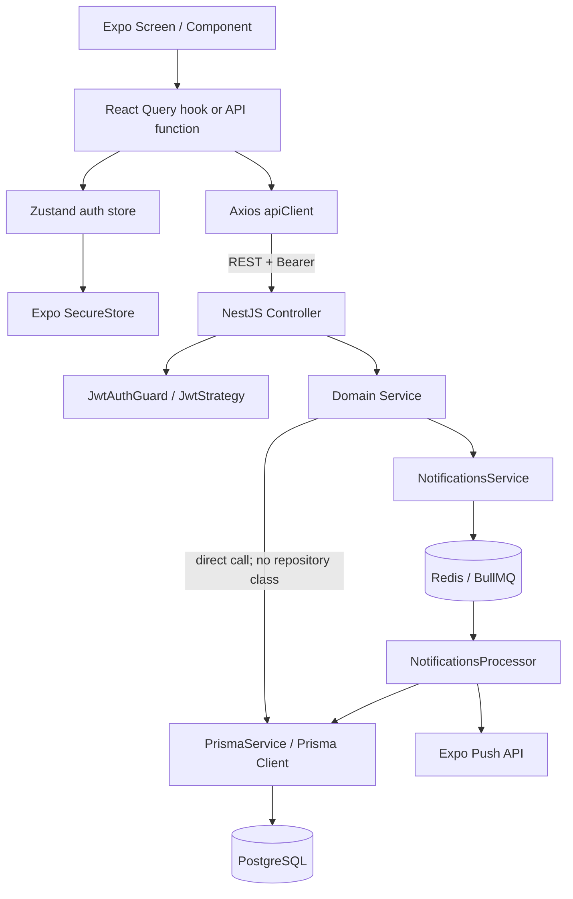
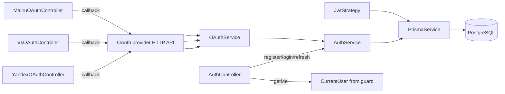
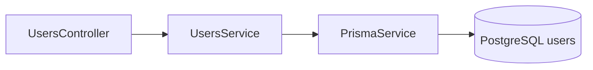
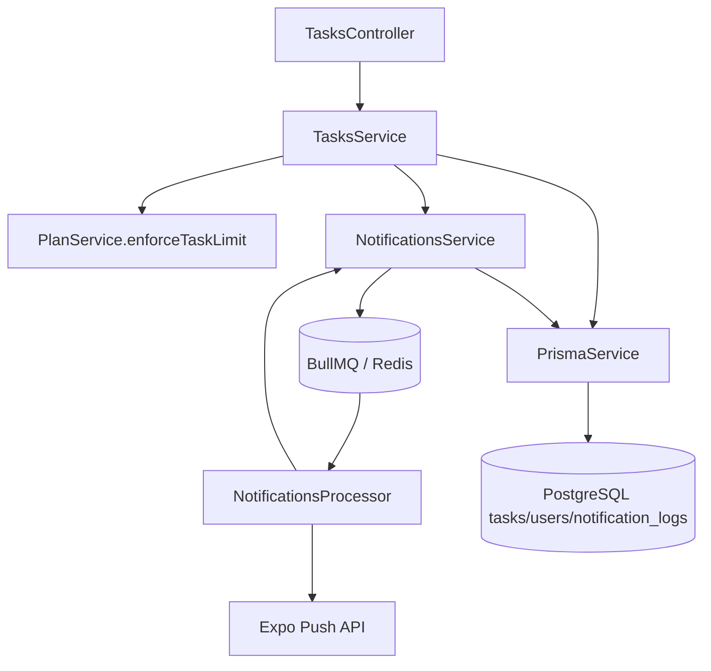
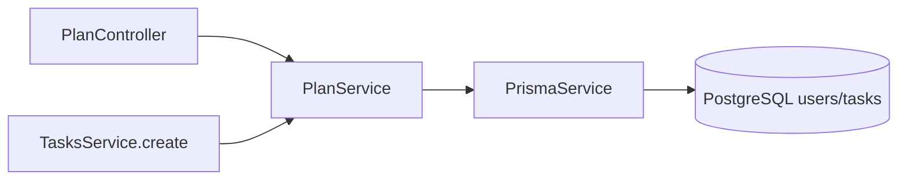
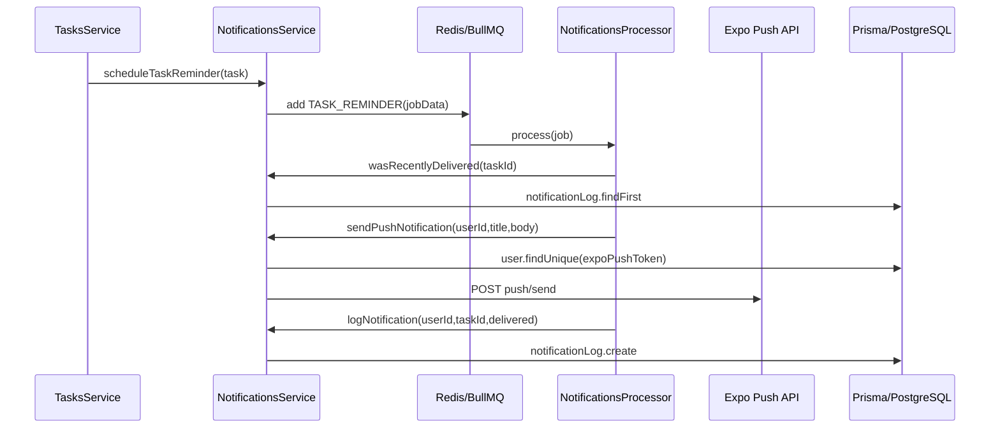
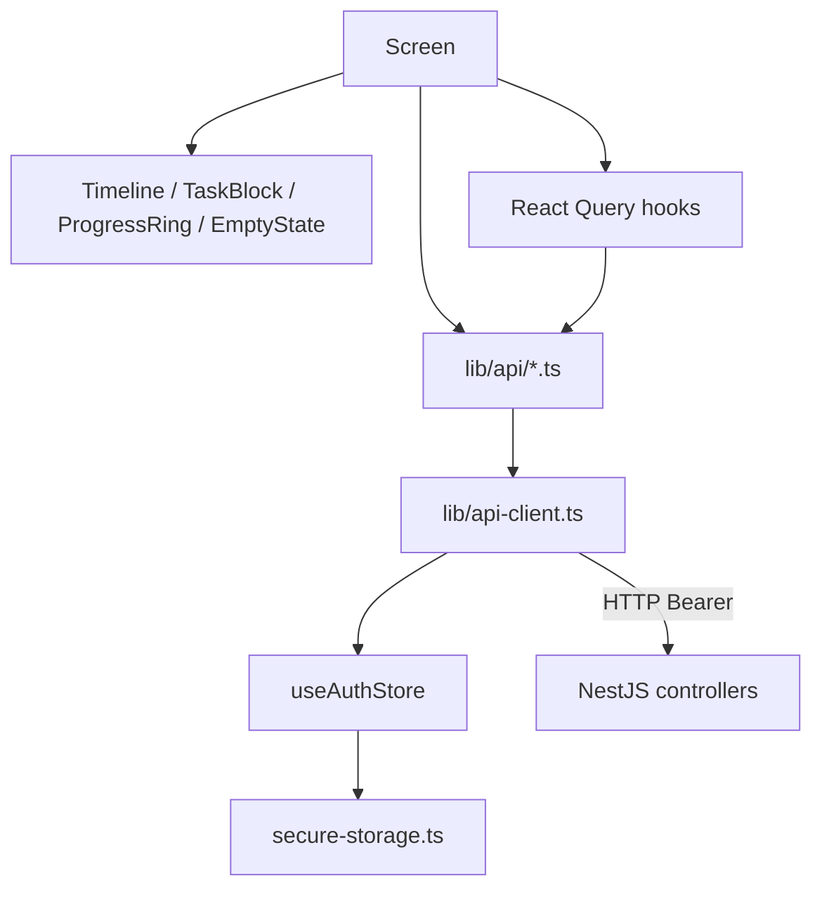
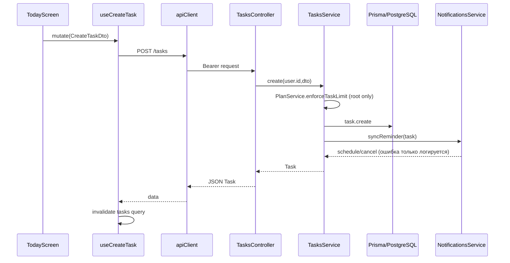
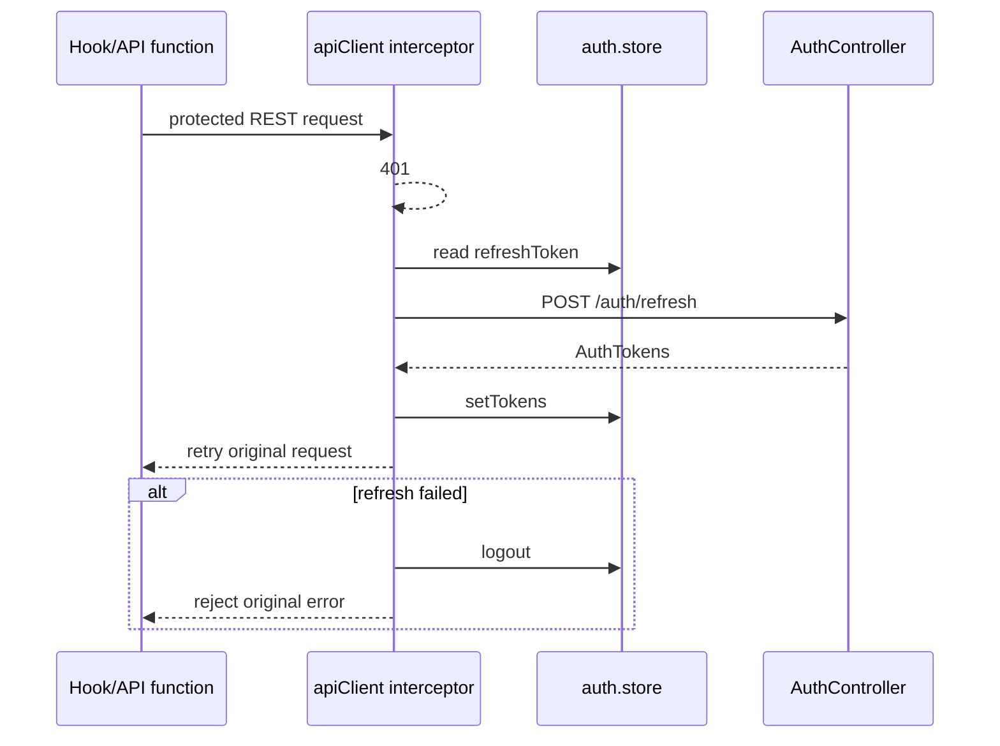

# Call Graph проекта Focus / ADHD Planner

> Исследование исходного кода: `apps/api/src` и `apps/mobile`. Файл описывает **статический граф вызовов**, найденный по импортам и телам функций, а не runtime-trace.

## 1. Границы и важные оговорки

- Backend — NestJS, точка входа `apps/api/src/main.ts`, HTTP API слушает `PORT` (по умолчанию `3000`).
- Frontend — Expo/React Native + Expo Router, React Query и Zustand.
- В проекте **нет отдельных классов Repository**. Сервисы напрямую инжектят `PrismaService`; поэтому цепочка `Service → Repository` фактически равна `Service → PrismaService`.
- Prisma datasource — PostgreSQL (`apps/api/prisma/schema.prisma`, `DATABASE_URL`). `PrismaService` вызывает `$connect()` при старте и `$disconnect()` при остановке.
- DTO валидируются глобальным `ValidationPipe` в `main.ts`; `JwtAuthGuard`/`JwtStrategy` выполняют аутентификацию до защищённых controller-методов. Ошибки Prisma, Axios, Redis/BullMQ и `fetch` могут дополнительно пробрасываться/обрабатываться инфраструктурой.
- `FocusSession` и `FocusSessionParticipant` присутствуют в Prisma schema, но активных controller/service/API-вызовов для них в текущем коде не найдено.

## 2. Общий Mermaid-граф

## 3. Backend: Controller → Service → Prisma → Database

### 3.1 Auth и OAuth

#### `AuthController` (`apps/api/src/auth/auth.controller.ts`)

| Метод / маршрут | Кто вызывает и что передаёт | Что вызывает метод | Возврат | Исключения и ошибки |
|---|---|---|---|---|
| `register(dto)` / `POST /auth/register` | Mobile `register()`; `RegisterDto` (email или phone, password, timezone) | `authService.register(dto)` | `AuthTokens { accessToken, refreshToken }` | `BadRequestException`, если нет email/phone; `ConflictException`, если идентификатор занят; ошибки bcrypt/Prisma могут проброситься |
| `login(dto)` / `POST /auth/login` | Mobile `login()`; `LoginDto` | `authService.login(dto)` | `AuthTokens` | `BadRequestException` без email/phone; `UnauthorizedException` при отсутствии пользователя или неверном пароле |
| `refresh(dto)` / `POST /auth/refresh` | `apiClient` interceptor; `RefreshTokenDto` | `authService.refreshTokens(dto.refreshToken)` | Новая пара `AuthTokens` | Любая ошибка verify/поиска пользователя нормализуется в `UnauthorizedException` |
| `getMe(user)` / `GET /auth/me` | `auth.store.bootstrap()`; user добавлен `JwtAuthGuard` | Только удаляет `passwordHash` из `user` | Safe user | Guard/strategy: `UnauthorizedException`, если JWT или пользователь недействительны |

#### `AuthService` (`apps/api/src/auth/auth.service.ts`)

| Метод | Вызывающий / вызовы | Данные | Возврат | Исключения |
|---|---|---|---|---|
| `register(dto)` | `AuthController.register` → `prisma.user.findFirst` → `bcrypt.hash` → `prisma.user.create` → `generateTokens` | Email/phone/password/timezone | Созданный пользователь преобразуется в `AuthTokens` | `BadRequestException` без идентификатора; `ConflictException` при существующем email/phone; Prisma/bcrypt ошибки |
| `login(dto)` | `AuthController.login` → `prisma.user.findFirst` → `bcrypt.compare` → `generateTokens` | Email или phone + password | `AuthTokens` | `BadRequestException`; `UnauthorizedException` при неверных данных |
| `refreshTokens(refreshToken)` | `AuthController.refresh` → `jwtService.verify` → `prisma.user.findUnique` → `generateTokens` | Refresh JWT | Новые `AuthTokens` | Весь `try` нормализуется в `UnauthorizedException('Refresh-токен недействителен или истёк')` |
| `generateTokens(user)` (private) | `register`, `login`, `refreshTokens`, `OAuthService.handleOAuthCallback` | `User.id`, email/phone и plan-данные payload | Access и refresh JWT через `JwtService.sign` | Ошибки конфигурации JWT/подписи могут проброситься |

#### OAuth controllers и `OAuthService`

`YandexOAuthController`, `VkOAuthController`, `MailruOAuthController` имеют одинаковый контракт:

| Метод | Вызовы и данные | Возврат | Исключения |
|---|---|---|---|
| `initiateOAuth(res)` / `GET /auth/{provider}` | Browser/mobile WebBrowser; строит provider authorization URL | HTTP redirect на OAuth provider | Ошибка `res.redirect`/конфигурации |
| `handleCallback(code, error, res)` / `GET /auth/{provider}/callback` | Provider передаёт `code`; controller делает `fetch` token endpoint, `fetch` profile endpoint, формирует `OAuthProfile`, вызывает `oauthService.handleOAuthCallback(profile)` | Redirect `focus://auth/callback?accessToken=...&refreshToken=...` | Provider error или отсутствие code → `400`; неуспешный token/profile fetch и JSON ошибки → `500` с сообщением; `OAuthService` может дать `BadRequestException`; ошибки логируются |

Различия профилей:

- Yandex: token endpoint → `login.yandex.ru/info` → provider id/email/phone.
- VK: token endpoint → `users.get`; email приходит из token response.
- Mail.ru: token endpoint → подпись MD5 → `appsmail.ru/platform/api`.

`OAuthService.handleOAuthCallback(profile)`:

1. `prisma.user.findFirst` по provider ID.
2. Если найден — `authService.generateTokens(user)`.
3. Иначе ищет по email/phone; при совпадении `prisma.user.update`, затем выдаёт tokens.
4. Если нет email и phone — `BadRequestException`.
5. Иначе `bcrypt.hash(randomPassword)` → `prisma.user.create` → `generateTokens`.

Возвращает `AuthTokens`; возможны `BadRequestException` и ошибки Prisma/bcrypt/JWT.

### 3.2 Users

`UsersController` (`/users`, JWT guard): `getMe(user)` → `usersService.findById(user.id)`, `update(user,dto)` → `usersService.update(user.id,dto)`, `remove(user)` → `usersService.remove(user.id)`.

| Service method | Prisma call / данные | Возврат | Исключения |
|---|---|---|---|
| `findById(id)` | `user.findUnique({where:{id}})`; удаляет `passwordHash` | `SafeUser` | `NotFoundException('Пользователь не найден')` |
| `update(id,dto)` | `user.update({where:{id}, data:dto})`; удаляет `passwordHash` | `SafeUser` | Prisma `NotFound`/validation errors могут проброситься |
| `remove(id)` | `user.delete({where:{id}})` | `void` / HTTP 204 | Prisma ошибки могут проброситься |

### 3.3 Tasks

#### `TasksController` (`/tasks`, JWT guard)

`create(user,dto)` → `TasksService.create(user.id,dto)`; `findAll(user,query)` → `findAll`; `findOne(user,id)` → `findOne`; `update(user,id,dto)` → `update`; `toggle(user,id)` → `toggleComplete`; `remove(user,id)` → `remove`.

На всех `:id` работает `ParseUUIDPipe` (невалидный UUID отклоняется до service); JWT ошибки приходят от guard.

| Service method | Кто вызывает / что вызывает | Данные и возврат | Исключения |
|---|---|---|---|
| `create(userId,dto)` | Controller; при root task → `planService.enforceTaskLimit`; `task.create(include subTasks)` → `syncReminder` | title, dates, duration, color, recurrence, `parentTaskId`; возвращает `Task` с subTasks | `ForbiddenException` при Free limit; Prisma/validation errors; reminder ошибки поглощаются в `syncReminder` и логируются |
| `findAll(userId,query)` | Controller; если date → `user.findUnique(timezone)` и `date-fns-tz.toDate`; затем `task.findMany` | query date/incomplete/includeSubTasks; `Task[]`, root tasks ordered by start/created | Prisma errors; timezone conversion errors могут проброситься |
| `findOne(userId,taskId)` | Controller, а также `update`, `remove`, `toggleComplete`; `task.findUnique(include subTasks)` | task id/user ownership; `Task` | `NotFoundException` если нет задачи; `ForbiddenException` при чужой задаче |
| `update(userId,taskId,dto)` | `findOne` для ownership → `task.update` → `syncReminder` | изменяемые поля Task; `Task` | NotFound/Forbidden из `findOne`; Prisma errors; reminder errors логируются |
| `remove(userId,taskId)` | `findOne` → `task.delete` → `safeCancelReminder` | `void` / HTTP 204 | NotFound/Forbidden; Prisma delete error; cancel error логируется |
| `toggleComplete(userId,taskId)` | `findOne` → `task.update(completedAt)` → `syncReminder` | id; `Task` с новым completedAt | NotFound/Forbidden; Prisma errors; reminder errors логируются |
| `syncReminder(task)` (private) | create/update/toggle | completed/no start → cancel; иначе schedule | Любая ошибка NotificationsService перехватывается и логируется, CRUD не падает |
| `safeCancelReminder(taskId)` (private) | remove | отмена BullMQ job | Ошибка перехватывается и логируется |

### 3.4 Routines

`RoutinesController` (`/routines`, JWT guard) делегирует `create`, `findAll`, `findOne`, `update`, `remove` одноимённым методам `RoutinesService`.

| Метод | Prisma / данные | Возврат | Исключения |
|---|---|---|---|
| `create(userId,dto)` | `routine.create`; name, daysOfWeek, userId | `Routine` | Prisma/DTO errors |
| `findAll(userId)` | `routine.findMany({where:{userId}, orderBy:createdAt})` | `Routine[]` | Prisma errors |
| `findOne(userId,routineId)` | `routine.findUnique` → проверка owner | `Routine` | `NotFoundException('Рутина не найдена')`; `ForbiddenException` чужая рутина |
| `update(userId,routineId,dto)` | `findOne` → `routine.update` | `Routine` | NotFound/Forbidden; Prisma errors |
| `remove(userId,routineId)` | `findOne` → `routine.delete` | `void` / 204 | NotFound/Forbidden; Prisma errors |

### 3.5 Plan

| Метод | Вызовы и данные | Возврат | Исключения |
|---|---|---|---|
| `isProUser(userId)` | `user.findUnique(plan,proExpiresAt)`; проверка срока | `boolean` | Prisma errors |
| `enforceTaskLimit(userId)` | `isProUser` → если Free `task.count` активных root tasks | `void` | `ForbiddenException` с code `FREE_TIER_LIMIT_REACHED` при достижении лимита |
| `getPlanInfo(userId)` | `user.findUnique` + `isProUser` + `task.count` | plan, isPro, expiry, usage | Prisma errors |
| `upgradeToPro(userId,expiresAt?)` | `user.update(plan PRO, expiry)` | `void`; controller возвращает message/plan | Prisma errors |
| `downgradeToFree(userId)` | `user.update(plan FREE, expiry null)` | `void`; controller возвращает message/plan | Prisma errors |

### 3.6 Notifications и фоновые вызовы

`NotificationsService.scheduleTaskReminder(task)` отменяет прежний job, пропускает дату менее чем через 5 секунд, затем `taskReminderQueue.add`. `cancelTaskReminder(taskId)` получает BullMQ job по детерминированному id и удаляет его.

`NotificationsProcessor.process(job)`:

| Метод | Данные / вызовы | Возврат и ошибки |
|---|---|---|
| `sendPushNotification(userId,title,body)` | user token → `fetch` Expo; при DeviceNotRegistered очищает `user.expoPushToken` | `PushSendResult`: `sent`, `no-token` или `error`; network/JSON ошибки ловятся и превращаются в `error` |
| `logNotification(userId,taskId,delivered)` | `notificationLog.create` | `void`; Prisma error пробрасывается processor-у |
| `wasRecentlyDelivered(taskId,withinMs)` | `notificationLog.findFirst` по task, delivered=true, sentAt window | boolean; Prisma error пробрасывается |
| `process(job)` | дедупликация → push → log | `void`; чужое имя/дубликат — return; `error` push → `throw Error`, BullMQ применяет retry/backoff |

## 4. Frontend: Screen → Component → Hook → Store → API → Backend

### 4.1 Screen и component graph

| Screen | Компоненты / hooks / store | Backend path |
|---|---|---|
| `index.tsx` | `useAuthStore`: isLoading, isAuthenticated, user; `Redirect` | косвенно через `auth.store.bootstrap` → `GET /auth/me` |
| `login.tsx` | `loginRequest`, `getMe`, `useAuthStore.setTokens/setUser` | `POST /auth/login`, `GET /auth/me` |
| `register.tsx` | auth API + `setTokens`, `getMe` | `POST /auth/register`, `GET /auth/me` |
| `auth-provider-select.tsx` | `WebBrowser`, `Linking`, `setTokens` | OAuth GET routes и callback deep link |
| `onboarding.tsx` | `useCreateTask`, direct `apiClient.patch('/users/me')` | `POST /tasks`, `PATCH /users/me` |
| `(tabs)/today.tsx` | `useTasksForDate`, `useCreateTask`, `useToggleTask`; `Timeline`, `ProgressRing`, `EmptyState` | `GET/POST/PATCH /tasks`; limit error → `/paywall` |
| `task-form.tsx` | task hooks/API functions, callbacks to create/update/delete | `POST/PATCH/DELETE /tasks` |
| `paywall.tsx` | `usePlanInfo`, `useInvalidatePlan`, direct `apiClient.post('/plan/upgrade')` | `GET /plan`, `POST /plan/upgrade` |
| `(tabs)/settings.tsx` | `useAuthStore.logout`; navigation to paywall | logout local; plan screen |
| `(tabs)/focus.tsx` | UI screen; active backend call for FocusSession not найден | нет реализованного REST call |

`TodayScreen` передаёт в `Timeline` массив `Task[]`, `onToggle`, `onOpenTask`, `onCreateAt`, `currentTaskId`. `Timeline` вычисляет layout (`computeTimelineLayout`), рендерит `TaskBlock` и `NowIndicator`; `TaskBlock` вызывает переданные `onToggle(task.id)` и `onOpen(task)`. Это callbacks вверх, не новые API-вызовы.

### 4.2 React Query hooks и API-функции

| Hook/API method | Кто вызывает | Запрос, данные | Возврат | Ошибки |
|---|---|---|---|---|
| `useTasksForDate(date)` | TodayScreen | `GET /tasks?date=YYYY-MM-DD&includeSubTasks=true` | React Query `{data: Task[], isLoading,isError}` | Axios error, 401 interceptor |
| `useCreateTask(date)` | Today, onboarding, task form | mutation `POST /tasks`, `CreateTaskDto`; success invalidates date key | mutation result / `Task` | backend 400/401/403; `FREE_TIER_LIMIT_REACHED` обрабатывается UI |
| `useUpdateTask(date)` | task form | `PATCH /tasks/:id`, `{id,dto}` | mutation result / `Task` | backend/axios errors |
| `useToggleTask(date)` | Today/TaskBlock | optimistic cache update → `PATCH /tasks/:id/toggle`; rollback on error; invalidate settled | mutation result / `Task` | rollback; backend errors; 401 refresh |
| `useDeleteTask(date)` | task form | `DELETE /tasks/:id`; invalidate | mutation result / void | backend/axios errors |
| `createSubtask(parentTaskId,title)` | task form/helper | `POST /tasks` с parentTaskId | `Task` | same as task create |
| `deleteTaskById(id)` | task form/helper | `DELETE /tasks/:id` | `void` | Axios/backend errors |
| `login(payload)` | LoginScreen | `POST /auth/login` | `AuthTokens` | Axios error; `extractErrorMessage` UI |
| `register(payload)` | RegisterScreen | `POST /auth/register` | `AuthTokens` | Axios/backend errors |
| `getMe()` | Login/Register, auth bootstrap | `GET /auth/me` | `User` | Axios/guard errors |
| `usePlanInfo()` | Paywall | React Query `GET /plan`, staleTime 5 min | `PlanInfo` query | Axios/401 |
| `useInvalidatePlan()` | Paywall after upgrade/downgrade | `queryClient.invalidateQueries(['plan'])` | callback `() => void` | React Query errors handled by query |

### 4.3 Zustand auth store и Axios interceptor

`useAuthStore` (`apps/mobile/stores/auth.store.ts`) — frontend store, который также является вызывающим для persistence/API:

| Метод | Кто вызывает / что вызывает | Данные и возврат | Ошибки |
|---|---|---|---|
| `setTokens(tokens)` | login/register/OAuth callback; `setAuthToken` → `saveTokens` → Zustand set | access/refresh token; `Promise<void>` | SecureStore errors пробрасываются вызывающему |
| `setUser(user)` | login/register/bootstrap | user; void | нет явных |
| `logout()` | settings и interceptor при неудачном refresh; `setAuthToken(null)` → `clearTokens` | очищает state; Promise<void> | SecureStore errors могут проброситься |
| `bootstrap()` | `app/_layout.tsx` при старте; `loadTokens` → `setAuthToken` → `getMe` | восстанавливает session; Promise<void> | все ошибки ловятся, tokens очищаются, state становится unauthenticated |

`apiClient` (`apps/mobile/lib/api-client.ts`):

1. Axios request использует `baseURL` (`EXPO_PUBLIC_API_URL` или `10.0.2.2:3000`) и JSON headers.
2. `setAuthToken(token)` добавляет/удаляет `Authorization: Bearer ...`.
3. Response interceptor при первом `401` помечает `_retry`, читает `refreshToken` из store, делает отдельный `axios.post('/auth/refresh')`, вызывает `useAuthStore.setTokens`, повторяет исходный request.
4. Если refresh отсутствует/неуспешен — вызывает `logout()` и отклоняет исходную ошибку.

## 5. Полная карта Prisma → Database

| Prisma delegate | Операции | Вызывающие методы | Таблица |
|---|---|---|---|
| `user` | `findFirst`, `findUnique`, `create`, `update`, `delete` | Auth/OAuth, JwtStrategy, UsersService, PlanService, TasksService timezone, NotificationsService | `users` |
| `task` | `create`, `findMany`, `findUnique`, `update`, `delete`, `count` | TasksService, PlanService | `tasks` |
| `routine` | `create`, `findMany`, `findUnique`, `update`, `delete` | RoutinesService | `routines` |
| `notificationLog` | `create`, `findFirst` | NotificationsService | `notification_logs` |

Связи: `User 1:N Task`, `User 1:N Routine`, `Task self-relation` для subTasks, `Task 1:N NotificationLog`, `User 1:N NotificationLog`. `onDelete: Cascade` явно задан для User→Task и Task self-relation в соответствующих schema relations.

## 6. Сквозные сценарии

### Создание задачи

### Истечение access token

## 7. Исключения и границы ответственности

- **HTTP validation**: DTO/лишние поля отклоняются глобальным `ValidationPipe`; UUID — `ParseUUIDPipe`.
- **HTTP auth**: `JwtAuthGuard` и `JwtStrategy.validate` возвращают `UnauthorizedException` для плохого/истёкшего токена или отсутствующего пользователя.
- **Domain**: ownership — `NotFoundException`/`ForbiddenException`; Free limit — `ForbiddenException` с машинным code.
- **Notifications**: CRUD задачи не откатывается из-за Redis/queue ошибки; processor, напротив, бросает ошибку для BullMQ retry при статусе push `error`.
- **Frontend**: Axios errors доходят до mutation/query; отдельные экраны показывают `Alert` или переводят пользователя на paywall. Interceptor автоматически обновляет токен ровно один раз для конкретного запроса.

## 8. Непокрытые вызовами элементы

- Не найден отдельный Repository слой.
- Не найден frontend API/store для `Routine`, `FocusSession`, `FocusSessionParticipant`.
- OAuth provider HTTP calls выполняются непосредственно внутри OAuth controllers, без отдельного provider adapter.
- Push notifications используют внешний Expo API, а очередь — BullMQ/Redis; это не PostgreSQL persistence, но входит в фактический call graph напоминаний.
