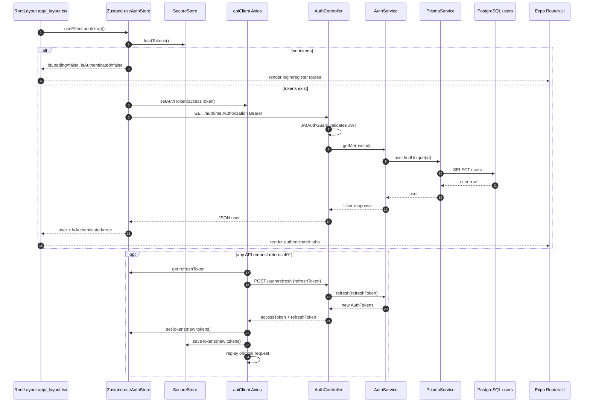
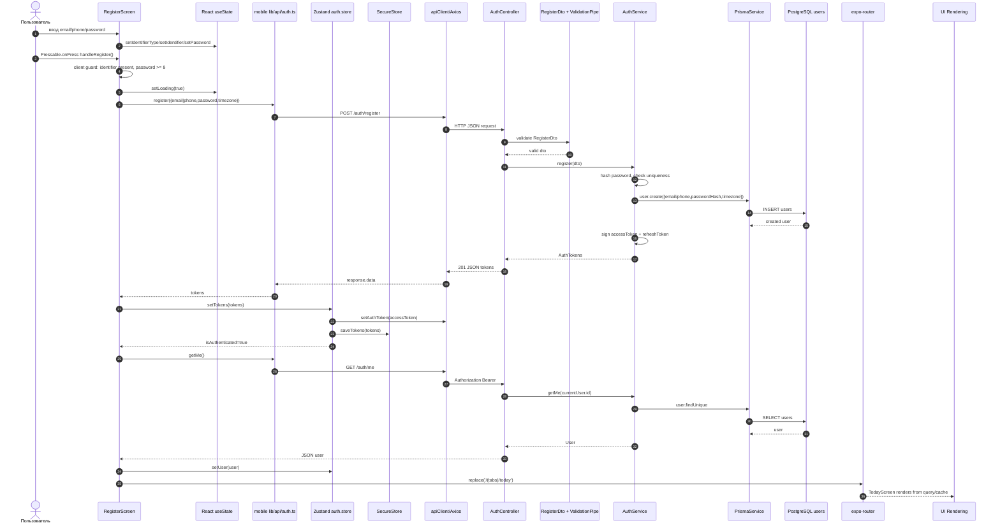
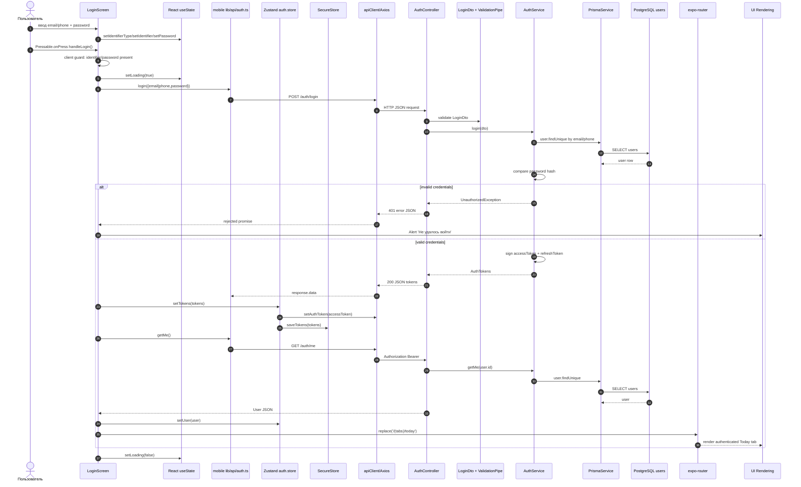
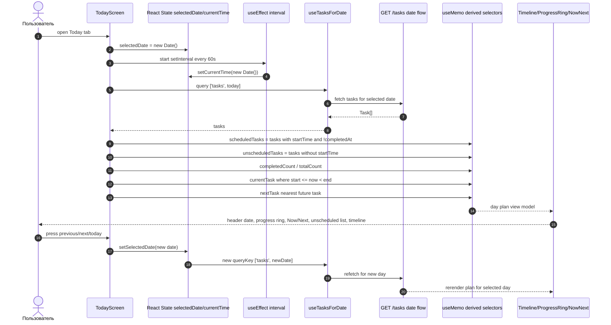
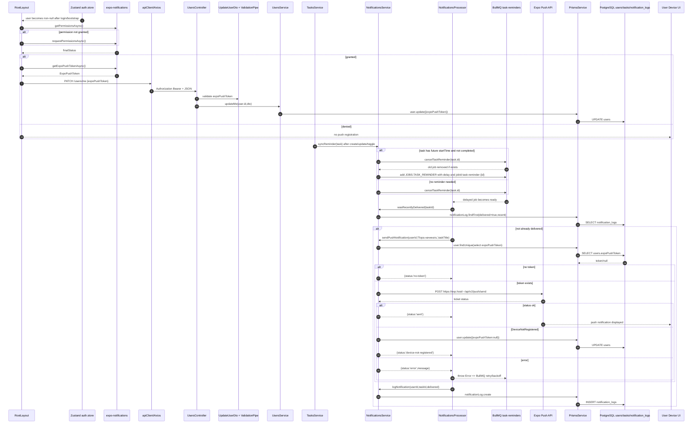
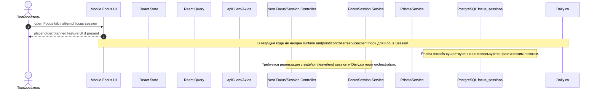
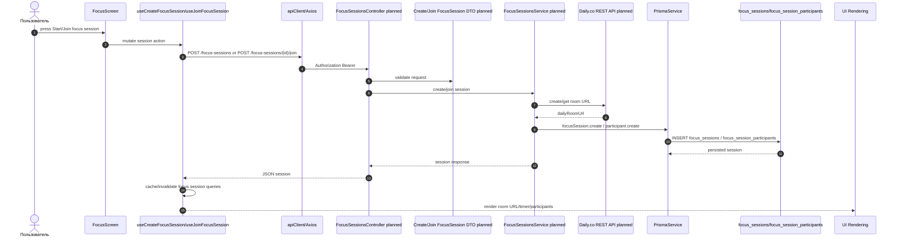

# 15. Data Flow Research

Дата исследования: 2026-08-03  
Scope: сквозные потоки данных приложения Focus/ADHD planner — не только HTTP API, но и UI events, React state, Zustand store, React Query cache, Axios client/interceptors, NestJS controllers/DTO/validation/services, Prisma, PostgreSQL, фоновые push-процессы и UI rendering.

## 1. Методология

Исследованы фактические точки входа и передачи данных в `apps/mobile`, `apps/api`, `packages/shared-types` и Prisma schema.

Ключевые файлы:

- Mobile UI:
  - `apps/mobile/app/login.tsx`
  - `apps/mobile/app/register.tsx`
  - `apps/mobile/app/_layout.tsx`
  - `apps/mobile/app/(tabs)/today.tsx`
  - `apps/mobile/app/task-form.tsx`
  - `apps/mobile/app/paywall.tsx`
- Mobile data layer:
  - `apps/mobile/stores/auth.store.ts`
  - `apps/mobile/lib/api-client.ts`
  - `apps/mobile/lib/api/auth.ts`
  - `apps/mobile/lib/api/tasks.ts`
  - `apps/mobile/lib/api/plan.ts`
  - `apps/mobile/lib/secure-storage.ts`
- Backend:
  - `apps/api/src/auth/auth.controller.ts`
  - `apps/api/src/auth/auth.service.ts`
  - `apps/api/src/tasks/tasks.controller.ts`
  - `apps/api/src/tasks/tasks.service.ts`
  - `apps/api/src/tasks/dto/*.ts`
  - `apps/api/src/plan/plan.controller.ts`
  - `apps/api/src/plan/plan.service.ts`
  - `apps/api/src/users/users.controller.ts`
  - `apps/api/src/users/users.service.ts`
  - `apps/api/src/notifications/notifications.service.ts`
  - `apps/api/src/notifications/notifications.processor.ts`
  - `apps/api/prisma/schema.prisma`

## 2. End-to-end participant map

| Layer | Реализация | Роль в потоках |
|---|---|---|
| UI Events | `Pressable.onPress`, `TextInput.onChangeText`, `onSubmitEditing`, `Alert`, `router.push/replace/back`, `useEffect` | Запускают auth, CRUD задач, регистрацию push-токена, premium upgrade |
| React State | `useState`, `useMemo`, `useEffect` | Поля форм, loading/saving state, selectedDate, modal state, derived day progress/current/next task |
| Stores | Zustand `useAuthStore` | `user`, `accessToken`, `refreshToken`, `isAuthenticated`, `bootstrap`, `setTokens`, `setUser`, `logout` |
| React Query | `useQuery`, `useMutation`, `useQueryClient` | Cache `['tasks', date]`, `['plan']`, invalidation, optimistic toggle |
| API Client | `apiClient` | Axios instance with `baseURL`, JSON headers, timeout |
| Axios | Response interceptor | On `401`: `POST /auth/refresh`, save new tokens, replay original request, logout on failure |
| Nest Controller | `AuthController`, `TasksController`, `PlanController`, `UsersController` | HTTP routing, guards, current user extraction |
| DTO | `RegisterDto`, `LoginDto`, `CreateTaskDto`, `UpdateTaskDto`, `GetTasksQueryDto`, `UpdateUserDto` | Request shape and typed validation boundary |
| Validation | Nest global/class-validator DTO decorators | Rejects invalid input before service layer |
| Service | `AuthService`, `TasksService`, `PlanService`, `UsersService`, `NotificationsService` | Business rules, auth, limits, persistence orchestration, reminders |
| Prisma | `PrismaService` | ORM calls to `user`, `task`, `notificationLog` |
| Database | PostgreSQL via Prisma schema | Tables: `users`, `tasks`, `notification_logs`, `focus_sessions`, `focus_session_participants`, `routines` |
| Response | JSON DTO/entity response | Axios unwraps `response.data`, React Query/store consumes data |
| UI Rendering | React Native components | Timeline, EmptyState, ProgressRing, forms, Paywall, alerts |

## 3. Общий auth/token flow



## 4. Регистрация



## 5. Логин



## 6. Создание задачи

Фактические входы:

- Quick add в `TodayScreen`: `openQuickAdd`, `handleSubmitQuickAdd`, `useCreateTask(selectedDate)`.
- Full form в `TaskFormScreen`: `handleSave`, `useCreateTask(today)`.
- Subtasks: последовательный `createSubtask(parentTaskId,title)` вызывает тот же `POST /tasks` с `parentTaskId`.

```mermaid
sequenceDiagram
    autonumber
    actor User as Пользователь
    participant UI as TodayScreen / TaskFormScreen
    participant State as React State
    participant RQ as React Query useCreateTask
    participant Axios as apiClient/Axios
    participant Controller as TasksController
    participant Guard as JwtAuthGuard + CurrentUser
    participant DTO as CreateTaskDto + ValidationPipe
    participant Service as TasksService
    participant PlanSvc as PlanService
    participant NotifSvc as NotificationsService
    participant Queue as BullMQ task-reminders
    participant Prisma as PrismaService
    participant DB as PostgreSQL tasks/users
    participant Render as Timeline/EmptyState/Paywall

    User->>UI: tap + / timeline slot / save form
    UI->>State: setQuickAddOpen, setTitle, setSaving/loading
    UI->>RQ: mutate(dto) or mutateAsync(dto)
    RQ->>Axios: POST /tasks {title,startTime,duration,color,recurrence,parentTaskId?}
    Axios->>Controller: Authorization Bearer + JSON
    Controller->>Guard: validate JWT
    Guard-->>Controller: current user
    Controller->>DTO: validate CreateTaskDto
    Controller->>Service: create(user.id,dto)
    alt top-level task
        Service->>PlanSvc: enforceTaskLimit(userId)
        PlanSvc->>Prisma: user.findUnique(plan), task.count(active top-level)
        Prisma->>DB: SELECT users; SELECT COUNT(tasks)
        DB-->>Prisma: plan + count
        alt free limit reached
            PlanSvc-->>Service: ForbiddenException FREE_TIER_LIMIT_REACHED
            Service-->>Controller: 403
            Controller-->>Axios: error JSON
            Axios-->>RQ: rejected mutation
            RQ-->>UI: onError
            UI->>Render: router.push('/paywall')
        end
    end
    Service->>Prisma: task.create(include subTasks)
    Prisma->>DB: INSERT tasks
    DB-->>Prisma: created task
    Service->>NotifSvc: syncReminder(task)
    alt task has startTime and not completed
        NotifSvc->>Queue: remove old job + add delayed task-reminder-{task.id}
    else no startTime/completed
        NotifSvc->>Queue: cancelTaskReminder(task.id)
    end
    Service-->>Controller: Task
    Controller-->>Axios: 201 JSON Task
    Axios-->>RQ: response.data
    RQ->>RQ: invalidateQueries(['tasks', date])
    RQ-->>UI: mutation success
    UI->>Render: close modal/router.back; refetch renders Timeline or EmptyState
```

## 7. Редактирование задачи

```mermaid
sequenceDiagram
    autonumber
    actor User as Пользователь
    participant Today as TodayScreen/Timeline item
    participant Form as TaskFormScreen
    participant State as React State
    participant RQ as React Query useUpdateTask
    participant Axios as apiClient/Axios
    participant Controller as TasksController
    participant DTO as UpdateTaskDto + ValidationPipe
    participant Service as TasksService
    participant NotifSvc as NotificationsService
    participant Queue as BullMQ
    participant Prisma as PrismaService
    participant DB as PostgreSQL tasks
    participant Render as UI Rendering

    User->>Today: longPress task / open edit
    Today->>Form: router.push('/task-form', params.task JSON)
    Form->>State: parse existingTask; initialize title/time/duration/color/recurrence/subtasks
    User->>Form: edit fields + press save
    Form->>State: setSaving(true)
    Form->>RQ: updateTask.mutateAsync({id,dto})
    RQ->>Axios: PATCH /tasks/{id}
    Axios->>Controller: Authorization Bearer + JSON
    Controller->>DTO: validate UpdateTaskDto
    Controller->>Service: update(user.id, taskId, dto)
    Service->>Prisma: task.findUnique(include subTasks)
    Prisma->>DB: SELECT task by id
    DB-->>Prisma: existing task
    Service->>Service: ownership check userId
    Service->>Prisma: task.update(data, include subTasks)
    Prisma->>DB: UPDATE tasks
    DB-->>Prisma: updated task
    Service->>NotifSvc: syncReminder(updated task)
    alt completed or no startTime
        NotifSvc->>Queue: cancelTaskReminder(task.id)
    else scheduled task
        NotifSvc->>Queue: cancel old job then add new delayed job
    end
    Service-->>Controller: Task
    Controller-->>Axios: 200 JSON Task
    Axios-->>RQ: response.data
    RQ->>RQ: invalidateQueries(['tasks', date])
    Form->>Render: router.back()
    Render->>RQ: refetch tasks if stale/invalidated
```

## 8. Удаление задачи

```mermaid
sequenceDiagram
    autonumber
    actor User as Пользователь
    participant Form as TaskFormScreen
    participant Alert as React Native Alert
    participant RQ as React Query useDeleteTask
    participant Axios as apiClient/Axios
    participant Controller as TasksController
    participant Service as TasksService
    participant NotifSvc as NotificationsService
    participant Queue as BullMQ
    participant Prisma as PrismaService
    participant DB as PostgreSQL tasks
    participant Render as Timeline/EmptyState

    User->>Form: press delete
    Form->>Alert: Alert.alert('Удалить задачу?')
    User->>Alert: confirm destructive action
    Alert->>RQ: deleteTask.mutateAsync(task.id)
    RQ->>Axios: DELETE /tasks/{id}
    Axios->>Controller: Authorization Bearer
    Controller->>Service: remove(user.id, taskId)
    Service->>Prisma: task.findUnique(include subTasks)
    Prisma->>DB: SELECT task by id
    DB-->>Prisma: task
    Service->>Service: ownership check
    Service->>Prisma: task.delete({id})
    Prisma->>DB: DELETE FROM tasks
    DB-->>Prisma: deleted
    Service->>NotifSvc: safeCancelReminder(taskId)
    NotifSvc->>Queue: getJob(task-reminder-{id}) + remove if exists
    Service-->>Controller: void
    Controller-->>Axios: 200/204 empty response
    Axios-->>RQ: success
    RQ->>RQ: invalidateQueries(['tasks', date])
    Form->>Render: router.back(); Timeline refetches/rerenders
```

## 9. Получение списка задач

```mermaid
sequenceDiagram
    autonumber
    participant UI as TodayScreen
    participant State as selectedDate React State
    participant RQ as useTasksForDate(date)
    participant Axios as apiClient/Axios
    participant Controller as TasksController
    participant DTO as GetTasksQueryDto + ValidationPipe
    participant Service as TasksService
    participant Prisma as PrismaService
    participant DB as PostgreSQL users/tasks
    participant Render as Timeline / EmptyState / ActivityIndicator

    UI->>State: selectedDate initialized or changed by date nav
    UI->>RQ: useQuery queryKey ['tasks', YYYY-MM-DD]
    RQ->>Render: isLoading=true => ActivityIndicator
    RQ->>Axios: GET /tasks?date=YYYY-MM-DD&includeSubTasks=true
    Axios->>Controller: Authorization Bearer
    Controller->>DTO: validate query params
    Controller->>Service: findAll(user.id, query)
    Service->>Prisma: user.findUnique(select timezone)
    Prisma->>DB: SELECT timezone FROM users
    DB-->>Prisma: timezone
    Service->>Service: build dayStartUtc/dayEndUtc via date-fns-tz toDate
    Service->>Prisma: task.findMany({userId,parentTaskId:null,startTime range, include subTasks, orderBy})
    Prisma->>DB: SELECT tasks LEFT/related subTasks
    DB-->>Prisma: task rows
    Prisma-->>Service: Task[]
    Service-->>Controller: Task[]
    Controller-->>Axios: 200 JSON array
    Axios-->>RQ: response.data
    RQ->>RQ: cache ['tasks', date]
    RQ-->>UI: data, isLoading=false
    UI->>Render: split scheduled/unscheduled; render Timeline, ProgressRing, EmptyState, Now/Next
```

## 10. План дня

В текущей реализации “план дня” — это клиентская композиция данных на `TodayScreen`, построенная поверх списка задач за выбранную дату. Отдельного backend endpoint `/day-plan` нет: источником является `GET /tasks?date=...&includeSubTasks=true`.



## 11. Push Notification

Поток состоит из двух независимых частей:

1. Регистрация Expo push token после авторизации.
2. Планирование и доставка reminder job после create/update/toggle/delete задачи.



## 12. Focus Session

Статус: **runtime-поток не реализован**.

Факты:

- В Prisma schema есть модели:
  - `FocusSession`
  - `FocusSessionParticipant`
- Поиск по `apps` не нашёл реализаций `FocusSession`, `focus-session`, `sessions`, `Daily`, `dailyRoom`, `@Controller('focus')`, `@Controller('sessions')`.
- Следовательно, нет фактического UI event → React Query/API client → Nest controller/service → Prisma write/read → response → UI rendering flow.

Текущий фактический поток для Focus tab/session выглядит как gap/placeholder:



Ожидаемый будущий поток по существующей модели данных:



## 13. Premium Upgrade

Статус: реализован как dev endpoint без реального payment provider/IAP.

```mermaid
sequenceDiagram
    autonumber
    actor User as Пользователь
    participant UI as PaywallScreen
    participant State as React useState
    participant PlanRQ as usePlanInfo/useInvalidatePlan
    participant Axios as apiClient/Axios
    participant Controller as PlanController
    participant Guard as JwtAuthGuard
    participant Service as PlanService
    participant Prisma as PrismaService
    participant DB as PostgreSQL users/tasks
    participant Alert as Alert/UI Rendering
    participant Router as expo-router

    UI->>PlanRQ: usePlanInfo()
    PlanRQ->>Axios: GET /plan
    Axios->>Controller: Authorization Bearer
    Controller->>Guard: validate JWT
    Controller->>Service: getPlanInfo(user.id)
    Service->>Prisma: user.findUnique(plan,proExpiresAt)
    Service->>Prisma: task.count(active top-level)
    Prisma->>DB: SELECT users; SELECT COUNT(tasks)
    DB-->>Prisma: plan + usage
    Service-->>Controller: {plan,isPro,proExpiresAt,usage}
    Controller-->>PlanRQ: JSON PlanInfo
    PlanRQ-->>UI: planInfo
    UI-->>User: render Free vs Pro, usage bar, CTA

    User->>UI: press 'Попробовать Pro бесплатно 7 дней'
    UI->>State: setIsLoading(true)
    Note over UI,Controller: TODO in code: real Expo IAP/payment provider is not integrated.
    UI->>Axios: POST /plan/upgrade
    Axios->>Controller: Authorization Bearer
    Controller->>Service: upgradeToPro(user.id)
    Service->>Prisma: user.update({plan:'PRO', proExpiresAt:null})
    Prisma->>DB: UPDATE users
    DB-->>Prisma: updated user
    Service-->>Controller: void
    Controller-->>Axios: {message, plan:'PRO'}
    Axios-->>UI: success
    UI->>PlanRQ: invalidateQueries(['plan'])
    UI->>Alert: show welcome to Pro
    Alert->>Router: onPress router.back()
    UI->>State: setIsLoading(false)
```

## 14. Data Flow Coverage Matrix

| Scenario | UI Events | React State | Store | React Query | API Client/Axios | Nest Controller | DTO/Validation | Service | Prisma/DB | Response/UI Rendering |
|---|---|---|---|---|---|---|---|---|---|---|
| Регистрация | Да | Да | `useAuthStore` | Нет | Да | `AuthController` | `RegisterDto` | `AuthService` | `User` | tokens → store → `getMe` → Today |
| Логин | Да | Да | `useAuthStore` | Нет | Да | `AuthController` | `LoginDto` | `AuthService` | `User` | tokens → store → `getMe` → Today |
| Создание задачи | Да | Да | Auth token indirectly | `useCreateTask` | Да | `TasksController` | `CreateTaskDto` | `TasksService`, `PlanService`, `NotificationsService` | `Task`, `User`, queue side effect | invalidate tasks → Timeline |
| Редактирование задачи | Да | Да | Auth token indirectly | `useUpdateTask` | Да | `TasksController` | `UpdateTaskDto` | `TasksService`, `NotificationsService` | `Task` | invalidate tasks → Timeline/Form back |
| Удаление задачи | Да | Alert state | Auth token indirectly | `useDeleteTask` | Да | `TasksController` | path param | `TasksService`, `NotificationsService` | `Task` | invalidate tasks → Timeline/EmptyState |
| Получение списка | Mount/date nav | `selectedDate` | Auth token indirectly | `useTasksForDate` | Да | `TasksController` | `GetTasksQueryDto` | `TasksService` | `User.timezone`, `Task` | cache → Timeline/EmptyState/Progress |
| План дня | Mount/date nav/interval | `selectedDate`, `currentTime`, derived memo | Auth token indirectly | same as tasks list | same as tasks list | same as tasks list | same as tasks list | `TasksService` | `Task` | derived view model → Now/Next/Progress |
| Push Notification | `RootLayout.useEffect`, task CRUD events | user dependency in effect | `useAuthStore.user` | Нет | Да | `UsersController` for token | `UpdateUserDto` | `UsersService`, `NotificationsService`, `TasksService` | `User.expoPushToken`, `NotificationLog`, `Task` | device push + logs |
| Focus Session | Gap | Gap | Gap | Gap | Gap | Gap | Gap | Gap | Models only | Not implemented |
| Premium Upgrade | Да | `isLoading` | Auth token indirectly | `usePlanInfo`, invalidation | Да | `PlanController` | no payment DTO in dev endpoint | `PlanService` | `User.plan`, `Task.count` | plan cache + Alert/back |

## 15. Known gaps / implementation notes

1. **Focus Session**: модели БД есть, runtime-поток отсутствует. Для завершения нужны mobile hooks/UI, Nest controller/service, DTO, Daily.co integration и participant lifecycle.
2. **Premium Upgrade**: текущий `POST /plan/upgrade` — dev endpoint. Нет payment/IAP provider verification, webhook, purchase receipt validation или subscription renewal/cancel flow.
3. **Push recurring tasks**: `TasksService.syncReminder` планирует один reminder на конкретный `startTime`; в комментарии сервиса указано, что повторяющиеся RRULE-вхождения требуют отдельного механизма, например daily cron.
4. **React Query для auth**: регистрация/логин реализованы прямыми async вызовами `lib/api/auth.ts`, не через `useMutation`; состояние сессии хранится в Zustand + SecureStore.
5. **Task create optimistic update**: создание/редактирование/удаление используют invalidation, а optimistic update явно реализован для `useToggleTask`.
6. **Day plan**: сервер не возвращает отдельный агрегат “day plan”; UI строит его локально из `Task[]`.
