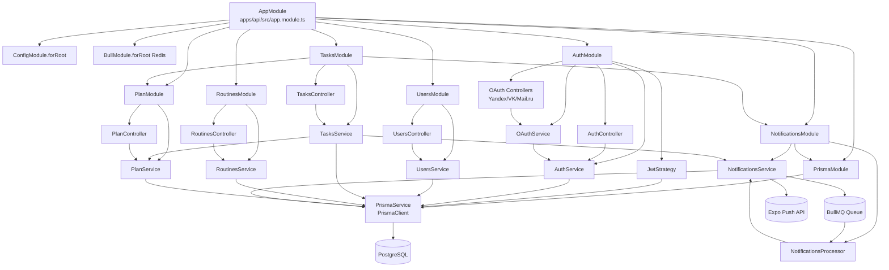

# 16. Module Analysis

Дата исследования: 2026-08-03  
Scope: backend NestJS-модули `apps/api/src`, их controllers/providers/exports, DTO, Prisma usage и статические вызовы. Анализ выполнен по исходникам, Nest metadata, constructor injections, HTTP decorators, private/public class methods и `apps/api/prisma/schema.prisma`.

## 1. Методология и границы

- Модуль = NestJS `@Module()` class или инфраструктурный root-модуль приложения.
- Публичные методы = controller endpoints, service methods без `private`, lifecycle hooks, BullMQ `WorkerHost.process`, exported provider API.
- Приватные методы = методы/поля с `private` в классах соответствующего модуля. `constructor(private readonly ...)` учитывается как dependency injection, а не как бизнес-метод.
- Входящие вызовы = статически подтверждённые HTTP routes, Nest imports/exports, constructor injections и вызовы из других сервисов/процессоров.
- Исходящие вызовы = вызовы injected services, Prisma Client delegates, BullMQ queue API, JWT/bcrypt/date-fns/fetch и helper-функций.
- В проекте нет repository layer: доменные сервисы напрямую используют `PrismaService`.
- Модели Prisma из schema: `User`, `Task`, `Routine`, `FocusSession`, `FocusSessionParticipant`, `NotificationLog`; enum `Plan`.

## 2. Общая диаграмма модулей и вызовов

## 3. Module summary matrix

| Модуль | Файл | Providers | Controllers | Exports | Ключевые Prisma-модели |
|---|---|---|---|---|---|
| `AppModule` | `apps/api/src/app.module.ts` | — | — | — | Косвенно все через child modules |
| `PrismaModule` | `apps/api/src/prisma/prisma.module.ts` | `PrismaService` | — | `PrismaService` | Все модели Prisma Client |
| `AuthModule` | `apps/api/src/auth/auth.module.ts` | `AuthService`, `OAuthService`, `JwtStrategy` | `AuthController`, `YandexOAuthController`, `VkOAuthController`, `MailruOAuthController` | `AuthService` | `User`; enum/fields `Plan` в JWT payload косвенно не используются, но user plan хранится в модели |
| `UsersModule` | `apps/api/src/users/users.module.ts` | `UsersService` | `UsersController` | `UsersService` | `User` |
| `TasksModule` | `apps/api/src/tasks/tasks.module.ts` | `TasksService` | `TasksController` | `TasksService` | `Task`, `User` |
| `RoutinesModule` | `apps/api/src/routines/routines.module.ts` | `RoutinesService` | `RoutinesController` | — | `Routine` |
| `NotificationsModule` | `apps/api/src/notifications/notifications.module.ts` | `NotificationsService`, `NotificationsProcessor`, Bull queue provider | — | `NotificationsService` | `User`, `NotificationLog`; принимает `Task` как typed job/source entity |
| `PlanModule` | `apps/api/src/plan/plan.module.ts` | `PlanService` | `PlanController` | `PlanService` | `User`, `Task`; enum `Plan` |

## 4. AppModule

**Файл:** `apps/api/src/app.module.ts`

### Назначение

Root composition module backend-приложения. Подключает конфигурацию, Redis/BullMQ и все доменные NestJS-модули.

### Ответственность

- Инициализация глобального `ConfigModule.forRoot({ isGlobal: true })`.
- Инициализация `BullModule.forRoot` с Redis host/port из env.
- Сборка backend dependency tree: Prisma, Auth, Users, Tasks, Routines, Notifications, Plan.

### Все публичные методы

- Публичных методов нет; `AppModule` — marker/composition class.

### Все приватные методы

- Приватных методов нет.

### Все зависимости

- `@nestjs/common`: `Module`.
- `@nestjs/config`: `ConfigModule`.
- `@nestjs/bullmq`: `BullModule`.
- Local modules: `PrismaModule`, `AuthModule`, `UsersModule`, `TasksModule`, `RoutinesModule`, `NotificationsModule`, `PlanModule`.
- Runtime env: `REDIS_HOST`, `REDIS_PORT`.

### Все входящие вызовы

- Nest bootstrap из `apps/api/src/main.ts`: `NestFactory.create(AppModule)`.

### Все исходящие вызовы

- Nest module imports: `ConfigModule.forRoot`, `BullModule.forRoot`, child modules.
- Прямых service method calls нет.

### Используемые DTO

- Нет прямых DTO.

### Используемые модели Prisma

- Нет прямого использования; доступ к Prisma идёт через `PrismaModule` в дочерних модулях.

### Используемые сервисы

- Нет injected services.

## 5. PrismaModule

**Файлы:** `apps/api/src/prisma/prisma.module.ts`, `apps/api/src/prisma/prisma.service.ts`

### Назначение

Инфраструктурный модуль доступа к базе данных. Экспортирует singleton `PrismaService`, расширяющий generated `PrismaClient`.

### Ответственность

- Предоставлять Prisma Client всем сервисам backend.
- Управлять lifecycle соединением с PostgreSQL через Nest hooks.
- Логировать подключение/отключение Prisma.

### Все публичные методы

| Метод | Файл | Входящие вызовы | Исходящие вызовы |
|---|---|---|---|
| `onModuleInit()` | `prisma.service.ts` | NestJS lifecycle при старте provider | `this.$connect()`, `logger.log(...)` |
| `onModuleDestroy()` | `prisma.service.ts` | NestJS lifecycle при shutdown provider | `this.$disconnect()`, `logger.log(...)` |
| Prisma delegate methods inherited from `PrismaClient` | generated client | Все сервисы через `prisma.user`, `prisma.task`, `prisma.routine`, `prisma.notificationLog` | SQL к PostgreSQL |

### Все приватные методы

- Приватных методов нет.
- Private field: `logger = new Logger(PrismaService.name)`.

### Все зависимости

- `@nestjs/common`: `Injectable`, `OnModuleInit`, `OnModuleDestroy`, `Logger`, `Module`.
- `@prisma/client`: `PrismaClient`.
- PostgreSQL datasource: `DATABASE_URL` из `apps/api/prisma/schema.prisma`.

### Все входящие вызовы

- `AppModule` imports `PrismaModule`.
- `NotificationsModule` imports `PrismaModule`.
- Constructor injections: `AuthService`, `OAuthService`, `JwtStrategy`, `UsersService`, `TasksService`, `RoutinesService`, `NotificationsService`, `PlanService`.

### Все исходящие вызовы

- `$connect()` при `onModuleInit`.
- `$disconnect()` при `onModuleDestroy`.
- Prisma Client delegates транслируются в SQL к PostgreSQL.

### Используемые DTO

- Нет DTO.

### Используемые модели Prisma

- Все модели доступны как delegates: `User`, `Task`, `Routine`, `FocusSession`, `FocusSessionParticipant`, `NotificationLog`; enum `Plan`.
- Фактически в текущих доменных сервисах используются `User`, `Task`, `Routine`, `NotificationLog`; `FocusSession` и `FocusSessionParticipant` активными сервисами не используются.

### Используемые сервисы

- Внутри не использует другие services.

## 6. AuthModule

**Файлы:** `apps/api/src/auth/*`

### Назначение

Модуль регистрации, логина, refresh tokens, чтения текущего пользователя, JWT strategy/guard integration и OAuth входа через Yandex/VK/Mail.ru.

### Ответственность

- Валидировать и обрабатывать auth endpoints `/auth/register`, `/auth/login`, `/auth/refresh`, `/auth/me`.
- Создавать и проверять JWT access/refresh tokens.
- Хешировать и проверять пароли через bcrypt.
- Обрабатывать OAuth redirect/callback flows и связывать OAuth provider IDs с пользователем.
- Экспортировать `AuthService` для использования внутри auth boundary и потенциально другими модулями.

### Все публичные методы

| Класс | Метод | Назначение | Входящие вызовы | Исходящие вызовы |
|---|---|---|---|---|
| `AuthController` | `register(dto)` / `POST /auth/register` | Регистрация по email/phone/password | HTTP client/mobile | `authService.register(dto)` |
| `AuthController` | `login(dto)` / `POST /auth/login` | Логин | HTTP client/mobile | `authService.login(dto)` |
| `AuthController` | `refresh(dto)` / `POST /auth/refresh` | Обновление access/refresh token пары | Axios interceptor/mobile | `authService.refreshTokens(dto.refreshToken)` |
| `AuthController` | `getMe(user)` / `GET /auth/me` | Возврат safe current user | HTTP client после `JwtAuthGuard` | object destructuring без `passwordHash` |
| `YandexOAuthController` | `initiateOAuth(res)` / `GET /auth/yandex` | Redirect на Yandex OAuth authorize URL | Browser/mobile WebBrowser | `res.redirect(authUrl)` |
| `YandexOAuthController` | `handleCallback(code,error,res)` / `GET /auth/yandex/callback` | Token/profile exchange и deep-link redirect | Yandex OAuth callback | `fetch` token endpoint, `fetch` profile endpoint, `oauthService.handleOAuthCallback(profile)`, `res.redirect(...)` |
| `VkOAuthController` | `initiateOAuth(res)` / `GET /auth/vk` | Redirect на VK OAuth authorize URL | Browser/mobile WebBrowser | `res.redirect(authUrl)` |
| `VkOAuthController` | `handleCallback(code,error,res)` / `GET /auth/vk/callback` | Token/profile exchange и deep-link redirect | VK callback | `fetch`, `oauthService.handleOAuthCallback`, `res.redirect(...)` |
| `MailruOAuthController` | `initiateOAuth(res)` / `GET /auth/mailru` | Redirect на Mail.ru OAuth authorize URL | Browser/mobile WebBrowser | `res.redirect(authUrl)` |
| `MailruOAuthController` | `handleCallback(code,error,res)` / `GET /auth/mailru/callback` | Token/profile exchange, MD5 signature, deep-link redirect | Mail.ru callback | `fetch`, `crypto.createHash('md5')`, `oauthService.handleOAuthCallback`, `res.redirect(...)` |
| `AuthService` | `register(dto)` | Создаёт пользователя и токены | `AuthController.register` | `prisma.user.findFirst`, `bcrypt.hash`, `prisma.user.create`, `generateTokens` |
| `AuthService` | `login(dto)` | Проверяет credentials и создаёт токены | `AuthController.login` | `prisma.user.findFirst`, `bcrypt.compare`, `generateTokens` |
| `AuthService` | `refreshTokens(refreshToken)` | Проверяет refresh JWT и выдаёт новые токены | `AuthController.refresh` | `jwtService.verify`, `prisma.user.findUnique`, `generateTokens` |
| `AuthService` | `generateTokens(user)` | Создаёт access/refresh JWT | `register`, `login`, `refreshTokens`, `OAuthService.handleOAuthCallback` | `jwtService.sign` дважды |
| `OAuthService` | `handleOAuthCallback(profile)` | Account lookup/link/create для OAuth | OAuth controllers | `prisma.user.findFirst`, `prisma.user.update`, `prisma.user.create`, `bcrypt.hash`, `authService.generateTokens` |
| `JwtStrategy` | `validate(payload)` | Загружает пользователя из JWT payload | Passport JWT strategy через guard | `prisma.user.findUnique` |
| `JwtAuthGuard` | inherited `AuthGuard('jwt')` behavior | Защита routes | Controllers с `@UseGuards(JwtAuthGuard)` | Passport strategy pipeline |
| `CurrentUser` decorator | decorator factory | Извлекает `request.user` | Protected controllers | `ExecutionContext.switchToHttp().getRequest()` |

> Важно: `AuthService.generateTokens` объявлен без `private`, поэтому является публичным TypeScript-методом и реально вызывается из `OAuthService`.

### Все приватные методы

- Приватных business methods нет.
- Private readonly fields в OAuth controllers: `clientId`, `clientSecret`, `redirectUri`.
- Private constructor injections: `authService`, `oauthService`, `prisma`, `jwtService`.

### Все зависимости

- Nest: `@nestjs/common`, `@nestjs/jwt`, `@nestjs/passport`.
- Passport: `passport-jwt` через `JwtStrategy`.
- Crypto/password: `bcrypt`, Node `crypto` для Mail.ru signature.
- HTTP: global `fetch` в OAuth controllers.
- Express response object: `@Res() res: Response`.
- Local: `PrismaService`, `AuthService`, `OAuthService`, `JWT_SECRET`, `JWT_REFRESH_SECRET`, `CurrentUser`, `JwtAuthGuard`.
- Shared types: `AuthTokens`, `JwtPayload` из `@focus/shared-types`.
- Prisma types: `User` из `@prisma/client`.

### Все входящие вызовы

- `AppModule` imports `AuthModule`.
- HTTP routes `/auth/*` вызываются mobile/API clients.
- `JwtAuthGuard`/`JwtStrategy` вызываются защищёнными routes в `AuthController.getMe`, `UsersController`, `TasksController`, `RoutinesController`, `PlanController`.
- `OAuthService.handleOAuthCallback` вызывается Yandex/VK/Mail.ru controllers.
- `AuthService.generateTokens` вызывается из `OAuthService`.

### Все исходящие вызовы

- `AuthController` → `AuthService`.
- OAuth controllers → provider HTTP APIs → `OAuthService` → `AuthService`.
- `AuthService` → `PrismaService.user.findFirst/create/findUnique`, `bcrypt.hash/compare`, `JwtService.sign/verify`.
- `OAuthService` → `PrismaService.user.findFirst/update/create`, `bcrypt.hash`, `AuthService.generateTokens`.
- `JwtStrategy` → `PrismaService.user.findUnique`.

### Используемые DTO

- `RegisterDto` — `email?`, `phone?`, `password`, `timezone?`.
- `LoginDto` — `email?`, `phone?`, `password`.
- `RefreshTokenDto` — `refreshToken`.
- `OAuthCallbackDto` находится в `auth/dto`, но callback controllers принимают query params напрямую (`@Query('code')`, `@Query('error')`), без явного использования DTO.
- Shared types: `AuthTokens`, `JwtPayload`.

### Используемые модели Prisma

- `User`: поиск, создание, обновление OAuth IDs, чтение для JWT validate.
- Enum/field `Plan` хранится в `User`, но AuthService payload сейчас содержит `sub/email/phone`, без plan fields.

### Используемые сервисы

- `AuthService`.
- `OAuthService`.
- `JwtService`.
- `PrismaService`.
- `JwtStrategy` as provider.

## 7. UsersModule

**Файлы:** `apps/api/src/users/*`

### Назначение

Модуль управления профилем текущего пользователя.

### Ответственность

- Возвращать текущего пользователя без `passwordHash`.
- Обновлять профильные поля пользователя: `email`, `phone`, `timezone`, `hasCompletedOnboarding`, `expoPushToken`.
- Удалять текущий аккаунт.

### Все публичные методы

| Класс | Метод | Назначение | Входящие вызовы | Исходящие вызовы |
|---|---|---|---|---|
| `UsersController` | `getMe(user)` / `GET /users/me` | Получить профиль текущего пользователя | HTTP + `JwtAuthGuard` | `usersService.findById(user.id)` |
| `UsersController` | `update(user,dto)` / `PATCH /users/me` | Обновить профиль | HTTP + `JwtAuthGuard` | `usersService.update(user.id,dto)` |
| `UsersController` | `remove(user)` / `DELETE /users/me` | Удалить аккаунт | HTTP + `JwtAuthGuard` | `usersService.remove(user.id)` |
| `UsersService` | `findById(id)` | Найти пользователя и скрыть пароль | `UsersController.getMe` | `prisma.user.findUnique` |
| `UsersService` | `update(id,dto)` | Обновить user row и скрыть пароль | `UsersController.update` | `prisma.user.update` |
| `UsersService` | `remove(id)` | Удалить user row | `UsersController.remove` | `prisma.user.delete` |

### Все приватные методы

- Приватных методов нет.
- Constructor private dependency: `prisma: PrismaService`.

### Все зависимости

- `@nestjs/common`: `Controller`, route decorators, guards/status decorators, exceptions.
- `JwtAuthGuard`, `CurrentUser` из `auth`.
- `PrismaService`.
- `UpdateUserDto`.
- Prisma type `User` для current-user typing.

### Все входящие вызовы

- `AppModule` imports `UsersModule`.
- HTTP routes `/users/me`.
- `JwtAuthGuard` обеспечивает наличие `request.user`.

### Все исходящие вызовы

- `UsersController` → `UsersService`.
- `UsersService` → `prisma.user.findUnique/update/delete`.

### Используемые DTO

- `UpdateUserDto`.

### Используемые модели Prisma

- `User`.

### Используемые сервисы

- `UsersService`.
- `PrismaService`.
- Auth infrastructure: `JwtAuthGuard`, `CurrentUser` decorator.

## 8. TasksModule

**Файлы:** `apps/api/src/tasks/*`

### Назначение

Модуль CRUD задач и подзадач, фильтрации задач по дате/статусу и синхронизации push-напоминаний.

### Ответственность

- Создавать root tasks и subTasks.
- Проверять ownership задач.
- Выдавать список root tasks с optional subTasks.
- Обновлять, удалять и toggle complete задачи.
- Применять Free tier лимит через `PlanService` при создании root task.
- Синхронизировать reminder job через `NotificationsService` без падения CRUD при ошибке очереди.

### Все публичные методы

| Класс | Метод | Назначение | Входящие вызовы | Исходящие вызовы |
|---|---|---|---|---|
| `TasksController` | `create(user,dto)` / `POST /tasks` | Создать задачу | HTTP + `JwtAuthGuard` | `tasksService.create(user.id,dto)` |
| `TasksController` | `findAll(user,query)` / `GET /tasks` | Получить список задач | HTTP + `JwtAuthGuard` | `tasksService.findAll(user.id,query)` |
| `TasksController` | `findOne(user,id)` / `GET /tasks/:id` | Получить задачу по UUID | HTTP + `JwtAuthGuard`, `ParseUUIDPipe` | `tasksService.findOne(user.id,id)` |
| `TasksController` | `update(user,id,dto)` / `PATCH /tasks/:id` | Обновить задачу | HTTP + `JwtAuthGuard`, `ParseUUIDPipe` | `tasksService.update(user.id,id,dto)` |
| `TasksController` | `toggle(user,id)` / `PATCH /tasks/:id/toggle` | Toggle completedAt | HTTP + `JwtAuthGuard`, `ParseUUIDPipe` | `tasksService.toggleComplete(user.id,id)` |
| `TasksController` | `remove(user,id)` / `DELETE /tasks/:id` | Удалить задачу | HTTP + `JwtAuthGuard`, `ParseUUIDPipe` | `tasksService.remove(user.id,id)` |
| `TasksService` | `create(userId,dto)` | Создание task row | `TasksController.create` | `planService.enforceTaskLimit`, `prisma.task.create`, `syncReminder` |
| `TasksService` | `findAll(userId,query)` | Поиск root tasks | `TasksController.findAll` | `prisma.user.findUnique` для timezone, `toDate`, `prisma.task.findMany` |
| `TasksService` | `findOne(userId,taskId)` | Поиск и ownership check | `TasksController.findOne`, `update`, `remove`, `toggleComplete` | `prisma.task.findUnique` |
| `TasksService` | `update(userId,taskId,dto)` | Обновление task row | `TasksController.update` | `findOne`, `prisma.task.update`, `syncReminder` |
| `TasksService` | `remove(userId,taskId)` | Удаление task row | `TasksController.remove` | `findOne`, `prisma.task.delete`, `safeCancelReminder` |
| `TasksService` | `toggleComplete(userId,taskId)` | Переключить `completedAt` | `TasksController.toggle` | `findOne`, `prisma.task.update`, `syncReminder` |

### Все приватные методы

| Метод | Входящие вызовы | Исходящие вызовы | Назначение |
|---|---|---|---|
| `syncReminder(task)` | `create`, `update`, `toggleComplete` | `notifications.cancelTaskReminder`, `notifications.scheduleTaskReminder`, `logger.error` | Единая синхронизация reminder: отмена для completed/no startTime, постановка для active scheduled task |
| `safeCancelReminder(taskId)` | `remove` | `notifications.cancelTaskReminder`, `logger.error` | Безопасная отмена reminder после удаления задачи |

Private field: `logger = new Logger(TasksService.name)`.

### Все зависимости

- `PrismaService`.
- `NotificationsService` из `NotificationsModule`.
- `PlanService` из `PlanModule`.
- DTO: `CreateTaskDto`, `UpdateTaskDto`, `GetTasksQueryDto`.
- Prisma type: `Task`.
- `date-fns-tz`: `toDate`.
- Nest: route decorators, `JwtAuthGuard`, `CurrentUser`, `ParseUUIDPipe`, exceptions, `Logger`.

### Все входящие вызовы

- `AppModule` imports `TasksModule`.
- HTTP routes `/tasks*`.
- Mobile API hooks call task routes through Axios.
- `TasksService.findOne` is internally called by `update`, `remove`, `toggleComplete`.
- Private reminder methods are internally called by CRUD methods.

### Все исходящие вызовы

- `TasksController` → `TasksService`.
- `TasksService` → `PlanService.enforceTaskLimit` for root task creation.
- `TasksService` → `PrismaService.task.create/findMany/findUnique/update/delete`.
- `TasksService.findAll` → `PrismaService.user.findUnique` for timezone.
- `TasksService` → `NotificationsService.scheduleTaskReminder/cancelTaskReminder`.
- `TasksService` → `date-fns-tz.toDate`.

### Используемые DTO

- `CreateTaskDto`.
- `UpdateTaskDto`.
- `GetTasksQueryDto`.
- Shared package also defines interfaces `Task`, `CreateTaskDto`, `UpdateTaskDto`, but backend module imports local DTO classes from `apps/api/src/tasks/dto` and Prisma `Task` type.

### Используемые модели Prisma

- `Task`: CRUD, subTasks include, ownership via `userId`, `parentTaskId`, `completedAt`, scheduling fields.
- `User`: timezone lookup in date filtering.

### Используемые сервисы

- `TasksService`.
- `PrismaService`.
- `NotificationsService`.
- `PlanService`.
- Auth infrastructure: `JwtAuthGuard`, `CurrentUser`.

## 9. RoutinesModule

**Файлы:** `apps/api/src/routines/*`

### Назначение

Модуль CRUD шаблонов повторяющихся рутин.

### Ответственность

- Создавать routine templates с `name` и `daysOfWeek`.
- Возвращать routines текущего пользователя.
- Проверять ownership routine перед чтением/изменением/удалением.

### Все публичные методы

| Класс | Метод | Назначение | Входящие вызовы | Исходящие вызовы |
|---|---|---|---|---|
| `RoutinesController` | `create(user,dto)` / `POST /routines` | Создать routine | HTTP + `JwtAuthGuard` | `routinesService.create(user.id,dto)` |
| `RoutinesController` | `findAll(user)` / `GET /routines` | Список routines | HTTP + `JwtAuthGuard` | `routinesService.findAll(user.id)` |
| `RoutinesController` | `findOne(user,id)` / `GET /routines/:id` | Получить routine | HTTP + `JwtAuthGuard`, `ParseUUIDPipe` | `routinesService.findOne(user.id,id)` |
| `RoutinesController` | `update(user,id,dto)` / `PATCH /routines/:id` | Обновить routine | HTTP + `JwtAuthGuard`, `ParseUUIDPipe` | `routinesService.update(user.id,id,dto)` |
| `RoutinesController` | `remove(user,id)` / `DELETE /routines/:id` | Удалить routine | HTTP + `JwtAuthGuard`, `ParseUUIDPipe` | `routinesService.remove(user.id,id)` |
| `RoutinesService` | `create(userId,dto)` | Создать row | `RoutinesController.create` | `prisma.routine.create` |
| `RoutinesService` | `findAll(userId)` | Найти routines user | `RoutinesController.findAll` | `prisma.routine.findMany` |
| `RoutinesService` | `findOne(userId,routineId)` | Найти и проверить owner | `RoutinesController.findOne`, `update`, `remove` | `prisma.routine.findUnique` |
| `RoutinesService` | `update(userId,routineId,dto)` | Обновить row | `RoutinesController.update` | `findOne`, `prisma.routine.update` |
| `RoutinesService` | `remove(userId,routineId)` | Удалить row | `RoutinesController.remove` | `findOne`, `prisma.routine.delete` |

### Все приватные методы

- Приватных методов нет.
- Constructor private dependency: `prisma: PrismaService`.

### Все зависимости

- `PrismaService`.
- DTO: `CreateRoutineDto`, `UpdateRoutineDto`.
- Prisma type: `Routine`.
- Nest: route decorators, `ParseUUIDPipe`, `JwtAuthGuard`, exceptions.

### Все входящие вызовы

- `AppModule` imports `RoutinesModule`.
- HTTP routes `/routines*`.
- Internal: `findOne` вызывается `update` и `remove`.

### Все исходящие вызовы

- `RoutinesController` → `RoutinesService`.
- `RoutinesService` → `prisma.routine.create/findMany/findUnique/update/delete`.

### Используемые DTO

- `CreateRoutineDto`.
- `UpdateRoutineDto`.
- Shared package defines `Routine`, `CreateRoutineDto`, `UpdateRoutineDto`, but backend imports local DTO classes and Prisma `Routine` type.

### Используемые модели Prisma

- `Routine`.

### Используемые сервисы

- `RoutinesService`.
- `PrismaService`.
- Auth infrastructure: `JwtAuthGuard`, `CurrentUser`.

## 10. NotificationsModule

**Файлы:** `apps/api/src/notifications/*`

### Назначение

Инфраструктурно-доменный модуль push-напоминаний о задачах через BullMQ и Expo Push API.

### Ответственность

- Регистрировать BullMQ queue `TASK_REMINDERS_QUEUE`.
- Планировать/отменять delayed jobs для task reminders.
- Обрабатывать jobs в `NotificationsProcessor`.
- Отправлять Expo push notification без передачи чувствительных деталей задачи.
- Логировать доставку/недоставку в `NotificationLog`.
- Дедуплицировать свежие доставки.

### Все публичные методы

| Класс | Метод | Назначение | Входящие вызовы | Исходящие вызовы |
|---|---|---|---|---|
| `NotificationsService` | `scheduleTaskReminder(task)` | Поставить delayed job | `TasksService.syncReminder` | `cancelTaskReminder`, `taskReminderQueue.add`, `logger` |
| `NotificationsService` | `cancelTaskReminder(taskId)` | Удалить delayed job | `TasksService.syncReminder`, `TasksService.safeCancelReminder`, `scheduleTaskReminder` | `taskReminderQueue.getJob`, `job.remove`, `logger` |
| `NotificationsService` | `sendPushNotification(userId,title,body)` | Отправить Expo push | `NotificationsProcessor.process` | `prisma.user.findUnique`, `fetch(Expo Push API)`, `prisma.user.update` for dead token |
| `NotificationsService` | `logNotification(userId,taskId,delivered)` | Записать delivery attempt | `NotificationsProcessor.process` | `prisma.notificationLog.create` |
| `NotificationsService` | `wasRecentlyDelivered(taskId,withinMs?)` | Проверка дедупликации | `NotificationsProcessor.process` | `prisma.notificationLog.findFirst` |
| `NotificationsProcessor` | `process(job)` | BullMQ worker entrypoint | BullMQ runtime | `notifications.wasRecentlyDelivered`, `sendPushNotification`, `logNotification`, `throw Error` for retry |

### Все приватные методы

- Приватных методов нет.
- Private fields: `logger` in `NotificationsService`, `logger` in `NotificationsProcessor`.
- Private constructor injections: queue and services.

### Все зависимости

- `@nestjs/bullmq`: `BullModule.registerQueue`, `Processor`, `WorkerHost`, `InjectQueue`.
- `bullmq`: `Queue`, `Job`.
- `PrismaModule` / `PrismaService`.
- Constants: `TASK_REMINDERS_QUEUE`, `JOBS.TASK_REMINDER`.
- Prisma type: `Task` for scheduling input.
- External HTTP: `fetch('https://exp.host/--/api/v2/push/send')`.
- Runtime env: `EXPO_ACCESS_TOKEN`.

### Все входящие вызовы

- `AppModule` imports `NotificationsModule`.
- `TasksModule` imports `NotificationsModule` and injects exported `NotificationsService` into `TasksService`.
- `TasksService` calls `scheduleTaskReminder` and `cancelTaskReminder`.
- BullMQ invokes `NotificationsProcessor.process` for queued jobs.

### Все исходящие вызовы

- `NotificationsService` → BullMQ queue: `add`, `getJob`, `remove`.
- `NotificationsService` → `PrismaService.user.findUnique/update`.
- `NotificationsService` → `PrismaService.notificationLog.create/findFirst`.
- `NotificationsService` → Expo Push API via `fetch`.
- `NotificationsProcessor` → `NotificationsService` methods.

### Используемые DTO

- `RegisterPushTokenDto` существует в `notifications/dto/register-push-token.dto.ts`, но в текущем `NotificationsModule` нет controller endpoint, который его использует. Регистрация push token фактически покрывается `UsersModule` через `UpdateUserDto.expoPushToken`.
- Internal job DTO/interface: `TaskReminderJobData`.
- Internal result type: `PushSendResult`.

### Используемые модели Prisma

- `User`: чтение/очистка `expoPushToken`.
- `NotificationLog`: запись и дедупликация отправок.
- `Task`: используется как typed input для `scheduleTaskReminder`, но Prisma task delegate внутри модуля не вызывается.

### Используемые сервисы

- `NotificationsService`.
- `NotificationsProcessor`.
- `PrismaService`.
- BullMQ queue provider `TASK_REMINDERS_QUEUE`.

## 11. PlanModule

**Файлы:** `apps/api/src/plan/*`

### Назначение

Модуль подписочного плана пользователя и Free/Pro task limit enforcement.

### Ответственность

- Вычислять, является ли пользователь Pro.
- Ограничивать создание root tasks для Free tier.
- Возвращать текущую информацию о плане и usage.
- Обновлять пользователя до Pro или откатывать на Free.

### Все публичные методы

| Класс | Метод | Назначение | Входящие вызовы | Исходящие вызовы |
|---|---|---|---|---|
| `PlanController` | `getPlanInfo(user)` / `GET /plan` | Получить plan/usage | HTTP + `JwtAuthGuard` | `planService.getPlanInfo(user.id)` |
| `PlanController` | `upgradeToPro(user)` / `POST /plan/upgrade` | Dev/test upgrade to Pro | HTTP + `JwtAuthGuard` | `planService.upgradeToPro(user.id,expiresAt)` |
| `PlanController` | `downgradeToFree(user)` / `POST /plan/downgrade` | Dev/test downgrade | HTTP + `JwtAuthGuard` | `planService.downgradeToFree(user.id)` |
| `PlanService` | `isProUser(userId)` | Проверить Pro status | `enforceTaskLimit`, `getPlanInfo`; потенциально другие services | `prisma.user.findUnique` |
| `PlanService` | `enforceTaskLimit(userId)` | Запретить root task сверх лимита | `TasksService.create` | `isProUser`, `prisma.task.count`, throws `ForbiddenException` |
| `PlanService` | `getPlanInfo(userId)` | Сформировать plan info | `PlanController.getPlanInfo` | `prisma.user.findUnique`, `isProUser`, `prisma.task.count` |
| `PlanService` | `upgradeToPro(userId,expiresAt?)` | Установить `plan=PRO` | `PlanController.upgradeToPro` | `prisma.user.update` |
| `PlanService` | `downgradeToFree(userId)` | Установить `plan=FREE` | `PlanController.downgradeToFree` | `prisma.user.update` |

### Все приватные методы

- Приватных методов нет.
- Constructor private dependency: `prisma: PrismaService`.

### Все зависимости

- `PrismaService`.
- `@prisma/client`: `Plan` enum.
- `@focus/shared-types`: `FREE_TIER_LIMITS`.
- Nest: `Controller`, `UseGuards`, `Get`, `Post`, `ForbiddenException`.
- Auth infrastructure: `JwtAuthGuard`, `CurrentUser`.

### Все входящие вызовы

- `AppModule` imports `PlanModule`.
- `TasksModule` imports `PlanModule` and injects exported `PlanService` into `TasksService`.
- HTTP routes `/plan`, `/plan/upgrade`, `/plan/downgrade`.
- `TasksService.create` calls `enforceTaskLimit`.

### Все исходящие вызовы

- `PlanController` → `PlanService`.
- `PlanService` → `prisma.user.findUnique/update`.
- `PlanService` → `prisma.task.count`.
- `PlanService.enforceTaskLimit` → `isProUser`.
- `PlanService.getPlanInfo` → `isProUser`.

### Используемые DTO

- Локальных DTO в модуле нет.
- Shared constant/type: `FREE_TIER_LIMITS` from `@focus/shared-types`.
- Response shape формируется inline в `PlanService.getPlanInfo` и controllers.

### Используемые модели Prisma

- `User`: поля `plan`, `proExpiresAt`.
- `Task`: count active root tasks (`userId`, `parentTaskId: null`, `completedAt: null`).
- Enum `Plan`: `FREE`, `PRO`.

### Используемые сервисы

- `PlanService`.
- `PrismaService`.
- Auth infrastructure: `JwtAuthGuard`, `CurrentUser`.

## 12. Cross-module incoming/outgoing call index

| From | To | Тип связи | Где подтверждено |
|---|---|---|---|
| `main.ts` | `AppModule` | bootstrap | `NestFactory.create(AppModule)` |
| `AppModule` | all feature modules | Nest imports | `app.module.ts` |
| `TasksModule` | `NotificationsModule` | Nest import для provider availability | `tasks.module.ts` |
| `TasksModule` | `PlanModule` | Nest import для provider availability | `tasks.module.ts` |
| `NotificationsModule` | `PrismaModule` | Nest import для `PrismaService` | `notifications.module.ts` |
| `AuthController` | `AuthService` | controller delegation | `auth.controller.ts` |
| OAuth controllers | `OAuthService` | controller delegation | `*-oauth.controller.ts` |
| `OAuthService` | `AuthService.generateTokens` | service call | `oauth.service.ts` |
| `JwtStrategy` | `PrismaService` | provider dependency | `jwt.strategy.ts` |
| `UsersController` | `UsersService` | controller delegation | `users.controller.ts` |
| `TasksController` | `TasksService` | controller delegation | `tasks.controller.ts` |
| `TasksService` | `PlanService` | cross-domain service call | `tasks.service.ts` |
| `TasksService` | `NotificationsService` | cross-domain service call | `tasks.service.ts` |
| `RoutinesController` | `RoutinesService` | controller delegation | `routines.controller.ts` |
| `PlanController` | `PlanService` | controller delegation | `plan.controller.ts` |
| `NotificationsProcessor` | `NotificationsService` | worker delegation | `notifications.processor.ts` |
| Domain services | `PrismaService` | direct ORM access | constructor injections and Prisma delegate calls |

## 13. DTO usage index

| DTO/type | Файл | Используется в модулях | Назначение |
|---|---|---|---|
| `RegisterDto` | `apps/api/src/auth/dto/register.dto.ts` | Auth | Body `POST /auth/register` |
| `LoginDto` | `apps/api/src/auth/dto/login.dto.ts` | Auth | Body `POST /auth/login` |
| `RefreshTokenDto` | `apps/api/src/auth/dto/refresh-token.dto.ts` | Auth | Body `POST /auth/refresh` |
| `OAuthCallbackDto` | `apps/api/src/auth/dto/oauth-callback.dto.ts` | Auth DTO folder, not actively wired | Potential callback query contract |
| `UpdateUserDto` | `apps/api/src/users/dto/update-user.dto.ts` | Users | Body `PATCH /users/me`; includes `expoPushToken` |
| `CreateTaskDto` | `apps/api/src/tasks/dto/create-task.dto.ts` | Tasks | Body `POST /tasks` |
| `UpdateTaskDto` | `apps/api/src/tasks/dto/update-task.dto.ts` | Tasks | Body `PATCH /tasks/:id` |
| `GetTasksQueryDto` | `apps/api/src/tasks/dto/get-tasks-query.dto.ts` | Tasks | Query `GET /tasks` |
| `CreateRoutineDto` | `apps/api/src/routines/dto/create-routine.dto.ts` | Routines | Body `POST /routines` |
| `UpdateRoutineDto` | `apps/api/src/routines/dto/update-routine.dto.ts` | Routines | Body `PATCH /routines/:id` |
| `RegisterPushTokenDto` | `apps/api/src/notifications/dto/register-push-token.dto.ts` | Notifications DTO folder, not actively wired | Potential push-token registration body; current active path uses `UpdateUserDto.expoPushToken` |
| `AuthTokens`, `JwtPayload` | `packages/shared-types/src/index.ts` | Auth | Shared auth contract |
| `FREE_TIER_LIMITS` | `packages/shared-types/src/index.ts` | Plan | Shared plan limit constant |
| Shared `Task/Routine/User` interfaces and DTO interfaces | `packages/shared-types/src/index.ts` | Mostly mobile/shared contracts | Backend services use local DTO classes and Prisma types for active Nest validation |

## 14. Prisma model usage index

| Prisma model/enum | Использующие модули | Операции |
|---|---|---|
| `User` | Auth, Users, Tasks, Notifications, Plan | `findFirst`, `findUnique`, `create`, `update`, `delete`; timezone lookup; OAuth IDs; push token; plan fields |
| `Task` | Tasks, Plan, Notifications | CRUD in Tasks; active root task count in Plan; typed reminder scheduling in Notifications |
| `Routine` | Routines | CRUD |
| `NotificationLog` | Notifications | `create`, `findFirst` for reliability/dedup |
| `FocusSession` | PrismaModule only / schema | No active controller/service usage found |
| `FocusSessionParticipant` | PrismaModule only / schema | No active controller/service usage found |
| `Plan` enum | Plan, Auth indirectly via User model | `FREE`, `PRO` for plan checks/updates |

## 15. Findings

### Модули с наиболее широкой ответственностью

- `AuthModule`: объединяет password auth, refresh tokens, JWT strategy, decorator/guard integration и три OAuth provider controllers.
- `TasksModule`: CRUD задач плюс cross-domain orchestration с `PlanService` и `NotificationsService`.
- `NotificationsModule`: очередь, worker, external Expo API и persistence логов доставки.

### Cross-domain coupling hotspots

- `TasksService -> PlanService` для Free limit enforcement.
- `TasksService -> NotificationsService` для reminder lifecycle.
- `OAuthService -> AuthService.generateTokens`; при этом `generateTokens` публичен из-за cross-service usage.

### DTO observations

- Backend Nest validation использует local DTO classes из `apps/api/src/**/dto`.
- `packages/shared-types` содержит параллельные DTO/interface contracts для frontend/shared API typing.
- `RegisterPushTokenDto` и `OAuthCallbackDto` существуют, но не подключены к активным controller methods в текущем коде.

### Prisma observations

- Repository layer отсутствует; Prisma delegates вызываются напрямую из сервисов.
- `FocusSession` и `FocusSessionParticipant` присутствуют в schema/shared-types, но backend-модуль для них отсутствует.
- `NotificationLog` используется только reliability/dedup контуром notifications.
